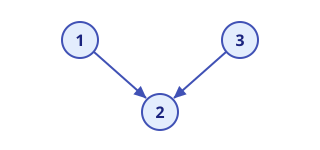
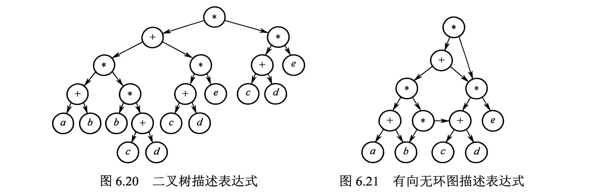
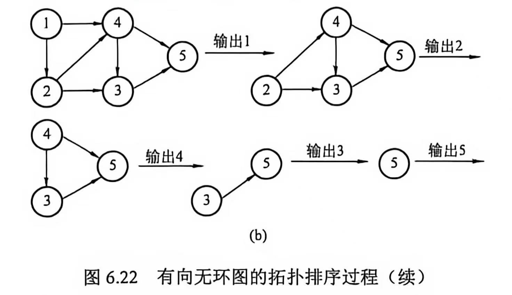
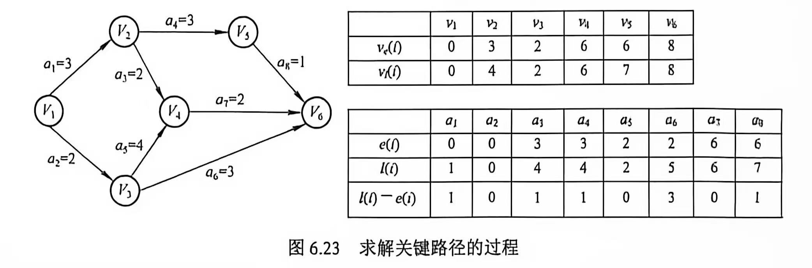

# 图论

## 图的重要概念

### 连通、弱连通、强连通

"连通"刻画的是顶点之间能否"相互到达"。无向图的边没有方向，相关概念只有一种；有向图的边带有方向，因此需要进一步区分 **强连通** 与 **弱连通** 。

**定义（连通）**：设 $G$ 为无向图。若从顶点 $u$ 到顶点 $v$ 之间存在路径，则称 $u$ 与 $v$ 是**连通的 (Connected)**。若 $G$ 中**任意两个顶点**都连通，则称 $G$ 为**连通图 (Connected Graph)**，否则称 $G$ 为**非连通图**。

**定义（强连通）**：设 $G$ 为有向图。若从顶点 $u$ 到顶点 $v$ 之间存在路径，**且**从 $v$ 到 $u$ 之间也存在路径，则称 $u$ 与 $v$ 是**强连通的 (Strongly Connected)**。若 $G$ 中**任意两个顶点**都强连通，则称 $G$ 为**强连通图 (Strongly Connected Graph)**。

**定义（弱连通）**：设 $G$ 为有向图。若**忽略所有边的方向**（把有向边当作无向边）后所得的无向图是连通的，则称 $G$ 为**弱连通图 (Weakly Connected Graph)**。

*   注意"连通"要求的是**路径存在**，两点不一定直接相邻（直接有边相连称为*相邻*，比连通更强）；路径可以经由若干个中间顶点辗转到达。
*   三个概念对"可达"的要求依次递减：**强连通**要求任意两点之间**双向**都有路径；**弱连通**只要求忽略方向后任意两点之间有路径；**连通**定义在无向图上——无向边本身可双向通行，"有路径"天然意味着"双向可达"。
*   有向图若是**强连通图**，必然是**弱连通图**；反之不一定成立。
*   类比无向图的"连通分量"，有向图的**极大强连通子图**称为**强连通分量 (Strongly Connected Component, SCC)**，详见下一节末尾的注意。
*   判定技巧：$n$ 个顶点的无向图若边数 $m > \frac{(n-1)(n-2)}{2}$，则必为**连通图**（非连通时边数最多的情况是 $n-1$ 个顶点构成完全图、剩余 1 个顶点孤立，恰好 $\frac{(n-1)(n-2)}{2}$ 条边）。

### 极大连通子图 (Maximal Connected Subgraph)

!!! Note "正式的解释"
    **定义**：设 $G$ 为无向图，$G'$ 是 $G$ 的一个连通子图。若 $G$ 中不存在连通子图 $G''$，使得 $G'$ 是 $G''$ 的真子图（$G' \subsetneq G''$），即 $G'$ 无法再并入更多顶点（连同其关联边）而仍保持连通，则称 $G'$ 为 $G$ 的**极大连通子图**。

    *   无向图 $G$ 的极大连通子图恰为 $G$ 的**连通分量 (Connected Component)**。
    *   "极大"的意思是包含了依附于连通分量中顶点的**所有边**。
    *   $G$ 的每个顶点恰好属于**唯一一个**极大连通子图；所有极大连通子图互不相交，且并集覆盖 $G$ 的全部顶点（构成顶点集的一个划分）。
    *   $G$ 本身连通 $\iff$ $G$ 只有一个极大连通子图（即 $G$ 自身）。
    *   *注意：这里的"极大"针对的是顶点集合——在保持连通的前提下，顶点数量已无法再增加。对于有向图，对应概念为强连通分量*。

??? Example "举个例子"
    把图想象成一张"社交关系网"：两个人之间有边 = 互相认识。

    **极大连通子图**就是"一个圈子"：圈内任意两人都能通过朋友的朋友等辗转认识（连通）；而圈子外的任何人，跟圈内人**没有任何一条边相连**，一旦拉进来，整个圈子就不连通了。

    *   一个团体 40 个人，按"是否认识"可以分成几个互不往来的小圈子，每个圈子就是一个极大连通子图（连通分量）。
    *   所以"极大"的意思是：这个圈子**已经大得不能再大了**——再添任何一个人进来，大家就连不起来了。
    *   如果 40 人都互相认识（整个图连通），那这个团体本身就是唯一的一个极大连通子图。

### 极小连通子图 (Minimal Connected Subgraph)

!!! Note "正式的解释"
    **定义**：设 $G$ 为连通图，$G'$ 是 $G$ 的一个连通子图，且通常要求 $G'$ **包含 $G$ 的全部顶点**（即生成子图）。若在 $G'$ 中**删除任意一条边**都会使其不再连通，则称 $G'$ 为 $G$ 的**极小连通子图**。

    *   若 $G'$ 含有 $G$ 的全部 $n$ 个顶点，则 $G'$ 恰好有 $n-1$ 条边，即 $G'$ 是一棵**生成树 (Spanning Tree)**。
    *   边数已是在"保持连通（并涵盖全部顶点）"前提下的**最小值**：少一条边即不连通，多一条边则产生回路。
    *   极小连通子图**一般不唯一**：同一个连通图通常存在多棵不同的生成树。
    *   辨析："极大连通子图"在**顶点维度**上求"包含关系最大"；"极小连通子图"在**边维度**上求"删除关系最小"。二者优化的维度不同，不可混淆。

??? Example "举个例子"
    接着用"社交网"打比方：老板要求**团体内 40 个人必须都能互相联系上**（连通），但关系越多维护成本越高，希望使用的"边"越少越好。

    **极小连通子图**就是：在保证 40 个人全都连得上的前提下，**删掉任何一条边都会有人掉队**的最精简关系网。

    *   这样的关系网恰好有 $40 - 1 = 39$ 条边（$n-1$ 条），也就是一棵"生成树"——用一条树状主干线把所有人串起来。
    *   类比：拉一个 40 人的群，并不需要两两都是好友，只要有一条主干线把所有人群串起来即可；再多加一条边（多余的关系）就属于浪费。

## 图的遍历

### 广度优先 (Breadth-First) 搜索，BFS

其基本思想是，

1. 首先访问起始节点 $v$，然后从 $v$ 出发，依次访问 $v$ 的所有未被访问的邻接节点 $w_1, w_2, \dots, w_i$；
2. 随后再依次访问 $w_1, w_2, \dots, w_i$ 的所有未被访问的邻接节点；
3. 再从这些被访问过的顶点出发，访问它们尚未被访问的邻接节点，直至所有从 $v$ 可达的节点都被访问。
4. 如果此时图中仍然有未被访问的节点，则再选一个未被访问的节点作为新的起始点，重复 1-3，直至所有节点都被访问。

事实上，图的 BFS 就是树的层序遍历算法的自然推广。

在执行 BFS 的过程中，我们需要一个辅助队列，暂存当前层顶点的下一层顶点。每个顶点最多入队一次，在最坏情况下，BFS 的空间复杂度是 $O(|V|)$。

采用 BFS 的遍历实质上是对每个顶点查找其邻接点的过程。采用 **邻接表** 存储时，每个顶点需要搜索（入队）一次，时间复杂度 $O(|V|)$；搜索每个顶点的邻接点时，遍历每个顶点的边表，最终每条边均需访问一次，时间复杂度 $O(|E|)$，因此总的时间复杂度为 $O(|V|+|E|)$。采用 **邻接矩阵** 存储时，查找每个顶点的临界点的时间复杂度是 $O(|V|)$，因此总的时间复杂度为 $O(|V|^2)$。

不难发现，BFS 总是按照距离由近到远的顺序遍历图中的顶点，从而保证了每个顶点首次被访问时，所经过的路径一定是最短路径。最短路径一定是 **简单路径**，也即没有重复顶点的路径。所以，BFS 可以求解 **无权图的单源最短路径问题**。

### 深度优先 (Depth-First) 搜索，DFS

类似树的先序遍历。其基本思想是，

1. 首先访问起始节点 $v$，然后从 $v$ 出发，访问 $v$ 的一个未被访问的邻接节点 $w_1$；
2. 随后访问 $w_1$ 的一个未被访问的邻接节点 $x_1$，以此类推；
3. 当无法继续向下访问时，回退至上一节点（递归返回），检查其是否还有未访问的邻接节点；
4. 若有，则从该节点开始继续前述搜索过程，直到所有节点都被访问。

我们通常采用递归的方式实现 DFS。因此，在最坏情况下，递归深度可达 $|V|$，因而空间复杂度为 $O(|V|)$。

采用 DFS 的遍历本质上是通过边依次访问邻接点的过程。和 BFS 一样，其时间复杂度进取决于图的存储结构。采用 **邻接表** 存储时，总的时间复杂度为 $O(|V|+|E|)$。采用 **邻接矩阵** 存储时，总的时间复杂度为 $O(|V|^2)$。

!!! Note "生成树"
    BFS 和 DFS 的生成树存在的前提是图是连通图（否则是生成森林）。不论是 BFS 还是 DFS，基于 **邻接表** 得到的生成树是不唯一的；基于 **邻接矩阵和同一源点** 得到的生成树是唯一的。

### 遍历与连通性

-   对于无向图，为了遍历所有顶点的调用 `BFS()` 或 `DFS()` 次数恰好等于该图的连通分量数，因为每次调用都恰好遍历一个连通分量重的所有顶点。
-   对于有向图，仅当初始顶点到达图中每一个顶点都有路径时才能通过一次遍历访问所有顶点。即使整个图是弱连通的，图中也会有非强连通分量。在非强连通分量重单次调用 DFS 或 BFS 不一定可以访问到该子图的所有顶点。

如上图所示，该有向图是 **弱连通** 的（忽略方向后所有顶点连通），但顶点 $1$、$3$ 都只指向顶点 $2$，没有任何边离开顶点 $2$：从顶点 $2$ 出发的单次 DFS/BFS 只能访问到 $2$ 自身，无法到达 $1$ 和 $3$，故该图 **不是强连通** 的。

## 图的应用

### 最小生成树

我们在极小连通子图中一并介绍了生成树的概念。最小生成树则是在带权无向图的语境下提出的。具有最小总权重的生成树成为图 $G$ 的最小生成树。

显然，如果图中没有权值相同的边，那么最小生成树唯一。那么如何构造最小生成树？

!!! Warning "注意"
    "如果图中没有权值相同的边，那么最小生成树唯一"的 **否命题不成立**。

!!! Success "原理"
    首先想象一个现成的最小生成树，其对应带权连通无向图 $G=(V, E)$。
    
    对于 $V$ 的任一非空子集 $U$，若 $(u,v)$ 是一条权值最小的边，其中 $u \in U, v \in V-U$，那么 $G$ 的最小生成树一定包含这条边 $(u, v)$。

依据这个原理我们主要介绍两种算法。设要表示的连通图 $G = (V, E)$，生成树为 $T = (U, E_T)$。

!!! Note "Prim 算法"
    1. 初始化。向空树 $T$ 中添加图 $G$ 的任一顶点而不加入任何边。此时 $U = \{u_0\}$, $E_T = \emptyset$。
    2. 循环。重复直至 $U = V$。从图 $G$ 中选择满足 $\{(u,v) | u \in U, v \in V-U\}$ 且具有最小权值的边加入树 $T$。更新 $U \leftarrow U \cup \{v\}$, $E_T \leftarrow E_T \cup \{(u, v)\}$。

    该算法的时间复杂度是 **$O(|V^2|)$**，因为对于每一个顶点都要遍历所有的顶点以找到最小权重的边。该时间复杂度与 $|E|$ 无关，因此 Prim 算法特别适合求解 **边稠密** 图的最小生成树。
    
!!! Note "Kruskal 算法"
    1. 初始化。每个顶点构成独立的树，不加入任何边，$T$ 是所有顶点构成的森林。此时 $U = V$, $E_T = \emptyset$。
    2. 循环。重复直至 $T$ 成为一棵树（连通分量数量为 1）。按照权值递增的顺序从 $E - E_T$ 中选择一条边。如果该边加入 $T$ 后不构成回路，则确实加入并更新 $E_T$；否则舍弃这条边，直到 $E_T$ 包含 n-1 条边。

    该算法的时间复杂度是 **$O(|E \log_2 E|)$**。在最坏情况下，由于有些关键边权重很大或存在环路等因素，我们需要对每一条边各扫描一次。在每一次扫描中，如果我们使用堆存储（常用的方法），从中选出最小值的时间是 $O(\log_2 |E|)$。同时，使用并查集来快速确定两个顶点是否已经属于同一棵树（集合）的时间复杂度是 $O(\alpha(|V|))$，由于 $\alpha(|V|)$ 增长极其缓慢而近似为常数。
    
    如果使用排序算法确定最小值，那么排序算法的时间复杂度 $O(|E|\log_2 |E|)$。随后依次取每一条边并判断是否成环的时间大致是 $O(|E|)$（$O(\alpha(|V|))$ 被近似为常数）。这样，总体的时间复杂度依旧是 $O(|E|\log_2 |E|)$。

    可以发现算法的时间复杂度与 $|V|$ 无关，因此 Kruskal 算法特别适合求解 **边稀疏** 以及 **顶点较多** 的图。

### 最短路算法

我们之前提到过 BFS 可以求解无权图的最短路径。对于带权图来说应该怎么办呢？

!!! Note "单源最短路：Dijkstra 算法"
    迪杰斯特拉算法使用一个集合 $S$ 记录 **已确定最短路径的顶点**。初始将源点放入 $S$。在每一步以 **贪心策略** 寻找到最短路径顶点 $i$ 加入 $S$ 后，更新源点到各个 **尚未确定最短路径的顶点** 的当前最短路长度。

    在算法执行过程中我们一般维护三个数组：

    -   `final[]`：标记各顶点是否已经找到最短路径；
    -   `dist[]`：记录从 **源点** 到点 $i$ 的当前最短路长度；
    -   `path[]`：存储从 **源点** 到点 $i$ 的最短路径。该数组用于算法流程结束后的回溯，以重构出最短路径。

    假设指定顶点 0 为源点，图以邻接矩阵 `arcs[][]` 存储。算法的步骤如下：

    1. 初始化。$S = \{0\}$，`dist` 数组初始值 `dist[i] = arcs[0][i]`；
    2. 选择最短路顶点。从不在 $S$ 的顶点集合中选出一个顶点 $j$，使得 `dist[j]` 最小。此时 $j$ 就是当前从源点出发的最短路径的终点，将 $j$ 加入 $S$，因为其最短路径已经确定。
    3. 松弛操作。更新最短路长度。对每个从顶点 $j$ 出发的邻接顶点 $k$，如果 `dist[j]` + `arcs[j][k]` < `dist[k]`，更新 `dist[k]` 为 `dist[j]` + `arcs[j][k]`。
    4. 重复步骤 2、3，直到所有顶点都包含在 $S$ 中。

    ??? Tip "Dijkstra 算法的适用性"
        迪杰斯特拉算法不适用存在 **负权边** 的图。

    !!! Success "时间复杂度"
        采用邻接矩阵表示图、线性扫描 `dist[]` 数组查找最小值（朴素方法）时，Dijkstra 算法的时间复杂度是 $O(|V|^2)$。这是因为要确定 $|V|$ 个顶点到源点的最短路径；在针对每个顶点操作时，线性扫描找最小顶点是 $O(|V|)$ 的，松弛操作也是 $O(|V|)$ 的。

        如果采用邻接表表示图，在针对每个顶点操作时，线性扫描找最小顶点还是 $O(|V|)$ 的，松弛操作则会变成 $O(|E|)$ 的。这是因为邻接表只需要遍历存在的边。

        如果采用堆优化，那么爪最小顶点的复杂度是 $O(\log |V|)$；每个顶点的松弛操作也是 $O(\log |V|)$ 的。

!!! Note "各顶点间的最短距离：Floyd 算法"
    弗洛伊德算法的基本思想是，对于两个给定的顶点 $v_i$ 和 $v_j$，从直接连接开始，依次考虑加入某个中间顶点后，给定顶点之间的最短距离。这是动态规划的思想。

    假设图依旧使用邻接矩阵 `arcs[][]` 存储，Floyd 算法的描述如下：

    1. 定义 n 阶方阵序列 $A^{(-1)}, A^{(0)}, \dots, A^{(n-1)}$。其中约定：

        $$
        \begin{cases}
        \ A^{(-1)}[i][j] = arcs[i][j] \\
        \ A^{(k)}[i][j] = \min\{A^{(k-1)}[i][j], A^{(k-1)}[i][k] + A^{(k-1)}[k][j]\}, k = 0, 1, \dots, n-1
        \end{cases}
        $$

        上标小括号内的数字 $i$ 代表允许使用编号不超过 $i$ 的顶点作为中间顶点，-1 代表两端点直接相连。
    2. 从 $A^{(-1)}$ 出发，迭代算出每一个 $A^{(k)}$，最后得到的 $A^{(n-1)}$ 即为所求的对应顶点对的最短路径长度。
    
    ??? Tip "Floyd 算法的适用性"
        弗洛伊德算法不适用存在 **负权环** 的图，其适用性较 Dijkstra 广一些。

    !!! Success "时间复杂度"
        Floyd 算法的时间复杂度为 $O(|V|^3)$。因为对于每一次迭代，都要有三层循环来遍历所有顶点。但它的好处是无需复杂的数据结构，且因常数因子实际较小，因此对于中等规模的图，运行效率不错。

### 拓扑排序和网络流

!!! Note "DAG 图"
    我们之前在树的章节了解过如何用二叉树表达一个表达式。但我们可能会发现一个表达式中存在在多个位置被复用的子表达式，对应到二叉树中重复的子结构。这些重复会造成空间的浪费。这个时候，我们可以考虑合并这些公共结构，这样二叉树就会变成一个有向无环图（DAG 图）。公共表达式只需被存储一次，并通过多个父节点的入边共享，显著节省了存储空间。

    

DAG 图还可以用来表示工程。每个顶点代表一个活动，有向边 <$V_i, V_j$> 表示活动 $V_i$ 必须先于活动 $V_j$ 进行。这样的 DAG 图我们称之为 **顶点表示活动的网络**，简称 **AOV 网**。

图论中的 **拓扑排序** 指的是由 DAG 图的顶点构成的一个线性序列，满足：
1. 每个顶点恰好出现一次；
2. 若存在从顶点 A 到顶点 B 的路径，则在拓扑排序的序列中，B 必须在 A 之后。

每个 AOV 网都有一个或多个拓扑排序序列。

一个常用的从 AOV 网构建拓扑排序的方法是：

1. 从 AOV 网中 **随机选择** 一个没有前驱（入度为 0）的顶点并输出它。
2. 从网络中删除该顶点和所有以它为起点的有向边；
3. 重复步骤 1 和 2，直至当前的网为空或非空但无法找到新的入度为 0 的顶点。后一种情况表明<u>有向图中必然有环</u>。

我们发现 AOV 网的边是无权值的，只能表现出活动的先后顺序。我们考虑一个“升级版”：让图还能表示出活动的开销。于是诞生了 **用边表示活动的网络**，AOE 网。在带权有向图中，以顶点表示*事件*，以有向边表示活动，并以边上的权值表示完成该活动所需的开销。

AOE 网满足：
1. 只有在某顶点所代表的事件发生后，从改顶点出发的有向边所代表的活动才能开始；
2. 只有当进入某顶点的各有向边所代表的活动都已经完成时，该顶点所代表的事件才能发生。

AOE 网中通常只有一个入度为 0 的顶点（源点）；同时仅有一个出度为 0 的顶点（汇点）。**完成整个工程所需要的最短时间** 等于 **关键路径** 的长度。可以看出，**路径长度最大** 的才被称为关键路径。根据定义，同一个 AOE 网的关键路径可能不止一条。

分别记事件的最早发生时间和最晚发生时间为 $v_e$ 和 $v_l$；分别记活动的最早开始时间和最晚开始时间为 $a_e$ 和 $a_l$。求关键路径的算法步骤如下：

1. 从源点出发，令 $v_e(源点) = 0$，按照拓扑有序求其余顶点的 $v_e$；
2. 从汇点出发，令 $v_l(汇点) = v_e(汇点)$，按照逆拓扑有序求其余顶点的 $v_l$；
3. 根据各顶点（事件）的 $v_e$，求所有弧（活动）的 $a_e$；
4. 根据各顶点的 $v_l$，求所有弧的 $a_l$；
5. 求 AOE 网络中所有活动的时间余量 $d(i) = a_l(i) - a_e(i)$，取所有余量为 0 的活动，构建出关键路径。 

