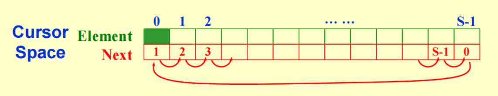

## 线性数据结构

**00 抽象数据类型 (ADT)**

!!! Note "简单定义"
    $$
    数据类型 = \{Objects\} \cup \{Operations\}
    $$

    !!! Example "int 类型"
        $$
        \text{int} = \{0, \pm 1, \pm 2 , \dots, \text{INT_MAX}, \text{INT_MIN}\} \cup \{+,-,\times,/,\%,\dots\}
        $$

抽象数据结构是一个逻辑上的概念，帮助我们了解一个数据结构的大致情况。我们只关心它能做什么 (Specification)，而不关心它怎么做 (Implementation)。

### 01 Lists - 线性表

线性表是最基本的数据结构。它可以完成诸如返回长度、打印所有元素、创建空表、**增删改查** 等操作。它的实现方式有很多种：

1.  数组实现
    -   **查找第 k 个元素的操作** 仅需 $O(1)$；
    -   必须预先估计最大空间 `MaxSize`；
    -   **插入和删除操作** 需要 $O(N)$，因为需要移动大量的后续数据。
2.  链表实现
    -   链表的一个节点 (Node) 由数据和指针组成。节点的指针指向下一个节点。节点的位置可能会随着不同的运行发生变化。
    -   链表的 **插入和删除** 都只需要 $O(1)$。

        ??? Tip "插入、删除操作的实现"
            插入操作一般是两步。假设我们在 `node` 之后插入一个节点：

            ① `newNode -> next = node -> next;`
            
            ② `node -> next = newNode;`

            这两步的顺序不能反。如果交换步骤，`node->next` 原本指向的后续节点就丢失了。

            对于删除操作，我们一样是改变指针指向。改变被删节点的前序节点的指针指向，使得被删节点被跳过，然后释放掉被删节点的内存。假设我们删除 `node` 节点：

            ① `prevNode -> next = node -> next;`

            ② `free(node);`

    -   为了方便处理“在第一个位置插入/删除”的情况，通常会加一个不存数据的头节点，这样的节点被称为 Dummy Head 。

    !!! Note "双向循环链表"
        -   **双向**：单链表找“下一个”很快，但找“上一个”需要从头遍历。双向链表通过 `llink`（左链接）和 `rlink`（右链接）解决了这个问题。
        -   **循环**：让尾节点指向头节点，头节点的前驱指向尾节点，形成一个环，处理起来更灵活。（尾节点 +1 就是头节点）

3.  游标 (Cursor) 实现的链表
    
    在没有指针的编程语言中会用游标来实现线性表。
    
    -   其原理是用一个 **大数组（例如结构体数组）** 模拟内存，以数组下标模拟地址。每个结构体中存储数据和下一个结构体所在的下标（也就是 freelist）。

        

    -   通过对 freelist 的管理，我们可以实现 `malloc` 和 `free`：
        -   `malloc` 相当于是从 freelist 里删除了地址为 p 的节点。
        -   `free` 相当于是向 freelist 插入地址为 p 的节点。

??? Example "多重表"
    考虑这样的情景：有 40000 名学生和 2500 门可供选择的课程。你的任务是为每名学生输出 ta 选的课程，以及给每门课程的任课老师提供一份学生名单。
    
    -   我们首先可能想到第一种实现：**二维数组**。然而，这种实现浪费了大量的空间。
    -   我们还可以考虑 **多重链表**（稀疏矩阵）。维护一些节点，每个节点既属于“学生链表”，又属于“课程链表”。

### 02 Stack - 栈

-   栈是一种 **LIFO (后进先出)** 的数据结构。
-   栈的操作有判断是否空栈、创建栈、丢弃栈、清空栈、**`pop` (入栈)、`push` (出栈)、`top` (查看栈顶)** 等。

!!! Warning "需要注意——"
    对空栈进行 Pop 是 **ADT 层面** 的错误；而在数组实现中，栈满时再 Push 属于 **实现层面** 的错误。

栈的应用十分常见，例如：

1.  符号匹配。检查括号是否成对闭合。
2.  后缀表达式计算。

    如果是数字，入栈；如果是运算符，弹出两个数字计算，结果再入栈。

3.  中缀表达式转后缀表达式。编译器经常会处理此类任务，以将高级语言转化为线性指令序列。
    -   如果是操作数，则直接输出（中缀和后缀的操作数顺序是一致的）；
    -   如果是运算符，则循环进行以下操作直至被压栈：若栈空则直接压栈，否则与栈顶比较。若栈顶元素优先级较高或平级，则弹出栈顶元素，否则压栈。
        -   **括号的处理**：括号的优先级在栈外最高（必须入栈），在栈内最低（直到遇到右括号才弹出）。
4.  函数调用与递归。
    -   操作系统用“系统栈”来存储函数的返回地址和局部变量。
    -   有些编译器可以把尾递归优化为循环以节省栈空间。

### 03 Queue - 队列

-   队列是一种 **FIFO (先进先出)** 的数据结构。
-   队列的操作和栈类似，其中我们仍然重点关注 **`enqueue` (入队)、`dequeue` (出队)、`front` (查看队首)** 等。

队列可以用 **数组** 或者链表来实现。采用链表的实现是容易的，我们重点介绍数组的实现。

我们需要维护一个指示队首的指针 (front) 和一个指示队尾的指针 (rear)。我们可以这样来记录一个队列：
```c
struct QueueRecord {
    int Capacity;   /* max size of queue */
    int Front;      /* the front pointer */
    int Rear;       /* the rear pointer */
    int Size;       /* Optional - the current size of queue */
    ElementType *Array;    /* array for queue elements */
} ;
```
入队则 `rear` 变化，出队则 `front` 变化。我们在这里采用 Weiss 教材门派的约定，`front` 指向队首元素所在位置，`rear` 指向队尾元素所在位置。在初始化时，为了使第一个元素入队后 front 和 rear 都能够指向它，我们规定此时 `front = x; rear = x - 1` 。

-   如果我们按照普通的数组实现，随着入队出队，整个队列会往数组的后端“漂移”，导致前面有空间却无法使用。
-   我们可以采用 **循环队列** 来解决这一问题：
    -   利用取模运算 `%`。当指针走到数组末尾时，回到开头 (`ptr = (ptr + 1) % Capacity`)。

    !!! Quesion "判满问题"
        可以考虑到的是，当队列空和队列满（容量用尽）时，rear 和 front 的关系是一样的。此时我们应该如何判断呢？

        ??? Success "可行的方法..."
            -   增加 `Size` 字段来记录元素个数，如上。
            -   数组中空出一个位置不用。

---

## 树形数据结构

### 01 基本概念和术语

树作为一种非线性的数据结构非常重要，用来模拟具有层级关系的数据。

*   **根节点 (Root)**：树的最顶端节点。
*   **边 (Edge)**：连接两个节点的线。**一个有 $N$ 个节点的树，必定恰好有 $N-1$ 条边**。
*   **度 (Degree)**：
    *   **节点的度**：该节点拥有非空子树的个数（或者说子节点的个数）。
    *   **树的度**：这棵树中所有节点的度的 **最大值**。
*   **叶子节点 (Leaf / Terminal node)**：度为 0 的节点（没有子节点的节点）。
*   **深度 (Depth)**：从根节点走到某个节点 $n_i$ 的路径长度（经过的边数）。**根节点的深度规定为 0**。
*   **高度 (Height)**：从某个节点 $n_i$ 走到最深叶子节点的最长路径长度。**叶子节点的高度为 0**。树的高度等于根节点的高度，也等于最深叶子节点的深度。

!!! Note "树在课件中的定义"
    一棵树是一些节点的集合。它可以是空的。如果它不空，那么这棵树：
    
    1.  拥有一个 **独一无二的** 根节点 $r$。
    2.  拥有 0 或多个非空子树，每个子树的根节点直接和 $r$ 由边相连。

如果我们考虑一般链表的做法，每个节点直接存放指向所有子节点的指针——由于每个节点的度数不一样，有的可能有 3 个子节点，有的有 1 个，会导致节点结构大小不一，极其浪费空间和难以管理。

*   **长子-兄弟表示法 (FirstChild-NextSibling)**：
    这是一种非常聪明的做法。不管普通的树长什么样，我们只给每个节点分配**两个指针**：

    1.  `FirstChild`：指向该节点 **最左边的第一个孩子**。
    2.  `NextSibling`：指向该节点 **右边紧挨着的亲兄弟**。
    *   *Fun Fact*：如果你把这种表示法的树顺时针旋转 45 度，你会发现**任何一棵普通的树，都可以被转化为一棵“二叉树”**！

### 02 二叉树与遍历

二叉树是一种特殊的树，**每个节点最多只能有两个子节点**，并且**严格区分左孩子和右孩子**（即使只有一个孩子，也要说明是左还是右）。

二叉树的核心 **性质** 有：

*   第 $i$ 层最多有 $2^{i-1}$ 个节点（$i \ge 1$）。
*   深度为 $k$ 的二叉树，最多有 $2^k - 1$ 个节点（这叫满二叉树）。
*   对于任何一棵非空二叉树，如果叶子节点数为 $n_0$，度为 2 的节点数为 $n_2$，则永远有 **$n_0 = n_2 + 1$**。
    *(证明思路：节点总数 = 边的总数 + 1。用节点度和边的关系列方程化简即可得出。)*

**遍历** 是指按某种规则访问树中的每一个节点，且每个节点只访问一次。我们在这里介绍四种遍历方式：

1.  **前序遍历 (Preorder)**：**根** -> 左子树 -> 右子树。
2.  **后序遍历 (Postorder)**：左子树 -> 右子树 -> **根**。
3.  **中序遍历 (Inorder)**：左子树 -> **根** -> 右子树。
4.  **层序遍历 (Levelorder)**：从上到下，从左到右按层访问。需要借助**队列 (Queue)**来实现。

*   **表达式树 (Expression Trees)**：利用二叉树表示数学表达式。叶子是操作数（a, b, c），内部节点是运算符（+, -, *, /）。对表达式树进行**中序遍历**能得到常规的中缀表达式，**后序遍历**能得到后缀表达式（逆波兰表达式）。

#### 线索二叉树 (Threaded Binary Trees)
*   **问题痛点**：一个有 $N$ 个节点的二叉树，共有 $2N$ 个指针域，但只有 $N-1$ 条边，意味着有 **$N+1$ 个指针是 NULL（空废的）**。
*   **线索化原理**：A. J. Perlis 等人提出，把这些 NULL 指针利用起来。
    *   如果左指针为空，就让它指向**中序遍历的前驱节点**。
    *   如果右指针为空，就让它指向**中序遍历的后继节点**。
*   加上线索后，我们可以非常方便地找到某个节点的前驱和后继，无需再用递归或栈就能完成整棵树的遍历。

### 03 二叉搜索树 (BST)

这是数据结构中最核心的树形结构之一，主要用于快速查找。

#### 1. BST 的定义
BST 是一棵二叉树，如果非空，必须满足：
1.  每个节点都有一个唯一的键值 (Key)。
2.  **左子树**上所有节点的键值都 **小于** 根节点的键值。
3.  **右子树**上所有节点的键值都 **大于** 根节点的键值。
4.  它的左右子树也分别都是二叉搜索树。

#### 2. 核心操作
*   **查找**：如果要找的值 $X$ 比当前节点小，往左走；比当前节点大，往右走；相等则找到了。时间复杂度 $O(d)$，$d$ 是树的深度。
*   **找最小/最大**：
    *   最小元素一定在树的**最左下角**（一直往左走即可）。
    *   最大元素一定在树的**最右下角**（一直往右走即可）。
*   **插入**：类似查找，直到走到一个 `NULL` 的位置，那个位置就是新节点该插入的地方。
*   **删除**（**最复杂的操作**）：分三种情况：
    1.  **节点是叶子节点 (度为0)**：直接删除，把父节点连向它的指针置空。
    2.  **节点只有一个孩子 (度为1)**：让父节点直接指向它的那个唯一孩子（类似链表删除）。
    3.  **节点有两个孩子 (度为2)**：**找替身**。在它的**左子树中找最大值**，或者在**右子树中找最小值**，把那个值替换到当前节点，然后再把作为替身的那个节点删除（因为替身肯定最多只有一个孩子，转化为了前两种情况）。

#### 3. 懒惰删除
如果删除操作不频繁，实际应用中常采用“懒惰删除” (Lazy Deletion)：

**不真正从内存中删掉它**，而是在节点里加一个布尔标记 `isDeleted = true`。这样可以省去改变指针和释放内存的麻烦，如果以后这个数字又被插入进来了，直接把标记改回 `false` 即可。

#### 4. 性能分析 (Average-Case Analysis)
*   **最好/平均情况**：元素随机插入，树会比较平衡，树的高度是 $\log N$，查找/插入/删除的时间复杂度是 **$O(\log N)$**。
*   **最坏情况**：如果把已经排好序的数字（如 1, 2, 3, 4, 5, 6, 7）依次插入，二叉搜索树会退化成一条单向链表（高度等于节点数 $N$），时间复杂度退化到 **$O(N)$**。

有关 ADS 课程中介绍的其他树形结构，请看这里：

## 优先队列 (堆)

我们在之前已经了解过队列。

### 1. 优先队列 (Priority Queue) 简介与 ADT 模型

优先队列是一种特殊的数据结构，它的主要特点是每次总是**删除具有最高（或最低）优先级的元素** 。它被定义为一个包含零个或多个元素的有限有序表。

*   **基本操作**：主要包含初始化 (`Initialize`)、插入元素 (`Insert`)、删除最小/最高优先级元素 (`DeleteMin`) 以及查找最小元素 (`FindMin`) 。

### 2. 一些简单的实现方式

我们先来看，如果用简单的数据结构实现优先队列：

*   **普通数组 (Array)**：插入极快，只需添加到末尾，时间复杂度为 $O(1)$ ；但删除最小元素时，需要遍历整个数组去寻找最值 $O(n)$，并且删除后需要移动后续元素来填补空缺 $O(n)$ 。
*   **普通链表 (Linked List)**：在链表头部插入元素的时间复杂度为 $O(1)$ ；但删除最小元素同样需要遍历 $O(n)$，只是移动指针的操作较快 $\Theta(1)$ 。
*   **有序数组 (Ordered Array)**：这种方式要求在插入时就找到合适的排序位置，时间复杂度为 $O(n)$ ；由于数据已经有序，删除最末尾（或最前端）元素的速度非常快，复杂度仅为 $\Theta(1)$ 。
*   **二叉搜索树 (Binary Search Tree)**：虽然可以用来实现，但在极端插入情况下可能会导致树极度不平衡，丧失效率。

### 3. 二叉堆 (Binary Heap)

为了更高效地维持优先级顺序，我们引入“二叉堆”。它必须同时满足两个重要性质：

1.  结构性质。
    
    二叉堆在逻辑上必须是一棵**完全二叉树** 。这意味着除了最底层外，其余各层都被完全填满，且最底层节点从左向右紧密排列 。高度为 $h$ 的树其节点总数在 $2^h$ 到 $2^{h+1}-1$ 之间，树的高度为 $h = \lfloor \log N \rfloor$ 。

* **数组表示法**：因为完全二叉树的结构非常紧凑且规律，可以直接使用数组 `BT[n+1]` 来进行顺序存储，这种方式省去了指针开销 。通常将数组索引 `0` 的位置留空或设为哨兵 。


* 
**父子索引计算**：对于数组中任意索引为 $i$ 的节点：其父节点索引为 $\lfloor i/2 \rfloor$ ；左子节点为 $2i$ ；右子节点为 $2i+1$ 。


* **2. 堆序性质 (Heap Order Property)**：
* 以**最小堆 (Min Heap)** 为例，它的核心规则是：**每个节点的键值都不大于其所有子节点的键值** 。这意味着根节点永远是整个树中的最小元素 。类似地，也可以改变规则构建最大堆 (Max Heap) 。


### 4. 二叉堆的基础操作

* **插入操作 (Insertion) 与 上滤 (Percolate Up)**：
* 为了保持完全二叉树的形状，首先在树的末尾（数组最后一个有效位置的后一个位置）创建一个“空穴” 。


* 然后将待插入的新元素与其父节点比较，如果新元素更小，就将父节点的值**下移**填入空穴，空穴随之**上移** 。不断重复这个比较和上移的过程（即上滤），直到找到合适的位置 。


* 利用数组索引 `0` 放置一个比所有可能输入都小的“哨兵”值，可以省去循环中判断越界的开销 。时间复杂度为 $O(\log N)$ 。


* **删除最小元素 (DeleteMin) 与 下滤 (Percolate Down)**：
* 最小元素就是根节点，直接将其删除，此时根部留下一个“空穴” 。


* 随后取出堆中最后一个元素 。


*   比较空穴的**两个子节点**，选出较小的一个，将该子节点**上移**填入空穴，空穴随之**下移** 。重复这个过程（即下滤），直到最后一个元素能够合法放入空穴 。时间复杂度同样为 $O(\log N)$ 。

### 5. 系统级高级操作

在操作系统内核的设计中，进程的 CPU 调度经常依赖优先队列来管理。课件中特别提到的几个高级操作在此类场景下极具应用价值：

* 
**DecreaseKey $(P, \Delta, H)$**：将位置 P 处的元素键值减小 $\Delta$ 。键值减小可能破坏堆序，因此需要对该节点执行**上滤 (Percolate up)** 操作 。这可以用来强制提升某个系统进程的优先级，以便让程序能优先获得执行权 。


* 
**IncreaseKey $(P, \Delta, H)$**：将位置 P 处的元素键值增加 $\Delta$ 。对应需要执行**下滤 (Percolate down)** 操作 。这通常用于惩罚那些消耗了过多 CPU 时间的进程，主动降低其调度优先级 。


* 
**Delete (P, H)**：删除堆中任意位置 P 的节点 。常规做法是先执行 $DecreaseKey(P, \infty, H)$ 将其优先级提至无限高（使其一路“上滤”到根节点），然后再执行基础的 $DeleteMin(H)$ 将其剥离 。常用于处理用户手动结束（异常终止）某个进程的场景 。


* 
**注**：如果要在堆中寻找除最小/最大值之外的特定键值，堆并没有提供高效的路径，只能进行 $O(N)$ 的线性遍历扫描 。


### 6. 线性建堆算法 (BuildHeap)

* 如果我们要将 N 个无序的数据直接转换为一个二叉堆，逐个调用 $O(\log N)$ 的插入操作效率是不够的 。


* 更高效的算法是：将数据原封不动放入树形结构后，**从最后一个拥有子节点的父节点开始，依次向前倒序遍历，并对每个节点执行一次下滤 (Percolate Down) 操作** 。通过数学证明，这种方式的整体时间复杂度可以优化为惊人的 $O(N)$ 。


### 7. 典型应用与扩展

* **经典应用**：利用优先队列可以高效解决诸如“给定一个包含 N 个元素的列表，寻找其中第 k 大的元素”这类选择与排序问题 。

* **进阶扩展：d-叉堆 (d-Heaps)**：除了二叉，堆也可以是 $d$ 叉的，即每个节点拥有 $d$ 个子节点 。

* 它的缺点在于执行 `DeleteMin` 时，为了找出最小的子节点，需要进行 $d-1$ 次比较 。因此整体时间复杂度变为 $O(d \log_d N)$ 。此外，二叉堆中寻找子节点的 `*2` 或 `/2` 操作可以用极快的二进制位移实现，而在 d-叉堆中只能依赖真实的乘除法器 。


* **适用场景**：但是，当优先队列的数据量过于庞大，**无法完全存放在主内存中时**，d-叉堆因为树的高度大幅降低，能够显著减少磁盘 I/O 访问深度，在此时会表现出极大的优势 。