# 查找

衡量一个查找算法的核心指标是 **平均查找长度 (ASL)**。查找长度指的是一次查找中关键字 (key) 的比较次数，ASL 则是所有查找长度的平均值，或者说是所有查找操作中 key 的比较次数的加权平均值：

$$
\text{ASL} = \sum\limits_{i=1}^n P_i C_i
$$

其中 n 表示查找表的长度，$P_i$ 表示查找第 i 个数据元素的概率，$C_i$ 是找到第 i 个数据元素所需进行的比较次数。

## 线性查找

### 顺序查找

顾名思义，依次、逐个地访问每一个元素。有一些顺序查找算法会在最后的位置加入一个“哨兵”元素，以避免在循环中反复判断是否越界。例如下面的算法：

```cpp
typedef struct{
    ElemType *elem;
    int TblLen;
}SSTable;

int Seq_Search(SSTable ST, ElemType key) {
    ST.elem[0] = key;
    for (int i = ST.TblLen; ST.elem[i] != key; --i) ;
    return i;       // 查找成功返回元素下标；查找失败返回 0
}
```
对于一般的含 n 个元素的表，查找成功的 ASL 是 $\text{ASL}_{成功} = \sum\limits_{i=1}^n P_i (n - i + 1)$，查找不成功时的 ASL 是 $\text{ASL}_{不成功} = n+1$；显然在等概率条件下，$\text{ASL}_{成功} = \displaystyle\frac{n + 1}{2}$。实际情况中，表中元素的查找概率往往并不相等；若能事先获知各记录的查找概率，则可以让记录按照查找概率降序排列，高频元素靠近查找起点从而降低 ASL。

进一步地，如果这个表是关键字有序的，查找不成功的 ASL 在等概率条件下可以降低至 $\text{ASL}_{不成功} = \displaystyle\frac{1+2+\dots+n+n}{n+1} = \displaystyle\frac{n}{2} + \displaystyle\frac{n}{n+1}$。这是因为，对于一列离散的数据，目标值要么等于这列数据中的一个，要么居于两个之间。查找失败的情况一定是落在由 n 个数据点分割而成的 n+1 个区间内的。落在第一个区间时，比较了一次；落在第二个区间时，比较了两次；以此类推。落在第 n 个区间和第 n+1 个区间时都比较了 n 次。

### 二分查找

> 《王道》中使用*折半查找*这个称呼。

首先确保表是有序的，例如表中的元素按照升序排列。将给定的 key 与表中中间位置的元素比较，若相等则查找成功并返回，否则待查元素只能位于中间元素以外的前半或后半部分（例如表中的元素按照升序排列，key 大于中间元素则待查元素只能在后半部分）。在缩小到一半的范围内重复上述过程，直至查找到目标元素或确定表中不存在该元素。

需要注意的是，选取中间结点时，既可以用向下取整，也可以用向上取整，但在整个查找过程中的每次查找，每次取整方式必须相同。

二分查找的比较次数最多不超过判定树的树高 $\lceil \log_2(n+1) \rceil$。读者可以发现二分查找的判定树是一棵平衡二叉树。在等概率的条件下，$\text{ASL} = \displaystyle\frac{1}{n} \sum\limits_{i=1}^h i \times <第 i 层实际节点数>$。在满二叉树的条件下，$\text{ASL} = \displaystyle\frac{1}{n}\dot[(h-1)2^h + 1] = \displaystyle\frac{n+1}{n}log_2(n+1) - 1$（注意 $2^h = n+1$）。

!!! Note "顺序查找 vs 二分查找适用的物理存储结构"
    顺序查找适用于顺序存储和链式存储；而二分查找由于要求能随机访问任意位置的元素以定位中间元素、缩小区间，故而仅适用于顺序存储，且要求表中元素有序。

### 分块查找

其基本思想是把整个查找表分成若干个 **有序的子块**（但块内的元素可以无序）。建立一个索引表，索引表中的每个元素包含对应块的起始位置和对应子块中的最大关键字，元素按照"最大关键字"有序排列。

随后，查找就可以简单分为两步：1) 在索引表中确定待查元素所在的块（二分或顺序）；2) 在该块内进行顺序查找。

分块查找的 $\text{ASL} = L_I + L_S$，其中 $L_I$ 表示索引查找的 ASL，$L_S$ 表示块内查找的 ASL。

如果将长度为 n 的查找表均匀地分为每块包含 s 个元素的 b 块表（n = bs），假设索引和块内的查找均采用顺序查找，在等概率条件下的 ASL 是 $\text{ASL} = \displaystyle\frac{b+1}{2} + \displaystyle\frac{s+1}{2} = \displaystyle\frac{s^2+2s+n}{2s}$。在块大小取最优值 $s = \sqrt{n}$ 时，ASL 取到最小值 $\sqrt{n}+1$。

## 树形查找

### 二叉排序树 (BST)

在实际情况中，我们经常需要动态查找、插入和删除数据，并且希望尽可能快。这个时候我们就需要一个有序的结构。二叉排序树可以胜任这个工作。一棵二叉排序树：

1.  或者是一颗空树；
2.  或者是具有下列特性的二叉树：
    1.  若左子树非空，则左子树上所有结点的关键字均小于根节点的关键字；
    2.  若右子树非空，则右子树上所有结点的关键字均大于根节点的关键字；
    3.  左右子树也分别是一棵二叉排序树。

不难发现，对 BST 进行中序遍历可以得到一个递增的有序关键字序列。

#### BST 的增删查改

-   **查找**：从根节点开始，逐层向下比较并按照比较结果选择左右子树。先将给定 key 与根节点比较，相等则查找成功，否则"左小右大"进入子树。
-   **插入**：由于 BST 的动态性，插入操作是在"查找失败"时进行的。进一步地说，插入操作需要先查找，若确认树中不存在关键字等于给定的 key 值，则进行插入。插入后的树应该仍然满足 BST 的性质。
    -   新插入的结点 **在插入完成后一定是一个叶节点**，且恰好是查找失败时所访问的最后一个结点的左孩子或右孩子。
    -   可以发现 BST 的构造本质上也是通过插入完成的。
-   **删除**：从 BST 中删除结点时需要保证删除后得到的树依然满足 BST 的性质。因此可以将删除分为三种情形：
    1.  被删结点 n 是叶结点。直接删除即可，因为这样不会破坏 BST 的性质。
    2.  被删结点 n 仅有一棵非空子树（即只有左子树或右子树中的一个非空）。用该非空子树替代 n，也即令 n 的父结点直接指向该子树的根结点。
    3.  被删结点 n 同时有左右两棵非空子树。用其中序遍历的直接前驱或直接后继，用其关键字（或数据）替换待删除结点的关键字（或数据），随后在原位置删除该前驱（或后继）结点。由于直接前驱至多只有左子树，直接后继至多只有右子树，这样就转化为前两种情况。

#### BST 的查找效率

BST 的查找效率主要取决于 **树的高度**。在最坏情况下，构造 BST 的输入序列是有序的，BST 会变成一个只有一侧子树的单支树，树高为 n。

!!! Note "二分查找 vs BST"
    二者在查找的方法上十分相似；就平均时间性能而言，二者也相近。它们的区别主要在于：
    
    -   二分查找所对应的判定树是唯一的，而由相同关键字集合可能因插入顺序不同而生成不同的 BST；
    -   就维护表的有序性而言，BST 无需移动结点，仅需修改指针即可完成插删。平均时间复杂度为 $O(\log_2 n)$；二分查找的对象是 **有序顺序表**，若需要执行插删操作，必须移动大量元素，时间复杂度是 $O(n)$。因而如果表是 **静态查找表**，可以采用顺序表存储并使用二分查找；如果表是 **动态查找表**，则可以采用 BST 作为其逻辑结构。

### 平衡二叉树 (AVL Tree)

从上面对 BST 查找效率的分析我们可以看到，BST 并不总是具有最好的查找性能。为了避免树的高度增长过快、左右子树高度相差过大而导致的 BST 性能下降，我们引入了 AVL 树。我们定义，在插入和删除节点时，保证任意结点的左右子树高度差的绝对值 **不超过 1** 的二叉树被称为 **平衡二叉树**。定义结点 **左子树和右子树的高度差** 为该结点的 **平衡因子**，所以 AVL 树中所有结点的平衡因子只能取 -1、0 或者 1.

!!! Question "为什么“平衡二叉树”又称“AVL 树”？"
    因为该结构是由苏联数学家 Adelson-Velsky 和 Landis 提出的。


#### AVL 树维持平衡的操作

在涉及树的结构发生变化时（插入和删除等），若查找路径上的某个结点失去平衡，就需要进行相应的调整。调整可以分为以下四种类型：

1.  **LL 旋转**（右单旋转）。由于结点 A 的左 (L) 孩子的左 (L) 子树上发生变化，以 A 为根的子树失去平衡，需要一次向右的旋转操作。

    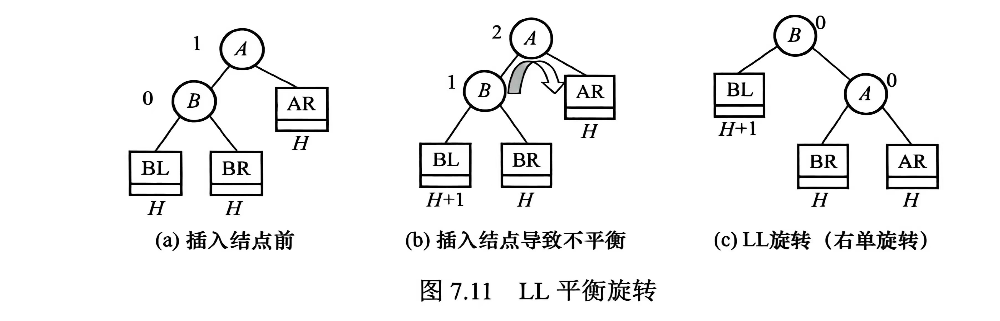

2.  **RR 旋转**（左单旋转）。由于结点 A 的右 (R) 孩子的右 (R) 子树上发生变化，以 A 为根的子树失去平衡，需要一次向左的旋转操作。

    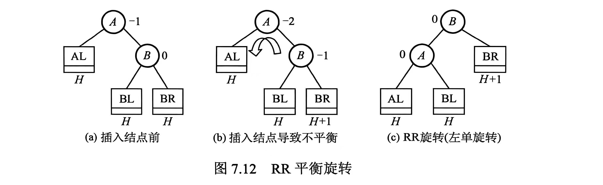

3.  **LR 旋转**（先左后右）。由于结点 A 的左 (L) 孩子的右 (R) 子树上发生变化，以 A 为根的子树失去平衡，需要先向左再向右的旋转操作。

    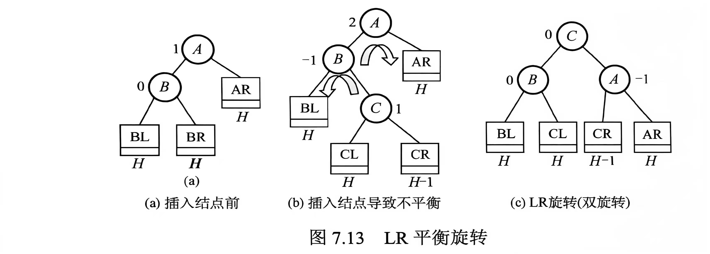

4.  **RL 旋转**（先右后左）。由于结点 A 的右 (R) 孩子的左 (L) 子树上发生变化，以 A 为根的子树失去平衡，需要先向右再向左的旋转操作。

    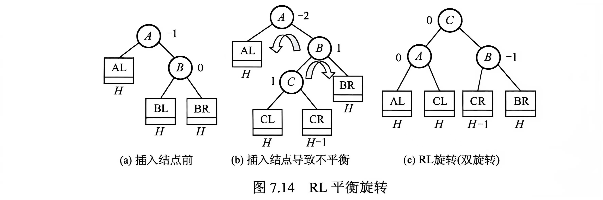

以 LL 旋转为例，实现代码可以是：

```cpp
struct Node {
    ElemType elem;
    Node* left;
    Node* right;
    int height;

};

// 在结点 A 的左孩子 B 的左子树结点变化，导致 A 处失衡
Node* LLrotate(Node* A) {
    Node* B = A->left;    // B 是 A 的左孩子
    Node* T2 = B->right;  // T2 是 B 的右子树

    // B 的原右子树成为 A 的左子树，A 旋转到右下作为 B 的新右子树，B 成为新的子树根结点
    B->right = A;
    A->left = T2;

    updateHeight(A);
    updateHeight(B);

    return B;
}
```

#### AVL 树的插删

AVL 的插删操作前半部分都和普通 BST 相同。但每次插删后都要检查查找路径上的某个结点是否失衡，如果失衡就需要调整。以下假设要插入/删除的结点是 w：

1.  使用 BST 的方法插入/删除 w；
2.  从 w 向上回溯，找到第一个不平衡的结点 z（最小不平衡子树的根）；
3.  根据树的情况进行相应的调整，例如 z 的左子树较高（设其根结点为 y），y 的左子树也较高（设其根结点为 x）时，应用 LL 旋转。

插删的不同之处在于，插入操作只需对以 z 为根的子树进行一次平衡调整（因为插入前是平衡的），而删除操作可能需要多次调整。若一次调整导致子树的高度 -1，则还可能对 z 的祖先结点进行平衡调整，甚至回溯到根结点。

#### AVL 树的查找效率

与 BST 一样，其查找效率主要取决于 **树的高度**。容易发现，拥有 n 个结点的 AVL 树最大深度为 $O(\log_2 n)$，因此平均的查找时间复杂度也就是 $O(\log_2 n)$。

### 红黑树

在上一节中，我们了解到 AVL 树为了保持其平衡性，在插删操作后可能会非常频繁地调整全树的整体拓扑结构，这带来了较大的开销。我们想平衡开销和性能，于是考虑放宽 AVL 树的平衡标准。这样我们引入了红黑树。一棵红黑树是满足如下性质的二叉排序树：

1.  每个结点要么是红色的，要么是黑色的；
2.  根结点是黑色的；
3.  叶结点（指虚构的外部结点）都是黑色的；
4.  **不存在两个相邻的红色结点**（红结点的父亲结点和孩子结点都是黑色的）；
5.  对每个结点，从该结点到任意一个叶结点的简单路径上，**所含黑色结点数量相同**。（注意这里红黑树是有向图，所以简单路径不包括向上层走）

为了保证任意一个实际存在的内部结点都有两棵非空子树，我们引入外部结点（NIL 结点）。如果不引入这个，那我们完全可以让红黑树也退化成一条链（红黑交替）。在实际应用中可以只实例化一个 NIL 结点，令所有内部结点的空指针域都指向它。

!!! Note "红黑树的有关数学推论"
    我们定义，从某个结点（不含它本身）到达一个叶结点的任意一个简单路径上的黑色结点种树称为该结点的 **黑高**（记为 `bh`）；根结点的黑高是红黑树的黑高。

    1.  从根到叶结点的最长路径 **不大于最短路径的两倍**。
    
        根据前面的性质 5，从根到任意叶结点的最短路径必然全由黑色结点构成。再由性质 4，最长路径必然由红色结点和黑色结点交替构成，此时黑色结点数量一定，红色结点的数量最多等于黑色结点的，因而得出结论。
    
    2.  有 n 个内部结点的红黑树高度 $h \leq 2\log_2(n+1)$。

        根据前面的结论，从根到叶结点（不含叶结点）的任意一条简单路径上至少有一半是黑色结点，因此根的黑高至少是 $h/2$。由此，$n \geq 2^{\displaystyle\frac{h}{2}} - 1$（每一个黑高最多对应一红一黑 2 个结点），因而得出结论。

#### 红黑树的插入

红黑树的插入前半部分都和普通 BST 相同。在插入新结点后可能会破坏红黑树的性质，于是此时我们还需要重新着色或进行旋转操作来调整，以恢复红黑树的基本性质。

!!! Note "新插入的结点初始应着为红色。"
    这是基于开销考量的。假设其一开始是黑色，那么该结点加入后所在路径的黑色结点树将比其他路径多 1，几乎必然违反性质 5，且调整代价较高。如果一开始是红色，则此时所有路径的黑色结点数量不变，且仅当父子同为红色是才破坏性质，进行局部调整即可。

设新插入的结点为 z。插入和调整的过程如下：

1.  用 BST 规则插入 z，并将其染成红色。若 z 的父结点为黑色，则红黑树的性质并未被破坏，插入结束。
2.  若 z 为根结点，则将其染成黑色。树的黑高 +1，插入结束。
3.  若 z 不是根结点且其父结点 z.p 为红色，则与性质 4 相悖。由于原来的树一定是红黑树，z.p 的父结点 z.p.p 必然存在且为黑色。此时，需要看叔结点 (uncle node，z.p 的兄弟) y 的情形：
    1.  y 是黑色的。（下图中情况 1 和 2 都在此类）
        
        1.  LR：y 是黑色的，且 z 是 z.p 的右孩子。此时先对 z.p 执行左旋，转化为情形 2.
        2.  LL：y 是黑色的，且 z 是 z.p 的左孩子。此时对 z.p.p 执行右旋，并将原父结点染黑、原祖父结点染红。
        3.  RL 和 RR 的情况分别和前两种情况对称。

        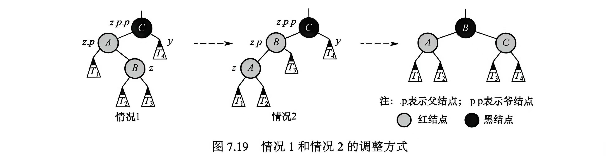

    2.  y 是红色的。
        
        此时无论 z 是 z.p 的左孩子还是右孩子都没有影响。此时先将 z.p 和 y 染成黑色，将 z.p.p 染成红色，以在局部恢复红黑树的性质 4 和 5。但 z.p.p 变红后，可能与其父结点产生红-红冲突（违背性质 4）。因此将 z.p.p 视作新的待调整结点继续向上回溯检查。

        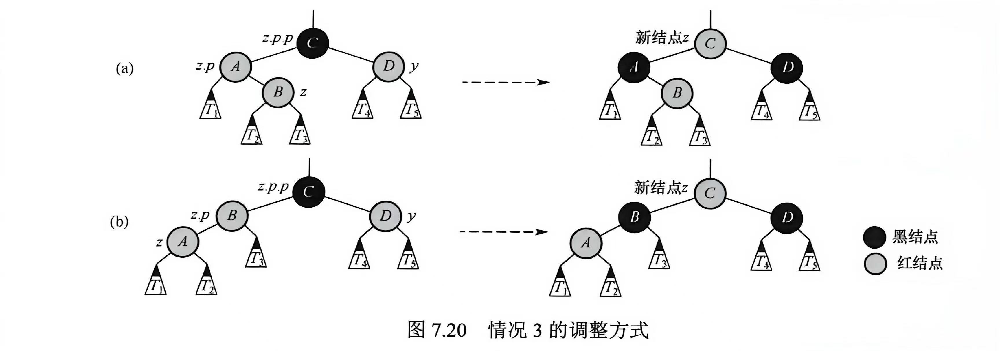

!!! Warning "所有调整操作必须考虑结点的子树。"
    尽管新结点最初总是插入在某个叶结点的位置，但在叔结点为红的情况中，"新结点"的指针可能已经上移至内部结点，从而拥有子树。因此，所有调整操作都必须考虑子树的存在。

#### ~~红黑树的删除~~

> 《王道》注释本节考察概率较低，在 ADS 实际的课程考试中也占比不大。

我们发现插入操作会可能破坏性质 4。删除操作则更容易破坏性质 5。当被删结点为黑色时，会导致经过该结点的所有路径黑高 -1（黑高亏损）。

设新插入的结点为 p。删除的过程如下：

1.  用 BST 规则删除 p。
    1.  若 p 有两棵非空子树，我们拿到 p 的中序遍历的直接前驱或直接后继，用其关键字（或数据）替换待删除结点的关键字（或数据），随后在原位置删除该前驱（或后继）结点。由于这样的中序前驱（或后继）在 p 的子树中一定是最大（最小）值，因此它只多只有一个左孩子（右孩子）。所以，删除操作都可以归结为下述两种情况：
    2.  p 有一个非空子树（有一个孩子）\[情况 A\]；
    3.  p 是终端结点（区别于 NIL 结点）\[情况 B\]。
2.  若为情况 A：那么有且仅有"p 只有右孩子"和"p 只有左孩子"两种情况，且 p 一定是黑色结点、p 的孩子 p.c 一定是红色结点。此时只需要进行旋转，让 p.c 替代 p，并将 p.c 染成黑色即可。
    
    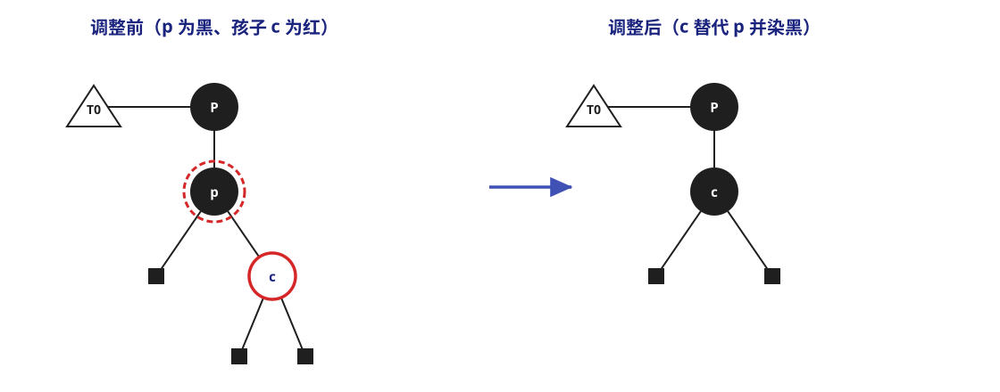
3.  若为情况 B：
    
    1.  p 是红色的。那么可以直接删除，不需要调整；
    2.  p 是黑色的。此时 NIL 结点替代 p 的位置，路径上会出现黑高亏损。此时我们需要从这个 NIL 结点开始进行删除调整。很多教材为了方便理解，设这个 NIL 结点为 **双黑结点**，因为路径上少了一个黑色结点，所以这个 NIL 结点多带了一层黑色。所以调整就是将双黑结点恢复成普通结点。假设这个 NIL 结点是 x，其兄弟结点是 w，将结点 * 的孩子记为 \*.lc/.rc，双亲记为 \*.p，那么可以细分为下面的几种情况，以 x 是 x.p 的左孩子为例：
        
        1.  w 是红色，w.lc 和 w.rc 都存在且是黑色。此时可以交换 w 和 x.p 的颜色，然后对 x.p 做一次左旋，那么 x.p.p = 原 w，x 的新兄弟结点 w' 是原 w 的孩子。现在，树的结构状态就转化成下面三种情况之一：
        
            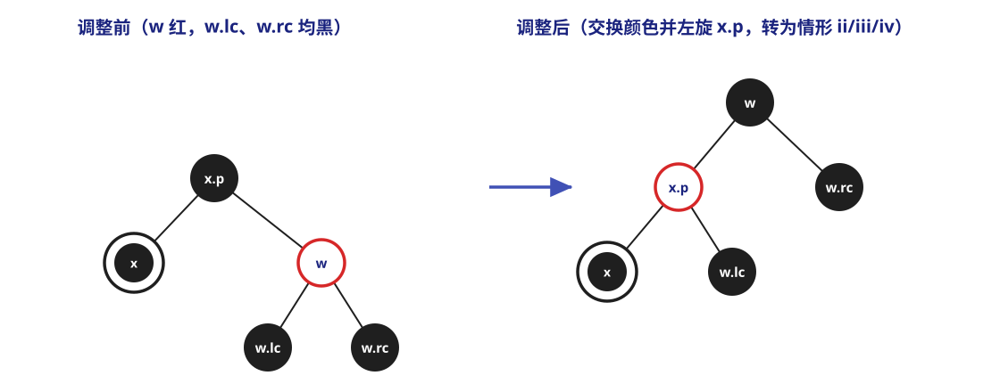

        2.  w 是黑色，且 w.rc 是红色 (RR)。此时可以交换 w 和 x.p 的颜色，把 w.rc 着为黑色并对 x.p 做一次左旋，x 就可以恢复单黑色，调整结束。
        
            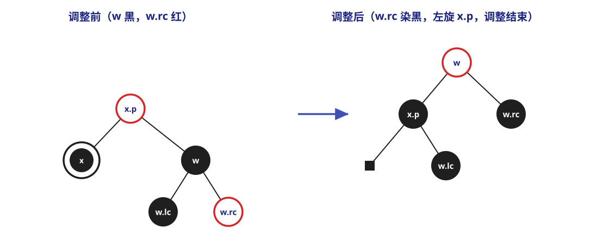

        3.  w 是黑色，且 w.lc 是红色 (RL)。此时可以交换 w 和 w.lc 的颜色，然后对 w 做一次右旋，这样这一情形就转化成了情形 ii。
        
            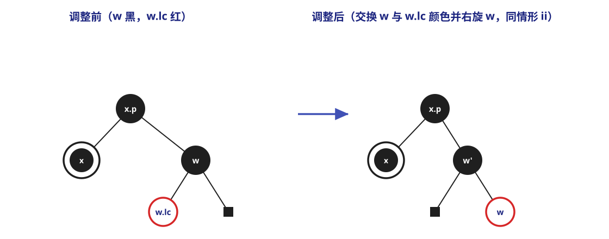

        4.  w 是黑色，且两个孩子都是黑色。此时可以从 w 和 x 上去掉一层黑色（x 恢复单黑，w 变成红色），为了补偿这一层黑色，将 x.p 加上一层黑色。对于情形 i 转化到情形 iv 的情况，可以发现此时 x.p 就是一层单黑，调整结束；对于其他情况，还需要让 x.p 作为新的 x 结点继续循环（"x" 被上移了一层）。
        
            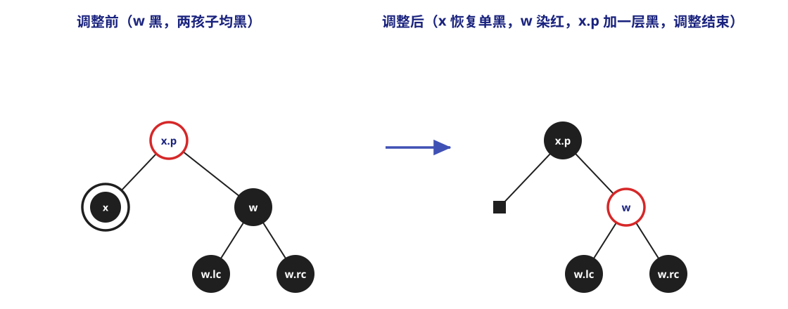
        
        x 作为 x.p 的右孩子时情况是对称的。

### B 树和 B+ 树

m 阶 B 树是一种自平衡的 m 路查找树，它或为空树，或是满足以下特性的 m 叉树：

1.  非叶的根结点至少有 2 个孩子，其余的所有非叶结点至少有 $\lceil \displaystyle\frac{m}{2} \rceil$ 个孩子；
2.  每个结点至多有 m 个孩子；
3.  若一个结点有 k 个孩子，则它本身恰包含 k-1 个关键字；
4.  同一结点中的关键字按照递增次序排列；
    
    若某结点含有关键字 $K_1 < K_2 < \dots < K_{n-1}$，并有 n 棵子树 $T_0, T_1, \dots, T_{n-1}$，则：

    $$
    \begin{gathered}
    T_0 中所有关键字 < K_1 \\
    K_i < T_i 中所有关键字 < K_{i+1}~~~(1 \leq i \leq k-2) \\
    T_{k-1} 中所有关键字 > K_{k-1}
    \end{gathered}
    $$

5.  所有叶结点均位于同一层。

!!! Warning "《王道》中说包括其自身在内的许多教材将叶结点定义为查找失败结点。为避免混淆，接下来我统一使用“外部结点”和“终端结点”。"

#### B 树的查找

B 树的查找包含两个基本操作：1) 在 B 树中定位目标节点；2) 在节点内查找关键字。

B 树通常是结点内部顺序存储，节点之间通过"指针"链接。单个结点内部通常是一个完整的数据块。

B 树常常存储在磁盘上，因此这些"指针"也往往是磁盘页号、块号或页面 ID；也是由于这个原因，前一个操作往往在磁盘上进行，将目标结点整体读到内存中来，再在内存中进行后一个操作。由于从磁盘读的时间远大于在内存访问的时间，所以在磁盘上的查找次数是决定查找效率的关键因素。

而磁盘的存取次数和树的高度成正比，我们下面来讨论 B 树的高度范围。设 $n \geq 1$，对于任意一棵包含 n 个 **关键字**、高度为 h、阶数为 m 的 B 树：

-   最小高度：每个结点拥有最多的关键字。在这种情况下，B 树最多可以容纳 $(m-1)(1+m+m^2+\dots+m^{h-1}) = m^h-1$ 个关键字，于是 $n \leq m^h-1$，$h \geq \log_m(n+1)$；
-   最大高度：每个结点拥有最少的关键字。在这种情况下，第 1 层有 1 个结点，第 2 层至少有 2 个结点；除根结点外，每个非叶结点至少有 $\lceil \displaystyle\frac{m}{2} \rceil$ 个孩子，以此类推，第 h+1 层至少有 $2(\lceil \displaystyle\frac{m}{2} \rceil)^{h-1}$。所以所以对包含 n 个关键字的 B 树，其外部结点恒有 n+1 个，于是 $n+1 \geq 2(\lceil \displaystyle\frac{m}{2} \rceil)^{h-1}$，$h \leq \log_{\lceil \displaystyle\frac{m}{2} \rceil}(\displaystyle\frac{n+1}{2}) + 1$。

也即树的高度的范围在 $\log_m(n+1) \leq h \leq \log_{\lceil \displaystyle\frac{m}{2} \rceil}(\displaystyle\frac{n+1}{2}) + 1$.

#### B 树的插入

将关键字 key 插入 B 树的过程可以大致分为：

1.  定位。这里我们只考虑 key 不在 B 树中的情况，因为 key 如果在树中，树只是做了一轮查找并没有发生结构变化。在这个条件下，插入必然发生在最底层的终端结点。
2.  插入、分裂。注意到每个非根结点的关键字个数必须维持在区间 $[\lceil \displaystyle\frac{m}{2} \rceil -1, m-1]$ 内。若该结点在插入 key 后关键字个数没有超过上限，则可直接插入无需后续考量；若关键字总数超过上限，则必须对该结点进行分裂。
    -   分裂：创建一个新结点，将插入 key 后的原结点从中间位置（一般取第 $\lceil \displaystyle\frac{m}{2} \rceil$ 个）将结点一分为二，左半部分保留在原结点，有伴部分移动至新结点中，中间位置的关键字本身被提升并插入原结点的父结点。若父结点因接收该关键字导致需要分裂，则对父结点递归进行分裂。这一过程可能一直向上传播直至根结点。若根结点也需要被分裂，则树高 +1.

#### B 树的删除

将关键字 key 从 B 树中删除同样需要先定位。回忆我们前面提到 B 树非根结点的关键字个数数量限制，在删除时我们同样需要关注关键字的数量。

以下我们只展开 key 在终端结点的情况。如果 key 在非终端结点，那么可以用 key 的前驱（左侧最近子树的最右下元素）或后继（右侧最近子树最左下元素）来替代 key，随后直接删除前驱/后继即可。注意到这里的前驱/后继一定在终端结点，因此这种情况是可以归结的。

-   若 key 被删除前所在结点拥有 $\geq \lceil \displaystyle\frac{m}{2} \rceil$ 个关键字，则可以 **直接删除**；
-   若 key 被删除前所在结点拥有 $\lceil \displaystyle\frac{m}{2} \rceil - 1$ 个关键字：
    -   若所在结点的相邻兄弟结点拥有 $\geq \lceil \displaystyle\frac{m}{2} \rceil$ 个关键字，则可以从兄弟结点 **借位**。可以使用*父子借位法*，请看图示。

        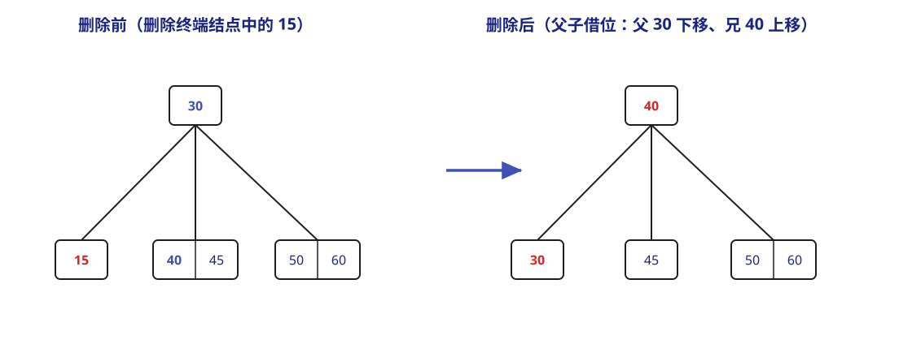

        例如上图的 4 阶 B 树（$m = 4$，非根结点至少含 $\lceil \displaystyle\frac{m}{2} \rceil - 1 = 1$ 个关键字）中删除终端结点中的 15：删除后左结点为空，而其兄弟结点 $[40, 45]$ 拥有 2 个关键字（$\geq \lceil \displaystyle\frac{4}{2} \rceil$），于是借位——父结点中分割它们的关键字 30 下移至左结点，兄弟结点中的最小关键字 40 上移至父结点，得到新的树。
    -   若所在结点的相邻兄弟结点也只拥有 $\lceil \displaystyle\frac{m}{2} \rceil - 1$ 个关键字，则删除 key 后，需要将原所在结点、其中一个相邻兄弟节点和父结点中分割它们的关键字 **合并** 为一个新结点。

        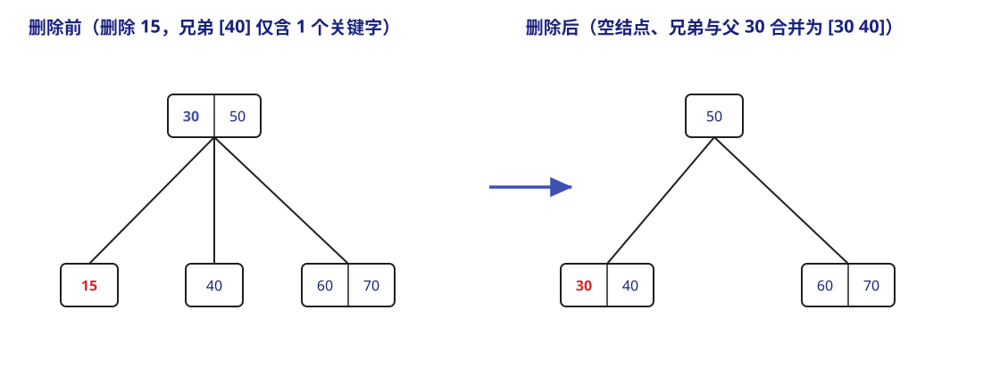

        例如上图的 4 阶 B 树中删除终端结点中的 15：删除后左结点为空，而其兄弟结点 $[40]$ 也只拥有 $\lceil \displaystyle\frac{4}{2} \rceil - 1 = 1$ 个关键字，无法借位，于是将空结点、兄弟结点 $[40]$ 与父结点中分割它们的关键字 30 合并为新结点 $[30, 40]$，得到新的树。

#### B+ 树

B+ 树是为了满足数据库系统高效检索的需求而设计的 **B 树变体**。一棵 B+ 树或者是空树，或者是满足下列条件的 m 叉树：

1.  每个分支结点最多有 m 个孩子；
2.  非叶的根结点至少有 2 个孩子，其余每个分支节点至少有 $\lceil \displaystyle\frac{m}{2} \rceil$ 个孩子；
3.  每个分支结点的关键字个数等于其孩子个数；
4.  所有关键字及其对应的记录指针均存储在叶结点中；叶结点内的关键字按升序排列，且相邻叶结点通过指针按关键字顺序链接，从而支持高效的顺序查找；
5.  所有分支结点（"索引的索引"）仅包含用于引导查找的关键字以及指向各子结点的指针。一般引导查找的关键字都是对应子结点中关键字的最大值。

!!! Note "m 阶 B 树和 B+ 树的主要差异"
    1.  结点的孩子和关键字的数量关系；
    2.  关键字的数量范围；
    3.  **关键字的存储位置**；
    4.  **结点的功能**；
    5.  对顺序查找的支持。

B+ 树的查找、插入和删除操作与 B 树基本类似。不过需要注意的是，在 B+ 树的查找过程中，即使在非叶结点遇到与给定关键字相等的值，查找也不会停止，而是一直到对应的叶结点。换句话说，无论查找成功与否，一次查找都能对应一条从根结点到某个叶结点的路径。

## 哈希表（散列表）

> 这一部分在《王道》中的组织顺序和在 FDS 课程中有些不一样。

在前面的查找中，查找特定的记录都需要进行一系列的关键词比较。而记录在表中的位置与其关键字之间并不存在映射关系，因此这些结构的查找效率取决于关键字的比较次数。有没有能够让关键字和位置对应起来来加快查找的办法？

**哈希表** 就是这样一种数据结构，它通过把关键字值映射到表中一个位置来访问记录，以加快查找的速度。它同样支持查询、插入、删除等操作。**哈希函数**（Hash 函数，或称散列函数）是一种将关键字映射到对应存储地址的函数。这里的地址可以是数组下标、索引或内存地址等，即对于关键字（或称标识符，identifier）$x$，哈希函数 $f(x)$ 表示 $x$ 在表中的位置。也因此，在理想情况下对哈希表进行查找的时间复杂度为 $O(1)$，与表中元素的数量无关。

我们设一个哈希表有 b 个桶 (bucket，也即哈希函数的取值范围)，每个桶有 s 个槽 (slot，也即一个哈希值可以对应多少记录)。我们记 T 表示 $x$ 可能的取值的个数，n 表示表中已经有的标识符数量，那么

-   标识符密度定义为 $\displaystyle\frac{n}{T}$
-   装载密度 $\lambda = \displaystyle\frac{n}{bs}$（《王道》中称为装载因子 $\alpha = \displaystyle\frac{n}{散列表长度}$）。

当存在 $x_1 \neq x_2$ 但是 $f(x_1) = f(x_2)$ 的情况，我们称之为发生了 **碰撞** 或 **冲突** (collision)。当哈希表的一个桶已经装满但仍然有新的标识符插入时，我们称发生了 **溢出** (overflow)。

### 哈希函数

构造哈希函数时需要注意以下几点：

1.  哈希函数的定义域必须包含全部关键字，而值域由哈希表的大小决定；
2.  哈希函数应该让取到每个值的概率相等 (unbiased)，即 $P(f(x) = i) = \displaystyle\frac{1}{b}$，这样的哈希函数被称为均匀哈希函数；
3.  哈希函数应该尽量简单、易于计算；
4.  哈希函数计算出的地址应该尽可能均匀地分布在整个地址空间，以有效减少冲突。

一些常用的哈希函数（以下均以 $H(x)$ 表记）：

-   直接定址法。直接取关键字的某个线性函数作为哈希地址。$H(x) = ax + b$，其中 $a, b$ 是常数；
-   除留余数法。$H(x) = x \% p$。这是最常用的哈希函数构造，其关键在于对 $p$ 的选择，合理的选择能够让不同关键字近似等概率地落在散列空间的各个位置。一般，$p$ 是一个不超过且尽可能接近哈希表长度 (TableSize) 的 **质数**；
-   数字分析法。分析关键字各位上的数码，选取数码分布较为均匀的数位，组合它们构成哈希地址。很显然，该方法适用于已知且固定的关键字集合，集合发生变动时需要重新构造；
-   平方取中法。取关键字平方值的中间几位作为散列地址。平方运算与关键字的每一位都有关系，因此哈希地址的分布较为平均。

### 处理冲突的方法

任何哈希函数都无法绝对避免冲突，所以一个有效的冲突处理机制也十分重要。

#### 链接法（分离链接法）

我们称发生冲突的不同关键字为 **同义词**。那么为了处理冲突，可以将哈希映射到同一个桶（同一哈希地址）的所有同义词组织为一个链表。

??? Example "采用链接法实现哈希查找：代码"
    ```cpp
    // 结构体定义
    struct ListNode;
    typedef struct ListNode *Position;
    struct HashTbl;
    typedef struct HashTbl *HashTable;
    struct ListNode {
        ElementType Element;
        Position Next;
    };
    typedef Position List;
    struct HashTbl {
        int TableSize;
        List *TheLists;
    };

    HashTable initializeTable(int tableSize) {
        HashTable H;
        if (tableSize < minTableSize) {
            printf("Table size too small");
            return NULL;
        }
        H = malloc(sizeof(struct HashTbl));
        if (H == NULL) Error("Out of space!!!");
        H->TableSize = nextPrime(tableSize);
        H->TheLists = malloc(sizeof(List) * H->TableSize);
        if (H->TheLists == NULL) Error("Out of space!!!");
        for (int i = 0; i < H->tableSize; ++i) {
            H->TheLists[i] = malloc(sizeof(struct ListNode));
            if (H->TheLists[i] == NULL) Error("Out of space!!!");
            else H->TheLists[i]->Next = NULL;
        }
        return H;
    }

    Position find(ElementType key, HashTable H) {
        Position P; List L;
        L = H->TheLists[hash(key, H->TableSize)];
        P = L->Next;
        while (P != NULL && P->Element != key) P = P->Next;
        return P;
    }

    void insert(ElementType key, HashTable H) {
        Position pos, newCell; List L;
        pos = find(key, H);
        if (pos == NULL) {
            newCell = malloc(sizeof(struct ListNode));
            if (newCell == NULL) Error("Out of space!!!");
            else {
                L = H->TheLists[hash(key, H->TableSize)];
                newCell->Next = L->Next;
                newCell->Element = key;
                L->Next = newCell;
            }
        }
    }
    ```

#### 开放地址法

名字中的"开放"意指哈希表中的所有空闲地址均可用于存放任意关键字。当有冲突发生时，尝试选择其它单元，直到找到空的为止。地址探测序列由以下递推式给出：

$$
H_i(x) = (H(x) + d_i) \% m
$$

其中 $H(x)$ 为初始哈希函数，$d_i (i = 1, 2, \dots, k; k \leq m - 1)$ 为第 i 次探测的增量，$m$ 是哈希表长度。

增量序列一旦确定，对应的冲突处理方法也就被确定了。常见的增量序列取法有以下几种：

-   **线性探测**。$d_i = i$。
    -   冲突发生时，依次查看表中下一个单元。如此循环，只要表未满，必能找到一个空闲单元。
    -   会导致聚集 (clustering) 现象：原本映射到地址 i 的同义词被映射到 i+1，而本应该存入 i+1 的元素则被迫占用 i+2，以此类推。这会导致大量元素在相邻地址上聚集，搜索次数会变得非常大。
        -   使用线性探测的探测次数对于插入和不成功查找来说，约为 $\displaystyle\frac{1}{2}(1 + \displaystyle\frac{1}{(1+\lambda)^2})$
        -   而对于成功查找来说，需要约 $\displaystyle\frac{1}{2}(1 + \displaystyle\frac{1}{1+\lambda})$
-   **二次探测**（平方探测）。$d_i = i^2$（王道给出的另一序列是 $1^2, -1^2, 2^2, -2^2, \dots, k^2, -k^2$）。
    -   如果哈希表长度为质数，当表至少有一半是空的时，使用二次探测总能插入一个新的元素。
    -   这是因为二次探测虽然未必能探测所有哈希表中的位置，但至少也可以覆盖一半的地址空间。

    ??? Example "二次探测下查找和插入的代码实现"
        -   查找（利用增量递推关系 $d_i = d_{i-1} + i^2 - (i-1)^2 = d_{i-1} + 2i -1$）

            ```cpp
            Position find(ElementType key, HashTable H) {
                Position currentPos = hash(key, H->TableSize);
                int collisionNum = 0;
                while (H->TheCells[currentPos].Info != Empty && 
                    H->TheCells[currentPos].Element != key) {
                    currentPos += 2 * ++collisionNum - 1;
                    if (currentPos >= H->TableSize) currentPos -= H->TableSize;
                }
                return currentPos;
            }
            ```
        -   插入

            ```cpp
            void insert(ElementType key, HashTable H) {
                Position pos = find(key, H);
                if (H->TheCells[pos].Info != Legitimate) {
                    H->TheCells[pos].Info = Legitimate;
                    H->TheCells[pos].Element = key;
                }
            }
            ```

-   **双重哈希**。该方法使用两个哈希函数，设第二个哈希函数 $H'(x)$，则 $d_i = iH'(x)$。
    -   这样探测序列就变成 $H_i(x) = (H(x) + iH'(x)) \% m$，其中初始位置 $H_0(x) = H(x)$。
    -   双重哈希虽然按确定的规则寻找空位，但如果设计得好，它的平均查找效率会很接近"随机选择探测位置"的理想情况。
    -   二次探测不需要使用第二个哈希函数，所以相比之下二次探测更为简单快速。
-   **伪随机序列**。增量序列由一个伪随机数生成器产生。

#### 再哈希 (rehashing)

> 《王道》中没有涉及这部分的内容。这一节应该对应 FDS 的最后一讲。

使用二次探测解决冲突时，如果表的元素过多，那么操作时间可能会过长，而且可能插入失败。这时常用的解决办法就是 **再哈希**：

-   建立一个两倍大的哈希表；
-   扫描原始哈希表；
-   利用新的哈希函数将元素映射到新的哈希值，并插入。

如果有原来的哈希表有 N 个元素，则再哈希的时间复杂度为 $O(N)$。进行再哈希的情况往往是：

-   表填满一半了或当哈希表达到了某一个特定的装载密度时；
-   插入失败；...

#### 哈希查找的性能

哈希表的 ASL 主要取决于哈希函数、冲突处理方法装载密度（装填因子）。下面是一个具体的例子：

!!! Example
    已知关键字序列 {19, 14 ,23, 01, 68, 20, 84, 27, 55, 11, 10, 79} 存储在散列表中，散列函数 $H(\text{key}) = \text{key} \% 13$，采用线性探测法处理冲突，所得的散列表 L 如下图所示：

    <table class="fl_table" style="margin-top: 0.6em">
    <thead>
        <tr class="fl-bit-row">
        <th scope="col">0</th>
        <th scope="col">1</th>
        <th scope="col">2</th>
        <th scope="col">3</th>
        <th scope="col">4</th>
        <th scope="col">5</th>
        <th scope="col">6</th>
        <th scope="col">7</th>
        <th scope="col">8</th>
        <th scope="col">9</th>
        <th scope="col">10</th>
        <th scope="col">11</th>
        <th scope="col">12</th>
        <th scope="col">13</th>
        <th scope="col">14</th>
        <th scope="col">15</th>
        </tr>
    </thead>

    <tbody>
        <tr>
        <td class="fl-table-node"></td>
        <td class="fl-table-node"></td>
        <td class="fl-table-node"></td>
        <td class="fl-table-node">10</td>
        <td class="fl-table-node">11</td>
        <td class="fl-table-node">23</td>
        <td class="fl-table-node">79</td>
        <td class="fl-table-node">84</td>
        <td class="fl-table-node">20</td>
        <td class="fl-table-node">19</td>
        <td class="fl-table-node">55</td>
        <td class="fl-table-node">27</td>
        <td class="fl-table-node">68</td>
        <td class="fl-table-node">01</td>
        <td class="fl-table-node">14</td>
        <td class="fl-table-node"></td>
        </tr>
    </tbody>
    </table>

    我们现在要查找 84：初始散列地址 $H(84) = 6$，发现 L[6] = 19 不是 84，冲突。$H_1 = (6+1) \% 16 = 7$，发现 L[7] = 20 不是 84。$H_2 = (6+2) \% 16 = 8$，L[8] = 84，查找成功，返回地址。

    对所有关键字计算查找次数，取平均可以得到 ASL：$\text{ASL} = \displaystyle \frac{1 \times 6 + 2 + 3 \times 3 + 4 + 9}{12} = 2.5$。