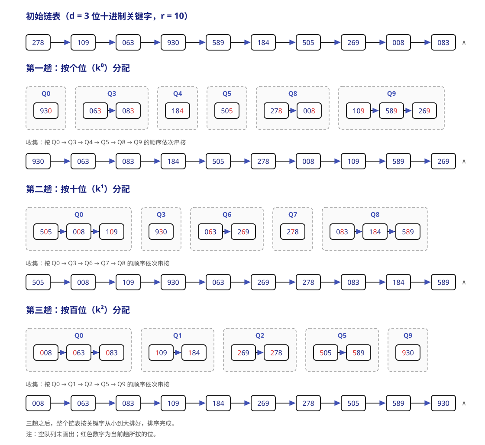

# 排序

排序就是指将表中的元素重新排列使之按关键字有序的过程。对于排序算法，我们有如下几个关注点：

1.  根据数据是否全部放在内存中，我们可以将排序算法分为 **内部排序** 和 **外部排序** 两类。内部排序在排序期间所有元素都放在内存中，外部排序在排序期间则需要频繁地在内外存之间交换数据。
2.  内部排序在执行过程中主要涉及 **比较和移动** 两种基本操作。但并非所有的内部排序都基于比较（例如，基数排序）。内部排序算法的性能主要由其 **时间复杂度** 和 **空间复杂度** 决定，而时间复杂度通常取决于比较和移动的操作次数。
3.  排序算法的稳定性。若排序表中有两个元素 $R_i$ 和 $R_j$，其关键字相同，在排序之前 $R_i$ 在 $R_j$ 之前。若使用某一排序算法后，这两个元素的 **相对位置** 仍然不变，就称这个算法是稳定的，反之称为不稳定。稳定性并不是衡量算法优劣的标准，只是其性质之一。进一步地，当关键字互不相同时，排序结果是唯一的，此时算法是否稳定就无关紧要了。

## 插入排序

这类排序算法的基本思想是：每次将一个待排序的记录，按其关键字大小插入到前面已经排好序的子序列中，直至所有记录都插入完毕。

### 直接插入排序

简单直观的一种排序算法。对于一个待排序表 `L[1...n]`，假设其子序列 `L[1...i-1]` 已经有序，需要将 `L(i)` 插入到该已有序的子序列中，同时后面还有无序序列 `L[i+1...n]`：

1.  查找 `L(i)` 在 `L[1...i-1]` 中的插入位置 k；
2.  将 `L[k...i-1]` 中的所有元素依次后移一个位置；
3.  将 `L(i)` 放入位置 k。

直接插入排序通常采用原地排序（空间复杂度 $O(1)$）。

```cpp
void InsertSort(ElemType a[], int n) {
    int i, j, temp;
    for (i=1; i<n; i++) {
        if (a[i] < a[i-1]) {            // 如果关键字小于前驱，那么往前插入
            temp = a[i];                // 复制暂存
            for (j=i-1; temp<a[j]; --j) // 从后往前查找待插入位置
                a[j+1] = a[j];          // 向后挪位
            a[j+1] = temp;              // 插入
        }
    }
}
```

可以看到，直接插入排序

-   在空间效率上，仅使用常数个辅助单元，复杂度为 $O(1)$；
-   在时间效率上，整个排序过程共进行 n-1 趟操作，每一趟包括关键字比较和元素移动，具体取决于初始序列的状态。
    -   最好情况下，表中的元素已经有序。此时每趟只需要一次且无需移动，时间复杂度为 $O(n)$；
    -   最坏情况下，表中的元素完全逆序。此时每趟需要比较 i-1 次并且移动 i-1 个元素，总的时间复杂度为 $O(n^2)$；
    -   平均情况下，表中的元素随机分布。平均的比较次数和移动次数都约为 $\displaystyle \frac{n^2}{4}$，故时间复杂度仍为 $O(n^2)$。所以总的来说直接插入排序的时间复杂度是 $O(n^2)$。

    !!! Tip "时间复杂度的分析"
        对于排序算法，我们常常一并考虑最好情况、最坏情况和平均情况的时间复杂度。

-   是稳定的排序算法。因为它总是从后往前比较，而且在找到插入位置后才移动元素，所以关键字相同的元素相对顺序不变。
-   适用于顺序存储和链式存储的线性表。注意采用链式存储时不需要移动元素（改换指针即可）。

### 二分插入排序

有没有可能改进直接插入排序？我们发现，每趟插入其实分为两项：查找待插入元素的正确位置、腾出空间放入待插入元素。一个比较简单的想法就是从查找位置作为切入点。于是诞生了 **二分插入排序**：先通过二分查找确定插入位置，再统一移动元素。

```cpp
void BInsertSort(ElemType a[], int n) {
    int i, j, low, high, mid, temp;
    for (int i=1; i<n; i++) {
        temp = a[i];
        low = 1; high = i-1;
        while (low <= high) {                // 二分查找
            mid = (low+high)/2;
            if (a[mid] > temp) high = mid-1;
            else low = mid+1;
        }
        for (j=i-1; j>=high+1; --j)
            a[j+1] = a[j];                   // 从后往前，统一后移元素
        a[high+1] = temp;                    // 插入
    }
}
```

二分插入排序

-   在空间效率上，与直接插入排序相同，复杂度为 $O(1)$；
-   在时间效率上，减少了关键字的比较次数，这部分的复杂度约为 $O(n \log_2 n)$，仅取决于元素个数，但元素的移动次数并未减少，仍然依赖初始序列的状态；综合来看总体的时间复杂度仍为 $O(n^2)$；
-   是稳定的排序算法，与直接插入排序相同。
-   由于二分查找的适用性，只适用于顺序存储的线性表。

### 希尔排序

根据前面的分析，我们知道直接插入排序更适用于基本有序或数据量较小的场景。**希尔排序** (Shell's sort) 正是基于这一特性对直接插入排序进行改进，也称为缩小增量排序。

希尔排序的基本思想是：通过逐步缩小增量的方式，对表中相隔一定距离的元素构成的子序列进行多次直接插入排序，使得整个表逐渐趋于基本有序，最终通过一趟完整的直接插入排序完成全局排序。

具体而言，希尔排序

1.  首先选取一个小于元素总数 n 的初始增量 $d_1$，将待排序表划分为 $d_1$ 个子序列，每个子序列中包含下标间隔为 $d_1$ 的记录；
2.  对各子序列分别进行直接插入排序；
3.  随后依次取更小的增量 $d_2, d_3, \dots$（满足 $d_1 > d_2 > \dots > d_k = 1$），重复分组与排序操作。
4.  当增量减至 1 时，所有记录同属一个子序列，此时执行最后一趟直接插入排序即可获得最终结果。

```cpp
void ShellSort(ElemType a[], int n) {
    int dk, i, j, temp;
    for (dk=n/2; dk>=1; dk/=2)      // 增量变化（仅做示例）
        for (i=dk; i<n; ++i)
            if (a[i] < a[i-dk]) {   // 子序列中元素非增序，需要将 a[i] 插入
                temp = a[i];
                for (j=i-dk; j>=0 && temp<a[j]; j-=dk)
                    a[j+dk] = a[j]; // 从后往前，元素后移
                a[j+dk] = temp;
            }
}
```

希尔排序

-   在空间效率上，同样仅使用常数个辅助单元，复杂度为 $O(1)$；
-   在时间效率上，其时间复杂度依赖于所选的增量序列。当 n 在常见范围时，时间复杂度约为 $O(n^{1.3})$；在最坏情况下会退化为 $O(n^2)$。

    !!! Tip "提示"
        目前仍然未找到理论上的最优增量序列，这个问题仍然是数学中的未解难题。因此想要精确讨论希尔排序的时间复杂度较为困难。

-   不是一个稳定的排序算法。因为相同关键字的记录被划分到不同的子序列时，算法可能会改变它们的相对位置。
-   只适用于顺序存储的线性表。

## 交换排序

### 冒泡排序

基本思想是：从后往前（或从前往后）依次比较相邻元素的关键字，若为逆序则交换它们的位置。每一趟排序都会将当前未排序的部分中的最小（或最大）元素放到其最终位置，好比气泡上浮到水面。如此最多进行 n-1 趟冒泡即可完成整个排序。

```cpp
void BubbleSort(ElemType a[], int n) {
    for (int i=0; i<n-1; i++) {
        bool flag = false;          // 表示本趟冒泡是否发生交换
        for (int j=n-1; j>i; j--)
            if (a[j-1] > a[j]) {    // 若为逆序就交换
                swap(a[j-1], a[j]);
                flag = true;
            }
        if (flag == false)
            return;                 // 遍历后没有交换说明已经有序
    }
}
```

冒泡排序

-   在空间效率上，仅使用常数个辅助单元，复杂度为 $O(1)$；
-   在时间效率上，
    -   最好情况下，初始序列即有序，此时仅需一趟冒泡，n-1 次比较、0 次移动，时间复杂度 $O(n)$；
    -   最坏情况下，初始序列为逆序，此时需要 n-1 趟排序，其中第 i 项进行 n-i 次比较，每次比较后需要三次移动来交换位置。所以总比较次数是 $\displaystyle \frac{n(n-1)}{2}$，总移动次数是 $\displaystyle \frac{3n(n-1)}{2}$，因此最坏情况下时间复杂度为 $O(n^2)$；
    -   平均情况下，时间复杂度也是 $O(n^2)$；
-   是稳定的排序算法。因为先比较再移动，相等的元素不会被交换。
-   适用于顺序存储和链式存储的线性表。

### 快速排序

快速排序（Quick Sort）是对冒泡排序的一种改进，其核心是 **分治**。对于待排序表 `a[low...high]`，任取一个元素作为 **枢轴**（pivot，通常取当前子表的首元素），通过一趟 **划分**（partition）把表分成两部分：

-   `a[low...pivotpos-1]` 中的所有元素均不大于枢轴；
-   `a[pivotpos+1...high]` 中的所有元素均不小于枢轴；
-   枢轴被放到 `a[pivotpos]`，此时它已经处于最终位置。

随后分别对枢轴左右两个子表递归地执行相同操作，直到子表为空或只含一个元素。注意，一次划分只保证 **枢轴归位** 以及左右两部分之间的大小关系，**并不保证两个子表内部已经有序**。

下面采用常见的“双指针交替扫描（挖坑法）”来具体说明。先暂存首元素作为枢轴，于是 `low` 处形成一个空位；再让 `high`、`low` 交替向中间扫描：

1.  `high` 从右向左寻找小于枢轴的元素，将它移到左侧空位；
2.  `low` 从左向右寻找大于枢轴的元素，将它移到右侧空位；
3.  重复上述过程，直到 `low == high`，最后把枢轴放入该位置。

```cpp
int Partition(ElemType a[], int low, int high) {
    ElemType pivot = a[low];               // 以当前子表的首元素为枢轴
    while (low < high) {
        while (low < high && a[high] >= pivot)
            --high;                        // 从右向左找小于枢轴的元素
        a[low] = a[high];
        while (low < high && a[low] <= pivot)
            ++low;                         // 从左向右找大于枢轴的元素
        a[high] = a[low];
    }
    a[low] = pivot;                        // 枢轴归位
    return low;                            // 返回枢轴的最终位置
}

void QuickSort(ElemType a[], int low, int high) {
    if (low < high) {
        int pivotpos = Partition(a, low, high);
        QuickSort(a, low, pivotpos-1);      // 递归排序左子表
        QuickSort(a, pivotpos+1, high);     // 递归排序右子表
    }
}
```
!!! Note "一些小细节"
    若要排序含 n 个元素的数组，初次调用 `QuickSort(a, 0, n-1)`。划分时必须先移动 `high`，因为首元素已被取作枢轴，最初的空位在左端；两个内层循环中的 `low < high` 也不可省略。对于含有相同关键字的序列，比较条件中的 `>=` 和 `<=` 能保证指针继续移动，避免停在相等元素处。

以序列 `[49, 38, 65, 97, 76, 13, 27, 49]` 为例，取第一个 `49` 为枢轴，一趟划分的主要过程为：

| 操作 | 序列状态 |
| --- | --- |
| 暂存枢轴 `49` | `[__, 38, 65, 97, 76, 13, 27, 49]` |
| 右侧找到 `27`，填入左侧空位 | `[27, 38, 65, 97, 76, 13, __, 49]` |
| 左侧找到 `65`，填入右侧空位 | `[27, 38, __, 97, 76, 13, 65, 49]` |
| 右侧找到 `13`，填入左侧空位 | `[27, 38, 13, 97, 76, __, 65, 49]` |
| 左侧找到 `97`，填入右侧空位 | `[27, 38, 13, __, 76, 97, 65, 49]` |
| 双指针相遇，枢轴归位 | `[27, 38, 13, 49, 76, 97, 65, 49]` |

此时枢轴左边的元素都不大于 `49`，右边的元素都不小于 `49`，但左右子表仍需继续递归排序。

快速排序

-   在空间效率上，由于采用递归实现，空间开销主要来自递归工作栈，因此 **空间复杂度等于递归深度**：最好和平均情况下为 $O(\log_2 n)$，最坏情况下为 $O(n)$；
-   在时间效率上，其运行时间取决于每次划分是否均衡，比较次数和移动次数都与初始序列以及枢轴的选择有关。对长度为 m 的子表进行一趟划分需要 $O(m)$ 的时间。
    -   最好情况下，每次枢轴都把子表近似等分，递归树高度为 $O(\log_2 n)$，时间复杂度为 $O(n\log_2 n)$；
    -   最坏情况下，每次枢轴都是当前子表中的最小或最大元素，只能得到长度为 0 和 m-1 的两个子表，此时时间复杂度为 $O(n^2)$。按上述“首元素为枢轴”的实现，初始序列有序或逆序时会出现这种情况；所有元素均相等时也会产生严重不均衡的划分；
    -   值得注意的是，平均情况通常接近最好情况而远优于最坏情况，因此认为平均情况时间复杂度为 $O(n\log_2 n)$。

    快速排序通常被认为是 **平均性能最好** 的内部排序算法之一。

-   不是稳定的排序算法。划分时会跨越较长距离移动元素，可能改变相同关键字记录的相对次序。例如 `[3a, 2, 3b, 1]` 以 `3a` 为枢轴划分后，`3b` 会移动到 `3a` 之前；
-   采用上述实现时主要适用于顺序存储的线性表，不适合直接用于仅能顺序访问的单链表，因为要求能够随机访问元素；

#### 快速排序的改进

枢轴的选择决定了划分是否均衡。可以随机选择枢轴，或采用 **“三数取中”法** 从首、中、尾三个元素中选择中间值，以降低连续出现极端划分的概率；但这些方法并没有改变快速排序最坏时间复杂度为 $O(n^2)$ 的结论。

实际实现中还常在子表规模很小时改用直接插入排序，或优先递归处理较短子表、用循环处理较长子表，以减小递归栈深度。相同关键字很多时，可使用三路划分把序列分成“小于、等于、大于枢轴”三部分。

!!! Tip "注意"
    “初始序列有序时快速排序最慢”只对固定选取首元素或尾元素等特定枢轴策略成立；若每次都能选到当前子表的中间值作为枢轴，即使原序列有序，也能得到均衡划分。一次划分后只有枢轴必然到达最终位置，不能把划分得到的左右子表误认为已经有序。

## 选择排序

选择排序的基本思想是，每一趟在待排序元素中选取一个关键字最小（或最大）的元素加在有序子序列的一端。这样直到最后一趟排序完成，剩下一个待排序元素而无需再选（已经有序）。

### 简单选择排序

假设排序表为 `L[1...n]`，第 i 趟排序可以从 `L[i...n]` 中选择关键字最小的元素并将其与 `L(i)` 交换，这样每一趟排序均可以确定一个元素的最终位置。

```cpp
void SelectSort(ElemType a[], int n) {
    for (int i=0; i<n-1; i++) {
        int min = i;                        // 初始化最小元素位置
        for (int j=i+1; j<n; j++)
            if (a[j] < a[min]) min = j;     // 更新最小元素位置
        if (min != i) swap(a[i], a[min]);
    }
}
```

可以看到，简单选择排序

-   在空间效率上，仅使用常数个辅助单元，空间复杂度 $O(1)$;
-   在时间效率上，移动元素的次数最多不超过 3(n-1) 次，最少 0 次；但总比较次数和初始序列状态无关，恒为 $\displaystyle \frac{n(n-1)}{2}$ 次。所以时间复杂度恒为 $O(n^2)$。
-   不是稳定的排序算法。因为依据比较的表达式不同，相同关键字的记录的相对位置可能会被改变。
-   适用于顺序存储和链式存储的线性表。尤其适合关键字较少的情况。

### 堆排序

这里的堆 (heap) 逻辑上可以表述为一种树形结构（**完全二叉树**），其满足：

1.  任意父结点的元素均大于其所有子结点，或者
2.  任意父结点的元素均小于其所有子结点。

或者表述为一个关键字序列 `L[1...n]`，满足（$1 \leq i \leq \lfloor \displaystyle \frac{n}{2} \rfloor$）：

1.  `L(i)` $\geq$ `L(2i)` 且 `L(i)` $\geq$ `L(2i+1)`，或者
2.  `L(i)` $\leq$ `L(2i)` 且 `L(i)` $\leq$ `L(2i+1)`。

满足条件 1) 的堆称为大根堆，满足条件 2) 的堆称为小根堆。

!!! Note "堆（二叉堆）的基本操作"
    以小根堆为例。

    -   插入 (Insertion) 与上滤 (Percolate Up)：
        -   为了保持完全二叉树的形状，首先在树的末尾（数组最后一个有效位置的后一个位置）创建一个“空穴”；
        -   然后将待插入的新元素与空穴的父节点比较，如果新元素更小，就将父节点的值下移填入空穴，空穴随之上移。不断重复这个比较和上移的过程（即上滤），直到找到合适的位置，填入待插入的元素。
        -   单次操作时间复杂度为 $O(\log_2 n)$。

        !!! Tip "“哨兵”"
            利用数组索引 `0` 放置一个比所有可能输入都小的“哨兵”值，可以省去循环中判断越界的开销。

    -   删除 (Deletion) 与下滤 (Percolate Down)：
        -   最小元素就是根节点，直接将其删除，此时根部留下一个“空穴”；
        -   随后取出堆中最后一个元素。比较空穴的两个子节点，选出较小的一个，将该子节点上移填入空穴，空穴随之下移。重复这个过程（即下滤），直到堆中的最后一个元素能够合法放入空穴。
        -   单次操作时间复杂度同样为 $O(\log_2 n)$。

堆排序的基本思路是，首先将待排序序列构建成初始堆。随后，每次取出堆顶元素（小根堆就是取最小，大根堆就是取最大），剩下的元素重新调整为堆（删除、下滤）。

!!! Note "线性建堆算法"
    -   如果我们要将 n 个无序的数据直接转换为一个二叉堆，逐个调用 $O(\log_2 n)$ 的插入上滤操作效率是不够的（这样的话时间复杂度是 $O(n \log_2 n)$）。
    -   更高效的算法是：将数据原封不动放入树形结构后，**从最后一个拥有子节点的父节点开始，依次向前倒序遍历，并对每个节点执行一次下滤操作**（《王道》：按自底向上的顺序，依次对每个分支节点执行自上而下的筛选操作，若其不满足堆的性质，则调整其对应的子树）。通过数学证明，这种方式的整体时间复杂度可以优化为 $O(n)$。

!!! Tip "上滤和下滤"
    读者可能会发现，上滤操作事实上在堆排序中是没有参与的。《王道》中也只讲解了类似“下滤”的操作（堆的调整）。在取出堆顶元素需要重新调整堆时：

    -   将堆底元素（堆中最后一个元素）放到堆顶；
    -   自上而下进行比较筛选，例如，若是小根堆，将新堆顶和其左右孩子中的较小者比较，若大于该结点则交换它们，重复此过程直至堆性质恢复。

    这个过程本质上和前面讲解的下滤没有区别。事实上我们课堂上讲到的下滤也用的是和这个讲解类似的实现。

建堆算法的实现（这里以小根堆为例）：
```cpp
void BuildMaxHeap(ElemType a[], int len) {
    for (int i=len/2; i>0; i--)
        PercolateDown(a, i, len);   // 反复调整子树
}

void PercolateDown(ElemType a[], int k, int len) {
// 对以 a[k] 为根的子树进行调整
    a[0] = a[k];                    // a[0] 暂存子树根结点
    for (int i=2*k; i<=len; i*=2) {
        if (i<len && a[i+1]<a[i])   // 沿关键字较小的子结点向下；
                                    // 默认取左孩子（因为可能没有右孩子）
            i++;
        if (a[0] <= a[i]) break;    // 好结局：下滤结束
        else {
            a[k] = a[i];            // 将较小结点上移
            k = i;                  // 赋值开始新一轮下滤
        }
    }
    a[k] = a[0];                    // 被下滤的值放到最终位置
}
```

那么写一个堆排序算法就很简单了：

```cpp
void HeapSort(ElemType a[], int len) {
    BuildMaxHeap(a, len);
    for (int i=len; i>1; i--) {
        swap(a[i], a[1]);           // 与堆底元素交换，输出堆顶元素
        PercolateDown(a, 1, i-1);   // 重新整理为堆
    }
}
```

堆排序

-   在空间效率上，仅使用了常数个辅助单元，空间复杂度 $O(1)$；
-   在时间效率上，建堆的复杂度是 $O(n)$，随后需进行 n-1 次堆顶输出与调整操作，每次调整的时间复杂度是 $O(\log_2 n)$。因此堆排序在最好、最坏和平均情况下的时间复杂度 **均为 $O(n \log_2 n)$**。
-   不是稳定的排序算法。因为堆调整的过程中，关键字相同的元素可能因交换改变相对位置。
-   仅适用于顺序存储的线性表，因为堆排序依赖完全二叉树的随机访问特性。

## 归并、基数和计数排序

### 归并排序

顾名思义，其核心思想是将两个或多个有序序列合并为一个更长的有序序列。一次归并 (merge) n 个序列的算法就被称为“n 路归并算法”。下面以二路归并算法为例。

假设有序列 `[49, 38, 65, 97, 76, 13, 27, 49]`，展示二路归并排序（自底向上）的全过程。每一趟都将序列中相邻的两个有序子序列两两归并为一个更长的有序序列：

1.  把相邻的单个元素两两归并为长度为 2 的有序序列。

    | 归并操作 | 归并结果 |
    | --- | --- |
    | `[49]` 与 `[38]` 归并 | `[38, 49]` |
    | `[65]` 与 `[97]` 归并 | `[65, 97]` |
    | `[76]` 与 `[13]` 归并 | `[13, 76]` |
    | `[27]` 与 `[49]` 归并 | `[27, 49]` |

第 1 趟结束后的序列：`[38, 49, 65, 97, 13, 76, 27, 49]`

2.  把相邻的长度为 2 的有序序列两两归并为长度为 4 的有序序列。

    | 归并操作 | 归并结果 |
    | --- | --- |
    | `[38, 49]` 与 `[65, 97]` 归并 | `[38, 49, 65, 97]` |
    | `[13, 76]` 与 `[27, 49]` 归并 | `[13, 27, 49, 76]` |

第 2 趟结束后的序列：`[38, 49, 65, 97, 13, 27, 49, 76]`

3.  把相邻的长度为 4 的有序序列两两归并为长度为 8 的有序序列。

    | 归并操作 | 归并结果 |
    | --- | --- |
    | `[38, 49, 65, 97]` 与 `[13, 27, 49, 76]` 归并 | `[13, 27, 38, 49, 49, 65, 76, 97]` |

第 3 趟结束后的序列：`[13, 27, 38, 49, 49, 65, 76, 97]`，此时整个序列已经有序。

归并排序的核心函数当然是用来实现归并的。它的功能是将同一顺序表中前后相邻的两个有序子表合并为一个有序表。如果要从小到大排序：

1.  首先，将这两个子表的所有元素复制到辅助数组 `b`；
2.  随后，设置两个指针，分别指向辅助数组中两个子表的起始位置，依次比较当前元素的关键字，将较小的放进原数组 `a` 的对应位置；其中一段的所有元素均已放置完毕后，另一端的剩余部分直接放进 `a` 里。

具体实现参考：

```cpp
ElemType *b = (ElemType *)malloc((n+1)*sizeof(ElemType));   // 辅助数组 b
void merge(ElemType a[], int low, int mid, int high) {
// 假设现在 a[low...mid] 和 a[mid...high] 各自有序，需要将它们合并
    int i, j, k;
    for (k=low; k<=high; k++)
        b[k] = a[k];
    for (i=low, j=mid+1, k=i; i<=mid && j<=high; k++) {
        if (b[i] <= b[j])                               // 比较 b 的两段中的元素
            a[k] = b[i++];                              // 将较小值复制到 a
        else
            a[k] = b[j++];
    }
    while (i <= mid)    a[k++] = b[i++];                // 某个子表未检测完时复制剩余
    while (j <= high)   a[k++] = b[j++];                // 这两个 while 循环只有一个会执行
}
```

#### 非递归版本

在非递归的语境下，一趟归并操作指：将当前序列划分为若干长度为 h 的有序段，然后两两归并形成长度为 2h 的有序段。

若序列总长度为 n，则每一趟需要调用 $\lceil \displaystyle \frac{n}{2h} \rceil$ 次 `merge()` 函数。因此整个排序过程需要进行 $\lceil \log_2 n \rceil$ 趟归并。

#### 递归版本

递归形式的二路归并排序基于 **分治** 思想。即：

1.  将含 n 个元素的待排序表从中间分成两个各含约 $\displaystyle \frac{n}{2}$ 个元素的子表；
2.  对两个子表分别递归地进行归并排序；
3.  合并两个已排序的子表。

代码实现如下：

```cpp
void MergeSort(ElemType a[], int low, int high) {
    if (low < high) {
        int mid = (low + high) / 2; // 从中间划分两个子序列
        MergeSort(a, low, mid);
        MergeSort(a, mid, high);
        merge(a, low, mid, high);
    }
}
```

对于二路归并排序，

-   从空间效率上，归并操作需要一个与待排序表等长的辅助数组，空间复杂度 $O(n)$；
-   从时间效率上，每趟归并需要遍历所有 n 个元素，且共需进行 $\lceil \log_2 n \rceil$ 趟，总时间复杂度为 $O(n \log_2 n)$；
-   是稳定的排序算法，因为两个元素关键字相等时总会取前一段（见实现）。
-   适用于顺序存储和链式存储，因为归并排序仅需顺序访问。

!!! Note "对于 k 路的情况..."
    一般而言，对于 n 个元素进行 k 路归并排序时，排序的趟数 m 满足 $k^m = n$，所以 $m = \log_k n$。而 m 是整数，所以 $m = \lceil \log_k n \rceil$。这和二路归并是一致的。

### 基数排序

这是一种 **不依赖比较** 的排序算法，而是借助多关键字排序的思想对单逻辑关键字进行排序。以下约定，一个长度为 n 的线性表中，每个结点 $a_j$ 的关键字由 d 个分量（从最高位到最低位分别记为 $k^{d-1}_j, k^{d-2}_j, \dots, k^1_j, k^0_j$）组成。

通常有两种方法实现这里的“多关键字排序”：其一是最高位优先 (MSD)，按位权重递减依次逐层划分成若干更小的子序列；其二是最低位优先 (LSD)，按位权重递增依次进行排序。

对于以基数 r 进行的 LSD 基数排序，其过程可以描述如下：

算法使用 r 个队列 $Q_0, Q_1, \dots, Q_{r-1}$；对每一位 $i = 0, 1, \dots, d-1$，依次执行一次分配和收集：
    1.  分配：初始化所有队列为空，然后依次扫描线性表中的每个结点，若 $a_j$ 在当前位上的关键字值为 k，则将 $a_j$ 加入 $Q_k$；
    2.  收集：若从小到大排序，则按照 $Q_0$ 到 $Q_{r-1}$ 的顺序依次将队列中的各结点连接起来构成新的线性表。

通常使用链式基数排序。下面以 10 个三位十进制整数为例（此时 d = 3、r = 10），演示按 LSD 方式进行的链式基数排序。图中红色数字即当前趟所按的位：



经由上面的分析，基数排序：

-   在空间效率上，一趟排序需要的辅助空间为 r（r 个队列）且可复用，故空间复杂度为 $O(r)$；
-   在时间效率上，共需进行 d 趟分配-收集，每一趟都要遍历 n 个元素、处理 r 个队列，所以总时间复杂度是 $O(d(n+r))$，且与序列初始状态无关；
-   是稳定的排序算法，因为分配按原序列入队，收集按队列编号顺序出队，相同关键字的元素相同次序不会改变。
-   使用于顺序存储和链式存储的线性表，而尤其适合链式结构。


### 计数排序

这是另一种 **不依赖比较** 的排序算法。其核心思想是，对每一个待排序元素 x，统计小于 x 的元素个数，从而确定 x 在序列中的位置。

假设待排序表中的 n 个元素的关键字均为非负整数，且取值范围为 `[0, k]`。算法使用一个长度为 k+1 的辅助数组 `count`：

1.  统计：遍历待排序表，令 `count[x]` 记录关键字 x 出现的次数；
2.  累加：对 `count` 求前缀和，此时 `count[x]` 表示关键字小于等于 x 的元素总数；
3.  定位与输出：**从后往前** 扫描原表，关键字为 x 的元素应放在输出数组的第 `count[x]` 个位置，放置后令 `count[x]--`。这样相同关键字的元素会依次占据前一个位置，且保持原有的相对次序；
4.  最后将输出数组复制回原表。

```cpp
void CountingSort(int a[], int n) {
    // 确定关键字的取值范围 [0, max]
    int max = a[0];
    for (int i = 1; i < n; i++)
        if (a[i] > max) max = a[i];

    // 统计每种关键字出现的次数
    int *count = new int[max + 1]();   // 全部初始化为 0
    for (int i = 0; i < n; i++)
        count[a[i]]++;

    // 求前缀和，count[x] 变为关键字小于等于 x 的元素总数
    for (int i = 1; i <= max; i++)
        count[i] += count[i - 1];

    // 从后往前扫描原表，将每个元素放到其最终位置
    int *output = new int[n];
    for (int i = n - 1; i >= 0; i--) {
        output[count[a[i]] - 1] = a[i]; // 放置到最终位置
        count[a[i]]--;                  // 相同关键字的下一个位置前移
    }

    // 复制回原表并释放辅助空间
    for (int i = 0; i < n; i++)
        a[i] = output[i];
    delete[] count;
    delete[] output;
}
```

!!! Tip "从后往前扫描的原因"
    若改为从前往后扫描并放置，相同关键字的元素将被“倒序”输出，从而破坏稳定性。从后往前扫描、放置后递减计数，才能保证相同关键字的元素保持原有的相对次序。

以序列 `[2, 5, 3, 0, 2, 3, 0, 3]` 为例（此时 n = 8，取值范围为 `[0, 5]`，即 k = 5），首先统计与累加：

| 步骤 | 操作 | `count` 数组状态 |
| --- | --- | --- |
| 统计 | 记录每种关键字出现的次数 | `[2, 0, 2, 3, 0, 1]` |
| 累加 | 求前缀和 | `[2, 2, 4, 7, 7, 8]` |

随后从后往前扫描原序列，依据 `count` 前缀和定位每个元素的最终位置：

| 当前元素 | 最终位置 | 输出序列状态 |
| --- | --- | --- |
| `3`（末位） | 第 7 个位置 | `[_, _, _, _, _, _, 3, _]` |
| `0` | 第 2 个位置 | `[_, 0, _, _, _, _, 3, _]` |
| `3` | 第 6 个位置 | `[_, 0, _, _, _, 3, 3, _]` |
| `2` | 第 4 个位置 | `[_, 0, _, 2, _, 3, 3, _]` |
| `0` | 第 1 个位置 | `[0, 0, _, 2, _, 3, 3, _]` |
| `3` | 第 5 个位置 | `[0, 0, _, 2, 3, 3, 3, _]` |
| `5` | 第 8 个位置 | `[0, 0, _, 2, 3, 3, 3, 5]` |
| `2` | 第 3 个位置 | `[0, 0, 2, 2, 3, 3, 3, 5]` |

最终得到的输出序列 `[0, 0, 2, 2, 3, 3, 3, 5]` 即有序结果。

计数排序

-   在空间效率上，需要与关键字取值范围等长的计数数组和与待排序表等长的输出数组，空间复杂度为 $O(n + k)$；
-   在时间效率上，统计一趟需要 $O(n)$ 的时间，累加一趟需要 $O(k)$ 的时间，定位输出与复制回原表各需 $O(n)$ 的时间，故总时间复杂度为 $O(n + k)$，且与序列初始状态无关；
-   是稳定的排序算法。因为放置时从后往前扫描原表，按计数指示的位置放置并递减计数，相同关键字的元素的相对次序不会改变；
-   适用于顺序存储的线性表，但要求关键字能够映射为非负整数，且仅当取值范围 k 不大时才能体现优势；否则辅助数组会占用大量空间，效率反而不如基于比较的排序算法。