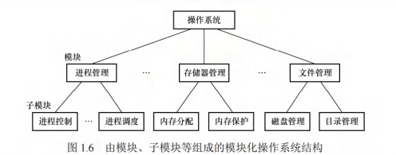
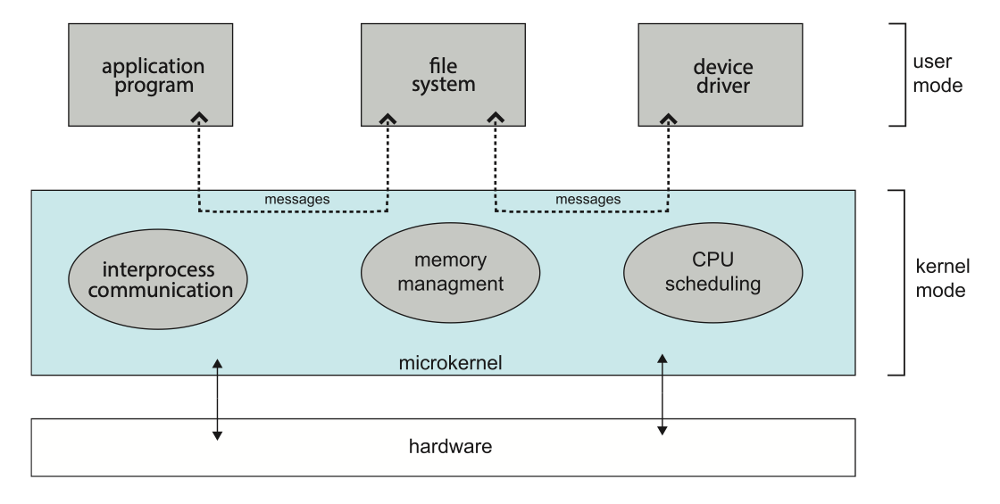
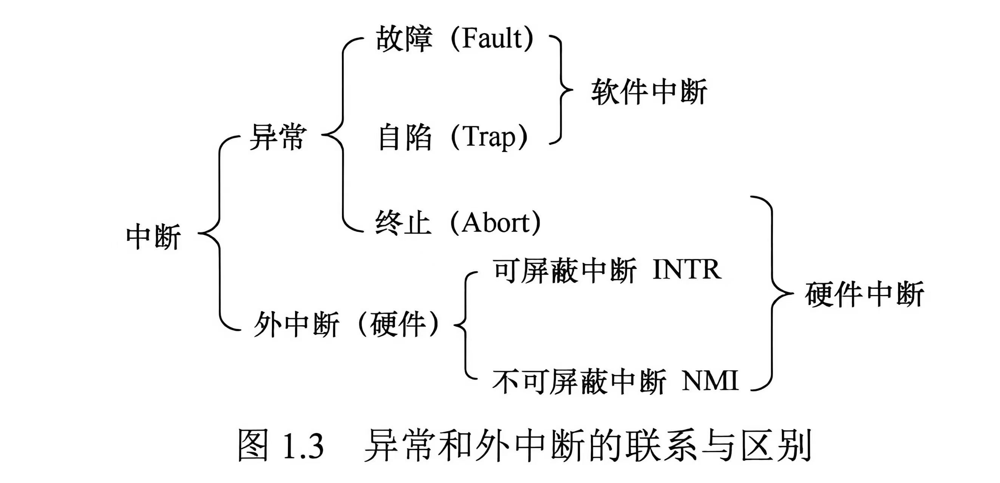
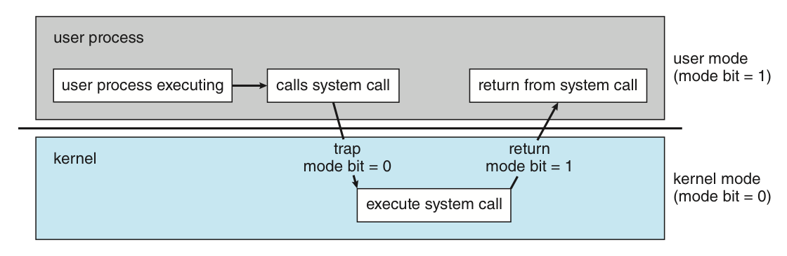

# 操作系统概述

我们知道，操作系统作为计算机系统中的重要软件，已经和现代计算机系统深度融合。我们耳熟能详的 Linux、MacOS、Windows 都对应着不同的操作系统程序。现代计算机系统的结构通常可以分为四层：计算机硬件、操作系统、（其他系统程序和）用户程序、用户。在这里，用户可以是坐在电脑前的你、其他的机器、其他的电脑等等。

## 操作系统的基本概念

这一节我们将围绕几个问题展开，以求对操作系统形成一个概括性的认识。

!!! Question "什么是操作系统？"
    王道中给出了一个定义：操作系统是控制和管理计算机系统软硬件资源、合理调度任务与分配资源，并为用户及其他软件提供统一接口与运行环境的最基本的 **系统软件**。它通过有效协调多个应用程序对硬件资源（CPU、内存、I/O 设备等）的访问，确保系统高效、安全地运行。

    但是这个定义只是一个视角的定义，它强调了操作系统的职能。如果我们想换个视角，强调它的存在，我们可以说，操作系统是一个不停运行着的，用来执行用户程序的软件。
    
    操作系统作为一个彻头彻尾的“人造物”，没有一个全局上普适的“定义”。

!!! Question "操作系统干了什么？"
    -   操作系统作为计算机系统资源的管理者。

        整体来讲，操作系统拥有“三大管理”的职能：进程管理、内存管理、存储管理。这也是我们《操作系统》围绕的主线。

    -   操作系统作为用户和计算机硬件系统之间的接口。

        用户通过应用程序或直接交互方式访问系统服务，而这些请求最终均由操作系统统一管理和调度。用户程序访问系统资源的方式就是 [系统调用](#syscall)，这样用户程序就间接地使用了系统资源。这种接口的角色反映了操作系统 **封装（encapsulation）** 的特点。

    -   操作系统实现了对计算机资源的扩充。

        未安装任何软件的计算机称为裸机，它仅构成计算机系统的物质基础。操作系统通过资源管理功能和用户服务功能，将裸机 **抽象并扩展** 为一台功能更强、使用更便捷的逻辑机器。因此，通常将这种被操作系统抽象和扩展后的机器称为扩充机器。

!!! Question "操作系统究竟和其他软件相比特殊在哪里？"
    在讨论操作系统的设计目标前，我们或许应该首先关注到，操作系统作为一种系统软件，但又和其他的系统软件和应用软件都有显著不同。因此我们需要了解操作系统的一些 **基本特征**。
    

    

    
    **并发性（Concurrency）**。

    并发，指的是两个或多个事件在 **同一时间间隔内** 发生。在多道程序的环境下，内存中会同时驻留多个程序，操作系统通过调度机制来实现多道程序的交替执行，使得 CPU 保持高利用率。在操作系统中，引入进程这一概念，其核心目的之一就是支持程序的并发执行。

    另外需要区分的是 **并行（Parallel）** 这个概念。并行指的是两个或多个事件在 **同一时刻** 发生。在单处理机系统中，在宏观上多道程序看起来像同时运行，但微观上，任一时刻只有一个程序在执行，这就是并发而非并行。
    
    

    

    

    

    
    **共享性（Sharing）**。

    共享，指的是系统中的资源可供内存中多个并发执行的进程共同使用。根据资源特性和访问方式的不同，共享主要分为 **互斥共享** 和 **同时访问** 两种方式。

    -   互斥共享。系统中的某些资源，如打印机、磁带机等，虽然可供多个进程使用，但为避免所打印或记录的结果混淆，必须保证在任一时间段内仅有一个进程访问该资源。我们还将在一段时间内只允许一个进程访问的资源称为 **临界资源**。计算机系统中的大多数独占型物理设备（如打印机），以及软件中的栈、变量、表格等，均属于临界资源，必须以互斥方式共享。
    -   同时访问。系统中还存在另一类资源，允许多个进程在宏观上“同时”访问。此处的“同时”通常指 **逻辑上的并发访问**，微观上这些进程可能通过分时交替方式访问资源，即分时共享。典型的可同时访问资源包括磁盘上的文件（尤其是只读文件），允许多个用户同时读取同一份文档。
    
    

    

    
    

    

    
    **虚拟性（Virtual）**。

    虚拟是指通过某种技术手段，将一个物理实体映射为多个逻辑上的对应物。物理实体是真实存在的硬件资源，而逻辑对应物则是用户或程序所感知的抽象资源。操作系统主要通过两类复用技术实现虚拟：时分复用（如处理器的分时共享）和空分复用（如虚拟存储器）。这个特性也可以反映出操作系统 **抽象（Abstraction）** 的特点。
    
    

    

    

    

    
    **异步性（Asynchronism）**。

    在多道程序环境下，多个进程并发执行。但由于系统资源有限，进程的执行并非连续进行，而是以不可预知的速度断续推进，这种特性称为进程的异步性。
    
    

    

## 操作系统的设计发展

### 操作系统的任务执行设计

手工操作阶段

1.  人工操作。

    在上个世纪、计算机发展的早期阶段，人们将程序和数据打孔在纸带或卡片上，装入输入设备后手动控制读入内存并启动程序运行。这样一来，程序的装入、执行和结果输出全都由人工操作，随着计算机硬件性能的不断提升，人机之间的速度差异也越来越大，系统资源利用效率较低的问题也越来越严重——最突出的表现就是 CPU 的长时间空闲。

2.  脱机 I/O。

    为了缓解上述问题，人们研发了脱机 I/O 技术。这里“脱机”的含义是脱离主机的控制。它通过引入一台外围机（小型专用计算机）在 CPU 不参与的情况下预先完成 I/O 准备工作：输入时，外围机将程序和数据（纸带或者卡片上的）读入磁带，供 CPU 后续调入内存；输出时，CPU 将结果先写入磁带，再由外围机将磁带内容输出至外设。这样一来，I/O 效率因 CPU 可以直接从高速磁带读写数据而大幅提高，CPU 的空闲时间也因为外围机代人工完成数据传输等操作而大幅减少。

这个时候，计算机还不能说配置有操作系统。

批处理阶段

在脱机 I/O 的基础上，人们开始思考能否实现作业（工作）的自动连续处理，以进一步提升 CPU 和其他系统资源的利用率，于是诞生了批处理系统。该系统为了实现对作业的连续处理，将一批（batch）作业以脱机方式输入，并配备一个监督程序（monitor）。

1.  单道批处理系统。

    监督程序控制作业自动、顺序地逐个执行。在正常情况下，系统无需人工干预，作业按磁带上的顺序依次装入内存，先装入、先完成。作业成批提交，但内存中任一时刻仅驻留一道用户程序。所以，单道批处理系统具有 **自动性、顺序性、单道性** 等特征。

2.  多道批处理系统。

    当 CPU 的速度越来越快，我们不难发现，当正在运行的作业发起 I/O 请求时，高速 CPU 不得不空闲等待低速 I/O 操作结束。这降低了资源的利用率。于是人们引入了 **多道程序设计技术** 来改进批处理系统。

    除了监督程序，多道系统还包含一个作业调度程序。用户提交的一批作业首先存放在外存的后备队列。随后，作业调度程序按照一定算法从队列中选取若干作业调入内存，使得它们在监督程序的控制下并发执行、共享资源。当某道程序因发起 I/O 请求而暂停时，CPU 即可切换至另一就绪的程序继续执行。这一机制依赖 [中断](#int)。它使系统各部件尽可能保持忙碌，从而显著提升了整体吞吐量和资源利用率。

    多道程序设计技术具有 **多道性、宏观上并行、微观上串行** 等特征。为了实现这一技术，我们需要解决几个问题：处理器的分配策略；多道程序的内存分配与保护；I/O 设备的分配与调度方法；大量程序和数据的组织、存储方式，以及安全性和一致性的保障；等等。

总体而言，批处理系统，尤其是多道批处理系统的资源利用率高、系统吞吐量大。但是，批处理系统缺乏交互能力，用户无法了解程序的运行状态或进行干预，响应时间较长。

这个时候，由于需要资源的管理，我们一般认为操作系统就开始出现了。

分时操作系统

鉴于批处理系统的局限，人们接着思考能不能提升人机交互的“体验”——不同于多道批处理系统的无需人工干预，以人机交互为核心目标，人们又设计出分时操作系统。

**分时技术** 是指将处理器时间划分为一系列很短的时间片，轮流分配给各用户程序使用。若某程序在其时间片内未完成计算，则把处理器释放让给其他用户程序，待下一轮继续执行。分时操作系统允许多个用户通过终端同时连接到同一主机，并与系统进行交互而互不干扰。其实现的核心在于：当用户在终端输入命令时，系统必须能够接收、快速处理并即时返回结果。很显然分时操作系统也是基于多道程序设计的，而又由于其核心目标，它具有 **同时性（多路性）、交互性、独立性、及时性** 等几个主要特征。同时性指多个终端用户可以同时使用同一台计算机；独立性则指各个用户的操作相互隔离，任一个用户在自己的视角看来都独占了这台计算机。

实时操作系统

分时操作系统很好，它较好地解决了通用交互问题。但在一些特定场景，系统必须在 **严格限定的时间内** 对外部事件做出相应，而且需要保证相应的确定性和时限性。所以，实时操作系统应运而生。

实时操作系统放弃了时间片轮转的机制，转而采用基于任务紧迫性或截止时间的调度策略（~~我去这不是我面对一大堆作业时候的样子吗~~），确保高优先级任务能够及时获得处理器资源。它又可以细分为两类：

-   硬实时操作系统。必须提供绝对可靠的时间保证。不在截止时间内完成相应任务可能引发灾难性的后果，例如飞机的飞控系统、导弹的制导系统等。
-   软实时操作系统。条件稍微放宽。只要不造成永久性损害，允许偶尔的“超时”现象，例如银行管理系统、订票系统等。

实时操作系统的主要特点包括 **确定性**（响应时间可预测）、**高可靠性、强时效性** 等特点。

网络操作系统和分布式系统

时间继续向前推进，有越来越多的任务，单个机器上处理花费的时间显得有些长。人类通过协作完成重要的任务，那为什么计算机不可以呢？

**网络操作系统** 是在单机操作系统的基础上 **扩展网络功能** 而形成的系统，主要用于支持计算机之间的通信、数据传输以及资源共享等等。在这样的系统中，各计算机保持独立运行，而用户需要显式地指定远程资源的位置方能访问，系统不提供全局视图。

分布式系统是多台计算机组成的集合。在这个系统中，各个节点的地位对等，没有固定的主从关系；系统资源可以被所有用户透明共享；具备良好的可扩展性和容错能力；支持动态重组；能够将一个任务分解成多个子任务，并分布到不同节点上并行执行、协同完成。管理这样的系统的操作系统就被称为 **分布式操作系统**，它具有 **分布性、并行性、透明性** 等特征。在这其中，透明性尤为重要，用户无需感知底层的多机结构，操作体验如同使用一台计算机（封装！）。

两者的区别在于，网络操作系统只实现了资源的共享以及通信的功能，用户还是需要主动干预远程操作；分布式操作系统则通过协同机制，多台计算机可以共同完成同一任务，向用户提供单一的系统映像。

微机操作系统及其他操作系统

顾名思义，为微型计算机（PC、工作站等）设计的操作系统。根据用户数量和并发能力，可以分为：

-   单用户单任务操作系统。例如早期的 16 位 MS-DOS。
-   单用户多任务操作系统。代表性的系统包括 Windows XP 及其后续版本、macOS 以及现代 Linux 桌面版。这也是当前的主流，它兼具良好的人机交互性、高效率与稳定性。
-   多用户多任务操作系统。通常用于服务器或高性能工作站，典型代表为 UNIX、Linux 服务器版本和 Windows Server 系列。

除了微机操作系统，还有嵌入式操作系统、服务器操作系统、智能手机操作系统等。

### 操作系统的结构设计

随着操作系统功能的不断扩展和代码规模的持续增长，采用合理的结构设计对降低系统复杂度、提升安全性和可靠性至关重要。

分层设计

分层设计 (layer approach) 的核心思想是将系统分为若干层，底层为硬件，顶层为用户接口，各层只调用其紧邻的下一层提供的接口，这就是所谓的 **单向依赖**。

分层设计的优点是明显的：① **便于调试和验证**。每一层都实现良好的封装，于是开发过程中只需要逐步实现并调试验证每一层，再逐级向上开发即可；② **易于扩充与维护**。在维护或扩展过程中，只要修改每一层的内部实现，而不需要修改其它层的代码，这样就大大降低了开发和维护的难度。

然而，其问题也不容忽视。① **运行效率较低**。由于每次执行一个功能都需要上下跨越多层，发生多次接口调用，分层设计下的系统效率往往都受到限制；② **层次划分困难**。要想真正意义上实现良好的分层设计，就需要对各层有良好的定义，这个设计难度是不小的。

模块化设计

模块化设计 (modules approach) 指将操作系统划分为若干分立模块，并规定模块之间的接口，甚至单个模块下也可能是由多个模块通过同样的方式组织而成的。这种设计方法也被称为模块-接口法。

理想上，模块化的操作系统能够 ① 提高操作系统设计的正确性、可理解性和可维护性；② 增强系统的可适应性，便于功能扩展；③ 让系统设计可以多线并行（只需要事先商量好接口，各个工程师就可以独立地实现、填充模块内容）。一般来说，一个好的模块是 **高聚合 (cohesion) 低耦合 (coupling)** 的。

然而，模块化的设计在现实中也有局限。① 模块化的设计并没有一个清晰的单向依赖关系，各模块设计者齐头并进，每个决定无法建立在上一个已验证的正确决定的基础上，因此无法找到一个可靠的决定顺序；② 除此之外，模块间的接口规定很难满足对接口的实际需求，如何设计接口使得所有需求都能被很好满足也是个难以解决的问题。

宏内核

宏内核 (monolithic-kernels) 也叫单内核或大内核，它的核心思想十分简单粗暴，将所有主要功能都紧密耦合在一起，作为一个完整的整体。各模块共享地址空间，可直接调用彼此的函数，减少了上下文切换和消息传递开销。

宏内核带来的好处是操作系统效率极高，从操作系统的发展历程来看，主流操作系统都是从宏内核发展过来的，当前的主流操作系统 (如Linux、Windows、Android) 主要采用宏内核或混合内核架构。

但是宏内核的缺点也是十分明显的，大量复杂的功能互相耦合，导致操作系统的维护十分困难；不仅如此，一旦某个部分出现了严重问题，整个系统都会受到影响。在这些方面，宏内核的表现不如微内核。

???+ Question "等等，什么叫内核 (kernel) ？"
    操作系统中最基础最中央的部分是内核。但是我们实在无法给出它的精确范畴，这与操作系统设计的结构有关。尽管如此，我们可以确定的是，内核最明显的一个特点就是自计算机上电后就不停在运行。与硬件紧密相关的模块（如中断处理程序、设备驱动程序）、运行频率较高的模块（如时钟管理、进程调度），以及各模块共用的基础操作，都是现代操作系统的核心组件，它们也就形成了内核。OS 和内核的概念界限不甚清晰，笔者水平实在有限、难以说清，在后面也就避免谈及这两者的“区别”了。

微内核

微内核 (micro-kernels) 的设计思路与宏内核相反，主张将不是必要的东西都从内核里拿出去，放到用户空间，以用户态执行。整体形成一种“微内核-服务器”的结构，此时内核只提供通讯、内存管理、进程管理等基本功能，也只有这些部分直接运行在内核态，作为服务器的其它功能部件则通过 **消息传递机制** 与内核互动。

微内核操作系统遵循“**机制 (mechanism) 与策略 (strategy) 分离**”的设计原则，将与硬件紧密相关的机制置于微内核中，而将策略交由用户态服务器实现。具体而言，微内核通常具备以下功能：

1.  进程（线程）管理。微内核提供进程/线程的创建、切换、调度队列管理等机制，而进程分类、优先级分配等策略则由用户态的进程管理服务器实现。
2.  低级存储器管理。微内核仅包含与硬件相关的地址转换机制(如页表管理、逻辑地址到物理地址的映射)，而页面置换算法、内存分配策略等由用户态的存储器管理服务器实现。
3.  中断和陷入处理。微内核负责捕获硬件中断和陷入事件，在识别中断或异常类型后，将其分发给相应的用户态服务器处理。中断与陷入的捕获及分发机制属于微内核的核心功能。

由于内核只提供最基本的功能，所以内核的体积会大大减小，内核的维护和扩展也会变得更加容易，微内核-服务器的结构也使功能扩展更加容易；另外，由于内核只提供最基本的功能，所以内核自身的效率也会大大提升；不仅如此，由于各个功能之间的耦合降低，且都运行在用户态，功能之间仅使用通信建立链接，即使某个功能部件出现问题，也不会导致整个系统崩溃，相比于宏内核，系统可靠性大大提升。

外核

与传统操作系统通过抽象层向应用程序提供统一接口不同，外核 (exokernel) 采用一种截然不同的设计思想：**将物理资源直接暴露给用户级系统**，自身仅负责资源的安全分配与隔离。

## 操作系统的运行

我们接下来进一步深入，简单了解一下操作系统在运行的时候都有什么东西。

### 时钟

时钟 (timer) 是计算机系统的关键部件，其功能包括计时和产生定时中断。操作系统通过时钟管理向用户提供标准系统时间，并利用时钟中断实现任务调度。例如，在分时操作系统中通过时间片轮转进行进程切换，在实时操作系统中依据截止时间控制任务执行，在批处理系统中衡量作业运行进度。因此，系统的大量活动均依赖于时钟机制。

### 中断 

中断机制对现代操作系统至关重要。操作系统的演进本质上是不断提升资源利用率的过程：当某程序因等待I/O等事件而暂时无法继续执行时，系统需及时将其挂起，转而调度其他就绪程序运行。在抢占式多任务系统中，这一调度行为主要依赖中断（尤其是时钟中断）来触发。当发生中断时，内核负责保存当前进程的现场，转移控制权至相应的处理程序，并在处理完成后恢复现场。可以说，中断机制是实现现代操作系统实现高效并发与资源共享的基础。

中断（此处和之前的中断实际上都是广义的中断）按照 **事件是否来自 CPU 指令内部**，可以分为：

-   中断（interrupt，狭义的中断），也叫外中断，指来自 CPU 执行指令外部的事件。如时钟中断、I/O 中断等；
-   异常（exception），也叫内中断，指来自 CPU 执行指令内部的事件。如非法操作码、地址越界、运算溢出、虚拟内存缺页等。

#### 中断的分类

-   中断（外中断）。
    -   **可屏蔽中断**。指的是通过 INTR 线发出的中断请求，通过改变屏蔽词可以实现多重中断，从而使得中断处理更加灵活。
    -   **不可屏蔽中断**。指的是通过 NMI 线发出的中断请求，通常是紧急的硬件故障，例如电源掉电。
-   异常。所有的异常都是 **不能被屏蔽的**。
    -   **故障**（Fault）。通常指的是由指令执行引起的异常，如非法操作吗、缺页故障、0 作除数、运算溢出等。
    -   **自陷**（Trap）。是一种事先安排的异常事件，用于在用户态下调用操作系统内核程序，如系统调用指令等。
    -   **终止**（Abort）。是指出现了使得 CPU 无法继续执行的硬件故障，如控制器出错、存储器校验出错等。

故障和自陷属于软件中断，终止异常和外中断属于硬件中断。

#### 中断的处理

中断的处理描述非常好理解：在 CPU 执行到用户程序的某条指令时，若该指令引发了异常，或在指令执行结束后检测到了中断（外中断）请求信号，则 CPU 会打断当前程序，转入相应的中断或异常处理程序进行。若问题可以解决，则对于异常，返回该条指令重新执行；对于中断，返回到该指令的下一条指令处继续执行。若问题无法解决，则用户程序被终止。

!!! Note "中断向量表"
    
    由于中断被广泛使用，操作系统需要处理中断的频率一定是非常频繁的，与此同时，处理每一种中断都需要一个特定的方法——因此，一种快速定位中断处理方法的手段就显得尤为重要。

    中断向量表就是这样一种方法。它通过中断号来索引中断处理方法，实现了一种“随机访问”，大大加速了操作系统中断处理的速度。

???+ Tip "中断处理和子程序调用（王道）"

    1.  中断处理程序与被中断的程序相互独立而无固定关联，但子程序与主程序属于统一程序的主从关系；
    2.  中断的产生通常是随机的，子程序调用则由 `call` 指令显式触发 [?]；
    3.  中断处理往往需要硬件电路支持，子程序调用则完全由软件实现；
    4.  中断处理程序的入口地址由中断向量表直接提供，子程序的入口地址则由 `call` 指令中的地址码指定；
    5.  虽然调用中断处理程序和子程序都需要保护程序计数器（PC）的内容，但是：
        -   前者由硬件在响应过程中自动保存，
        -   后者由 `call` 指令执行时将当前 PC 值压入栈中；
    6.  响应中断时，需要对同时到达的多个中断进行优先级裁决，而子程序调用则不需要。

### 系统调用 

系统调用（System Call）是操作系统提供给应用程序使用的接口，可视为一种特殊的公共子程序调用。系统中的各种共享资源均由操作系统统一管理，因此凡涉及共享资源的操作（如存储分配、I/O 传输及文件管理等）,都必须通过系统调用向操作系统提出服务请求，由操作系统代为完成，并将结果返回给应用程序。这样可以保证系统的稳定性和安全性，防止用户进行非法操作。

通常，一个操作系统提供的系统调用有几十条乃至上百条，每个系统调用都有唯一的 **系统调用号**。系统调用按功能大致可以分为几类，包括

-   设备管理。完成设备的请求或释放、设备的启动等；
-   文件管理。完成文件的读、写、创建和删除等；
-   进程控制。完成进程的创建或撤销、阻塞及唤醒等；
-   进程通信。完成进程间的消息传递或信号传递等；
-   内存管理。完成内存的分配、回收，以及获取作业占用的内存大小和起始地址等。

以及许多的功能。从上面的罗列，我们不难发现，系统调用涉及系统资源管理、进程管理等关键操作，对整个系统的影响非常大，因此必须由操作系统在足够安全的状态（见下一节 [特权模式](#priv)）下完成。它本质上是一种特殊的过程调用。它可以分为四个阶段：

传递系统调用参数 → 执行陷入（Trap）指令并切换至内核态 → 定位并执行相应服务 → 恢复现场并返回用户态。

???+ Tip "系统调用和普通过程调用（王道）"

    1.  运行状态不同。普通过程调用的调用者与被调用者运行在同一特权级；而系统调用的调用者运行在用户态，被调用者运行在内核态。
    2.  状态转换不同。普通过程调用无须特权级切换，可以直接跳转；系统调用则需要通过 trap 指令触发，先从用户态切换到内核态，再由内核分派至相应处理程序。
    3.  返回机制不同。系统调用执行完毕后，内核可能根据调度策略决定是否切换进程；而普通过程调用总是直接返回原调用点。
    4.  嵌套调用限制不同。系统调用的嵌套深度受到 **内核栈** 空间的限制；而普通过程调用的嵌套深度通常仅受 **用户栈** 大小约束。

### 特权模式 

操作系统的有些操作是有风险的（例如和硬件有关的操作等）。我们不想让随便什么用户程序就可以直接执行这些操作，以此降低被恶意利用的概率。那么我们或许会想到，将操作系统代码和用户程序各自的执行环境区分开来。

工业上的特权模式可能会有多种复杂的实现形式。我们这里只涉及简单的一种，即双模式（dual-mode）。双模式下，CPU 有两种运行模式，一种是 **用户态**（user mode，或称目态），一种是 **内核态**（kernel mode，或称管态，核心态）。

绝大多数计算机系统通过硬件支持这一区分。硬件通过一个 **模式位**（mode bit）标识当前的运行状态（mode bit = 0 时代表内核态、mode bit = 1 时代表用户态等），从而明确当前是在系统任务中还是用户任务中。

!!! Question "但是，等一下。前面说过，用户程序也是需要访问系统资源的（系统调用），存在着需要执行一些风险操作的需求。这个时候应该怎么办呢？"

考虑一个仓库。某个人现在需要从仓库里拿点东西，但是 ta 没有大门的钥匙。这种时候，我们请来一位保管着钥匙的管理员，ta 只需要委托管理员去仓库帮你拿就可以了。这样，ta 实现了需求，仓库也减少了被盗的风险。

操作系统只需要封装好一系列类似这种的需求-结果的处理方案，让用户在有需要的时候让操作系统执行这些方案，**在执行当前任务的时候将控制权让渡给操作系统，操作系统完成后再还回控制权**，就可以实现将特权指令隔离在内核态，同时用户程序也能完成需求。

前面提到的系统调用通过自陷的方式实现，就包含了这样的权限转换：

### 操作系统引导

无论怎么说，现代操作系统的体量也是不容小觑的。体量不小的情况下，无序的启动很容易导致一些混乱和错误。这也是操作系统引导（bootstrap，本意指靴子上的带子）的必要性所在。

常见操作系统的引导过程如下（王道）：

1.  **CPU 激活和 BIOS 初始化**。计算机上电后，CPU 从 ROM（只读存储器）中读取并执行 BIOS（基本输入/输出系统）程序。BIOS 初始化基本硬件，建立中断向量表，为引导阶段的设备访问提供支持。
2.  **硬件自检和启动设备选择**。BIOS 执行 POST（通电自检），检测 CPU、内存以及外设是否正常。自检通过后，依据 CMOS（<del>互补金属氧化物半导体。</del>主板上由单独的电池供电的配置存储器，用于保存启动顺序、系统时间等参数）确定启动设备的优先级，并选择首个有效的启动设备（硬盘？U 盘？）。
3.  **加载主引导记录（MBR）**。BIOS 将所选启动设备的首扇区（主引导记录，即 MBR）加载到内存中。MBR 包含两部分核心内容：引导代码与硬盘分区表。
4.  **定位活动分区并加载分区引导记录（PBR）**。MBR中的引导代码解析分区表，识别标记为“活动”的分区，并将其首扇区（分区引导记录，即 PBR）加载到内存中。
5.  **加载启动管理器**。PBR 中的代码负责加载活动分区内的启动管理器。启动管理器提供多操作系统或内核版本的选择界面。
6.  **加载操作系统内核**。启动管理器将用户选定的操作系统内核映象加载到内存中并加载执行。内核随即完全接管系统控制权，重建中断处理机制，不再依赖 BIOS。
7.  **内核初始化和用户环境启动**。包括：内存管理模块构建内核页表及用户进程地址空间框架；进程调度模块初始化进程控制块（PCB）链表、就绪队列与阻塞队列；设备驱动模块建立设备控制块、设备分配表以及 I/O 缓冲区管理结构。初始化完成后，内核启动首个用户态进程（Linux 的 `init`），由此逐步构建完整的用户操作环境。

??? info "更现代的操作系统..."

    前面介绍的是传统 PC 上 BIOS + MBR 的一种典型引导流程。现代 PC 则普遍采用 **UEFI 固件 + GPT 分区表** 的组合，不过两者解决的是不同层面的问题：UEFI 规定固件与操作系统之间的接口，GPT 规定磁盘分区信息的组织方式。

    **MBR vs GPT：磁盘如何分区？**

    MBR 分区表诞生于 1983 年。它使用 32 位字段记录分区起始逻辑块地址（LBA）和逻辑块数量。在逻辑扇区大小为 512 字节时，通常所说的容量上限约为 $2^{32} \times 512\ \mathrm{B} = 2\ \mathrm{TiB}$，即约 2.2 TB。此外，MBR 只有四个分区表项；需要更多分区时，通常要借助扩展分区和逻辑分区。[参考：Microsoft 对 MBR 容量限制的说明](https://learn.microsoft.com/en-us/troubleshoot/windows-server/backup-and-storage/support-for-hard-disks-exceeding-2-tb)。

    **GPT（GUID Partition Table，全局唯一标识符分区表）** 于 2000 年推出，使用 64 位逻辑块地址，突破了上述容量限制，也不再受 MBR 四个主分区表项的限制。它为磁盘和分区设置 GUID，并保存主、备两份分区表信息，利用 CRC32 校验检测分区元数据损坏。这里的备份和校验针对分区信息，并不等于备份或校验分区内的用户文件。GPT 磁盘的第一个逻辑块仍保留 **保护性 MBR**，使不识别 GPT 的旧工具将磁盘识别为已占用，降低误覆盖的风险；UEFI 启动时不执行其中的引导代码。[参考：UEFI 规范中的 GPT 磁盘布局](https://uefi.org/specs/UEFI/2.10/05_GUID_Partition_Table_Format.html)。

    **BIOS vs UEFI：内核如何被启动？**

    **UEFI（Unified Extensible Firmware Interface，统一可扩展固件接口）** 是接口规范，主板上的固件实现该规范，为引导程序提供加载文件、访问设备等服务。因此，更准确的说法是“操作系统支持通过 UEFI 引导”，而不是“操作系统基于 UEFI”。UEFI 固件可以识别规定的文件系统并加载可执行文件，不必沿用前面逐级执行 MBR、PBR 引导代码的方式。[参考：UEFI 概述](https://uefi.org/specs/UEFI/2.10/02_Overview.html)。

    以从本地 GPT 磁盘启动为例，典型过程如下：

    1.  **固件初始化硬件并选择启动项**。上电后，固件完成必要的硬件初始化，其内置启动管理器根据保存在非易失性存储中的启动项和启动顺序（如 `Boot####`、`BootOrder`）选择要执行的引导程序。启动项可以指定设备和文件路径，而不只是指定“从哪块硬盘启动”。[参考：UEFI 启动管理器](https://uefi.org/specs/UEFI/2.9_A/03_Boot_Manager.html)。
    2.  **从 EFI 系统分区加载引导程序**。磁盘上有一个 **EFI 系统分区（EFI System Partition，ESP）**，本地硬盘上的 ESP 通常采用 FAT32 文件系统，存放扩展名为 `.efi` 的引导程序及相关文件。固件按启动项定位并执行相应文件，不需要查找 MBR 的“活动分区”。ESP 用于存放启动所需文件，不要求整个操作系统都安装在其中。[参考：UEFI 文件系统规范](https://uefi.org/specs/UEFI/2.11/13_Protocols_Media_Access.html)。
    3.  **引导程序加载内核并完成交接**。引导程序可能先提供系统选择菜单，再由相应的操作系统加载器装入内核及启动所需的数据。准备好接管系统后，加载器调用 `ExitBootServices()` 结束 UEFI 的 **启动服务**，操作系统随后依靠自己的内核和驱动管理硬件。不过，部分 **运行时服务** 仍可供操作系统使用，例如访问 UEFI 变量、请求系统复位等，不能说此时固件的所有服务都停止了。[参考：UEFI 运行时服务](https://uefi.org/specs/UEFI/2.10/08_Services_Runtime_Services.html)。
    4.  **内核初始化并启动用户环境**。这一步和上面提到的流程是相似的。

    UEFI 还定义了 **安全启动（Secure Boot）** 机制。启用后，固件依据配置的信任与吊销信息，对将要执行的 UEFI 驱动、引导程序等映像进行验证，以阻止不符合策略的代码在启动阶段运行。它与“使用 UEFI 启动”是两个不同概念，也不等于磁盘加密。[参考：UEFI 安全启动与驱动签名](https://uefi.org/specs/UEFI/2.11/32_Secure_Boot_and_Driver_Signing.html)。

    通常来说，UEFI 搭配 GPT，BIOS 搭配 MBR，但它们并不是仅有的搭配。UEFI 规范也定义了对 MBR 分区的支持，具体操作系统则可能增加限制。例如，Windows 以 UEFI 模式部署时，包含 Windows 分区的系统磁盘需要使用 GPT。所以上述流程描述的是一种典型配置，并非所有设备、所有操作系统唯一的启动方式。[参考：Windows 的 UEFI/GPT 分区要求](https://learn.microsoft.com/en-us/windows-hardware/manufacture/desktop/configure-uefigpt-based-hard-drive-partitions)。

## 虚拟机

顾名思义，虚拟机是指通过虚拟化技术，将一台物理计算机抽象为多台逻辑上独立的计算环境，每台虚拟机都表现为完整硬件系统的精确复制品。虚拟化技术的核心在于隐藏底层物理硬件的细节，向上层提供统一且隔离的执行平台。目前主流的虚拟化方案有两类：

#### 第一类虚拟机管理程序

又称 **裸金属架构**。它直接运行在硬件之上，是系统中唯一一个处于最高特权级别的软件。它本身就类似于一个轻量级的操作系统，负责管理硬件资源和多个虚拟机。每个虚拟机均可以安装独立的操作系统（客户操作系统），本次完全隔离。

在这类架构中，客户操作系统运行在虚拟内核态（认为自己拿到了真实的 CPU 内核态，但实际上并不是），其用户程序运行在真实用户态。当客户操作系统执行一条仅允许在真实内核态下执行的敏感指令时，就触发 trap 陷入虚拟机管理程序。

在支持硬件虚拟化的 CPU 上，虚拟机管理程序能够根据执行上下文（context）判断某个指令（前面提到的敏感指令）是来自客户操作系统还是用户程序。若为前者，则代为完成功能；若为后者（即用户程序非法执行敏感指令），则模拟真实硬件的相应。在不支持硬件虚拟化的早期 CPU 上，所有敏感指令都被透明重定向到虚拟机管理程序，由其通过软件模拟实现对应功能。

#### 第二类虚拟机管理程序

又称 **寄居架构**。它以应用程序的形式运行在宿主操作系统上，依赖宿主操作系统进行资源分配与调度，本质是一个用户态进程。但它向客户操作系统伪装成完整的硬件平台。VMWare Workstation Pro/Fusion Pro 就属于这种类型。

!!! info "你知道吗..."
    VMWare Workstation 是 x86 平台上首个广泛使用的第二类虚拟机管理程序。

首次启动时，这类虚拟机管理程序模拟一台新计算机的行为，用户可将客户操作系统安装到虚拟磁盘（实际上是宿主操作系统中的一个文件），安装完成后即可正常启动和运行。