# 进程和线程

## 进程

我们知道，在多道程序环境下，我们允许多个程序并发执行。但是，并发性破坏了程序原本的封闭性，即使得程序的执行过程呈现间断性，并可能导致结果不可再现。为了兼顾“封闭性”与操作系统的“并发性”“共享性”，我们引入了进程（process）这个概念。

一段程序本质上是静态的、存储在硬盘上的指令数据，而当它附带运行程序所需要的必要信息进入内存，得到相关资源后，它成为一个动态的、与计算机资源互动的实体，这个实体就是进程。

上述描述可以从不同视角归结为定义性的语句，像“进程是正在执行的 **程序实例**”“进程是程序及其数据从外存加载到内存后，在 CPU 上运行的 **过程**”“进程是具有独立功能的程序在一个特定数据集合上的 **执行活动**”，等等。

但无论怎么说，进程是操作系统进行资源分配和调度的一个独立单位。进程是多道技术的重要基础。

综上，进程有一些核心特征：

-   动态性。进程是程序的一次执行实例，具有明确的生命周期（包括状态变化）。动态性是进程最根本的特征（from 王道）。
-   并发性。多个进程可以同时驻留在内存中，并在一段时间内交替或并行执行。
-   独立性。进程是实体，是能够独立运行、独立获取系统资源，并作为调度基本单位参与 CPU 竞争的实体。
-   异步性。进程间可能相互制约，以不可预知的速度向前推进。这也要求操作系统必须提供协调进程的相关机制。

### 进程的构成

进程既然是程序实例，那么除了程序原本的指令数据，必然还包含运行时的动态信息。进程从抽象上来说由三部分共同构成：

#### 进程控制块

即 PCB。进程创建时，操作系统为其分配一个 PCB；该数据结构常驻内存，可随时被系统访问，并在进程终止时被回收。在进程的整个生命周期内，系统始终依赖 PCB 对其进行管理：操作系统通过 PCB 记录并维护进程的当前状态，以便在需要调度、切换或干预时，能够准确地控制其行为。

PCB 是最核心的组成部分。**PCB 是进程存在的唯一标志**，系统唯有通过它才能感知并管理进程。

<div class="split-cols" markdown>
<div class="split-cols__text" markdown>
PCB 主要包括下列信息：

1.  进程标识信息。包括进程 ID（PID）、父进程 ID（PPID）、用户 ID（UID）。
2.  进程调度信息。例如，进程当前状态、进程优先级等；此外还包括 CPU 占用时间、等待时间、进入内存的时间等统计信息；还可能包含阻塞原因等。
3.  资源和内存信息。包括代码段、数据段和堆栈段在内存中的起始地址、已打开文件的描述符列表；以及所占用的 I/O 资源等。
4.  处理器状态信息。也称 CPU 上下文，包括各类寄存器的值。当进程被换出时，这些上下文就应被完整保存到 PCB 中，等待再次被调度运行时系统能够恢复至 CPU。
</div>
<div class="split-cols__media" markdown>
<figure markdown>
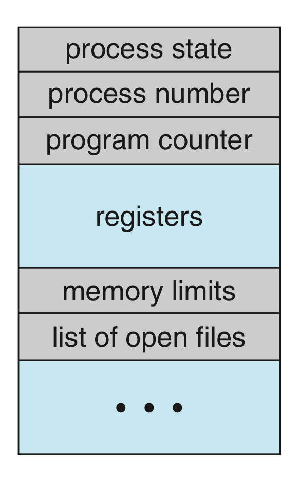
<figcaption>PCB 的组成部分示意</figcaption>
</figure>
</div>
</div>
<figure markdown>
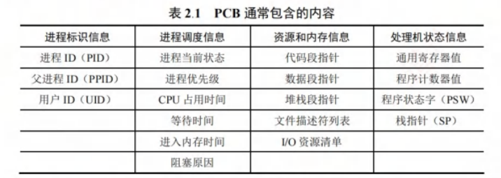{:width="70%"}
<figcaption></figcaption>
</figure>

当然，在实际系统中，通常同时存在大量进程，它们或许状态不相同、阻塞的原因不相同。为了高效地进行调度与管理，操作系统需将各进程的 PCB 以适当的方式组织起来，主要有两种常用的组织方法：

-   **链接方式**。系统将处于相同状态的 PCB 通过指针连接成一个队列（可以回忆一下哈希表的分离链接法），阻塞的进程还可以依据其阻塞原因进一步划分为多个子队列。
-   **索引方式**。系统为每种状态建立一个索引表，表项指向对应状态的 PCB。

#### 程序段、数据段

程序段就是进程中可被 CPU 执行的代码部分，它本身是静态的（其实就是写的程序代码），**可以被多个进程共享**。

数据段包含进程运行所需的各种数据，既包括程序处理的原始输入，也包括执行过程中产生的中间结果和最终输出。与程序段不同，**每个进程的数据段是私有的**，即使多个进程运行同一程序，它们的数据段也彼此隔离。

### 进程的内存映像

当程序被加载运行时，操作系统会为其建立一个虚拟地址空间，该空间的逻辑布局称为进程的内存映像，是动态的。在虚拟内存机制下，进程的整个地址空间不需要全部留在物理内存中。

> 有关虚拟地址、虚拟内存，可以查看 [内存](./memory.md) 章节。

<div class="split-cols" markdown>
<div class="split-cols__text" markdown>
在进程的虚拟地址空间中有以下几个部分：

1.  **代码段**，通常 **只读**。这里存放程序的机器指令，即编译后的可执行代码。只读是为了防止运行时意外修改指令，同时允许多个进程共享代码。代码段通常包含几个子区域：
    -   `.init`：程序启动时的初始化代码，由系统自动调用。
    -   `.text`：主程序的指令。例如 `main()` 函数编译后的机器指令。
    -   `.rodata`：存放只读数据。例如字符串常量。
2.  数据段。这里存放全局变量和静态（`static`）变量。通常分为两个部分：
    -   `.data`：存放已初始化的全局变量和静态变量。
    -   `.bss`：存放未初始化的全局变量和静态变量。
3.  堆。程序运行时动态申请内存的区域。具体来说，程序通过 `malloc()` 等函数从堆中申请内存，不再需要时通过 `free()` 等释放。**堆从低地址向高地址增长** 而大小不固定。
4.  栈。用于支持函数调用，存放局部变量、函数参数、返回地址等临时信息（函数栈帧），由系统自动管理。栈遵循 LIFO 原则，**从高地址向低地址增长**。
5.  共享库的存储映射区。共享库用于提供进程所依赖的公共函数库代码（例如 `printf()` 这类 STL 函数）。它们在运行时被动映射到进程的地址空间。**这些代码是只读的，且可在进程间共享**，以节省内存资源。
</div>
<div class="split-cols__media" markdown>
<figure markdown>
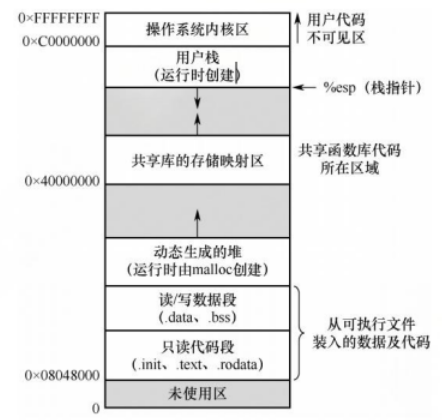
<figcaption>一个典型进程在内存中的映像</figcaption>
</figure>
</div>
</div>

!!! note "代码段和数据段的大小在程序加载时就已确定，而堆和栈则可在运行过程中动态扩展和收缩。"

!!! tip "PCB 的存放位置"
    
    前面介绍的都是进程的用户虚拟地址空间。虽然 PCB 是管理进程的核心数据结构，但它并不属于前面提到的用户虚拟地址空间。它由操作系统内核维护，**存放在系统内核区中**，对用户进程不可见。

    不过实际上后面我们会学到内核区也是在虚拟地址上的，可以说，PCB 存放在虚拟地址空间的系统内核部分。

### 进程的状态

对于现代操作系统面临的多道并发的环境，一个现实问题是，在单机语境下，系统资源，尤其是 CPU 资源是一种很宝贵的资源，而一个进程在其整个生命周期中并不是所有时间都需要 CPU，也不是任何时候都可以直接获得 CPU 资源并直接开始使用的。所以进程调度一个比较核心的部分就是将 CPU 资源给哪个任务用，为此我们需要对进程的状态进行建模。

<figure markdown>
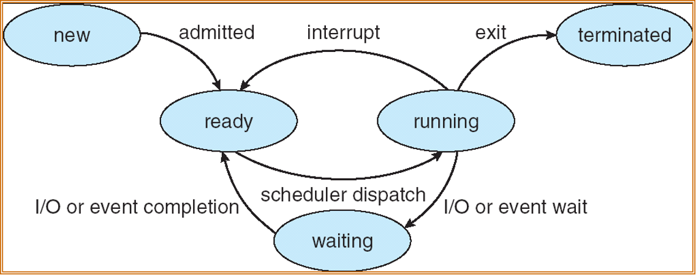{:width="80%"}
<figcaption></figcaption>
</figure>

通常，进程具有 5 种状态。

1.  运行态（running）。进程正在 CPU 上执行。一个 CPU 在任一时刻最多只有一个进程处于运行态。
2.  就绪态（ready）。进程已获得除 CPU 外的所有必要资源，等待 CPU 资源派发（dispatch），一旦获得 CPU 就能启动。
3.  阻塞态（waiting）。进程因等待某一事件暂停运行，即使此时 CPU 空闲进程也无法执行。
4.  创建态（new）。进程正处于创建过程中。
5.  终止态（terminated）。进程已完成执行（正常结束或强制终止），正在等待系统回收资源。

进程在就绪态和阻塞态看上去都在“等待”，但实际上区别很明显。前面提到，为了方便管理，我们会把 PCB 组织起来。对于就绪的进程和阻塞的进程，通常维护“就绪队列”和“等待队列”：

<figure markdown>
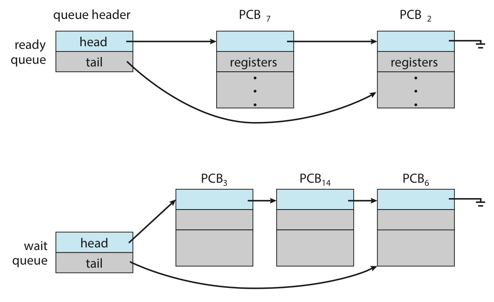{:width="70%"}
<figcaption></figcaption>
</figure>

实际实现中，由于等待的 I/O 或事件不同，可能维护多个子队列：

<figure markdown>
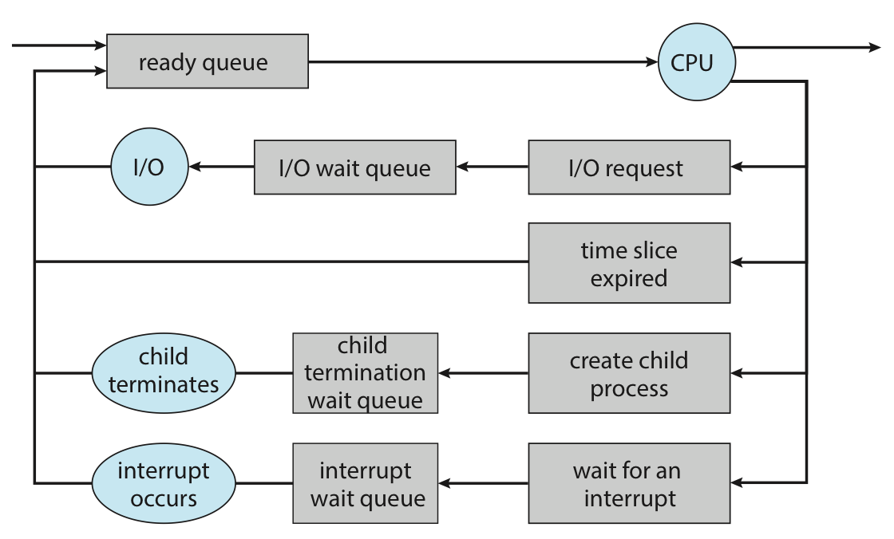{:width="70%"}
<figcaption></figcaption>
</figure>

## 进程管理

前面我们把视角放在单个进程身上。现在我们放大考察范围，从系统的层面上来看看进程的动态过程。

### 进程控制

在操作系统中，这些控制操作通常以原语（primitive）的形式实现。原语在执行期间不允许被中断，是一个不可分割的基本单位，确保了关键操作的原子性和一致性。

#### 进程的创建

用户进程在操作系统中，总体上来讲遵循一个树状的组织形式，每一个进程都有一个唯一标识符进程号（通常被称为 pid，但在特定语境下可能有不同的含义）。如下图是 Linux 的一个进程树。

<figure markdown>
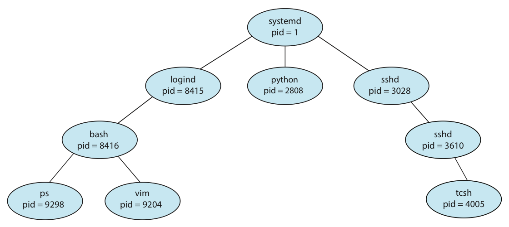{:width="70%"}
<figcaption></figcaption>
</figure>

既然用树形表示，那么我们可能会想到，进程间是不是存在着一种亲子关系？

答案是肯定的。在操作系统中，允许一个进程（父进程）创建另一个进程（子进程）。子进程在创建时会复制父进程的当前状态，但子进程与父进程是相互独立的实体，拥有各自的 PCB 和虚拟地址空间。

操作系统通过创建原语建立新进程，具体步骤如下：

1.  分配唯一标识号并申请 PCB。
2.  分配新进程运行所需要的资源（如内存、文件、I/O 设备等，PCB 中有记录）。这些资源或从操作系统获得，或从父进程继承。
3.  初始化 PCB。初始化的内容包括：标识信息、处理器状态信息、调度与控制信息和内存与资源信息。
4.  插入就绪队列。若系统允许新的进程参与调度，就将其 PCB 插入就绪队列。

!!! info "通常实现时会将新进程设置为最低优先级，除非用户显式地提出高优先级要求。"

<div class="card card-shadow" markdown="1">
<div class="card-header" markdown>Linux 中的进程创建：`fork()`</div>
<div class="card-body" markdown="1">
!!! warning "带 `fork()` 的程序分析在考试中是一个比较重要的点。读者朋友们可以多多实操进行练习。"

在 Linux 中，我们可以使用 `fork()` 来创建一个子进程。我们来看一个例子：

```cpp
#include <stdio.h>
#include <unistd.h>
#include <sys/wait.h>
#include <sys/types.h>

int main() {
    printf("A process starts!\n");

    pid_t pid;
    pid = fork();   // ①

    if (pid < 0) {
        printf("Fork failed!\n");
    } else if (pid == 0) {
        sleep(1);   // ②
        printf("We are in child process!\n");
    } else {
        wait(NULL); // ③
        sleep(1);   // ④
        printf("We are in parent process!\n");
    }
}
```

① 处的 `fork()` 语句创建了一个进程，该进程只有进程号与父进程不一样。`fork()` 函数依据其 **所在的执行环境**，返回值如下：

| 执行环境 | `fork()` 返回值 | 含义 |
| --- | --- | --- |
| 父进程 | 大于 0 | 返回新创建的子进程的 PID |
| 子进程 | 0 | 表示当前执行环境是子进程 |
| 创建失败 | -1 | 创建失败，不会产生子进程 |

父进程和子进程都会从 `fork()` 的位置后（① 的下一行）开始继续执行。如果 ③ 处的 `wait()` 不注释，那么父进程将等待子进程执行结束后再继续；如果注释掉，那么父子进程将并发执行。
</div>
</div>

在进程创建后，子进程有两种情况：1) 继续运行父进程所运行的程序；2) 载入新的程序继续执行。对于第一种，Linux 通过一个 `fork()` 就可以实现；对于第二种，则是通过先 `fork()` 再 `exec()`（`exec` 族函数）实现的。

`exec()` 会用新的程序替换当前进程的程序映像，或者说覆盖掉父进程的地址空间。

!!! note "进程创建中的内存开销"

    我们或许不难发现，`fork()` 的复制操作可能会因 PCB 表项等等带来较大的开销。所以在现代操作系统中，我们有几种技术来减小开销。

    > 这些内容会在[虚拟内存](./memory.md)的章节再次涉及。

    ??? tip "COW - Copy on Write 写时复制"

        通常不会在 `fork()` 时立即完整复制父进程的所有物理内存。只有当需要发生内容修改的时候，才真正去复制父进程的内容，也就是一种懒拷贝。

    ??? tip "Virtual Memory Fork"

        一些 UNIX 系统提供了 `vfork()` 这个创建进程的方法。为了减小复制带来的开销，`vfork()` 干脆就不复制了，直接阻塞父进程，然后自己用父进程的内存空间。这样一来，子进程在地址空间内做的修改对父进程就是可见的了。

#### 进程的终止

引起进程终止的事件主要包括：1) 正常结束。进程圆满地完成了预定任务。2) 异常结束。进程在运行过程中因严重的错误无法继续执行。一些常见的原因有：非法指令、特权指令违规、I/O 故障等等。3) 外界干预。外部实体请求终止进程。例如：操作员强制终止、操作系统因资源不足或安全策略终止进程、父进程通过 system call 终止其子进程等等。

操作系统通过终止原语完成进程的撤销，具体步骤如下：

1.  根据被终止进程的标识符检索其 PCB，并读取当前状态。
2.  若该进程正处于运行态，立即剥夺其 CPU，并触发调度程序选择下一就绪进程。
3.  释放该进程占用的所有系统资源，统一归还给操作系统。
4.  若系统支持级联终止，则递归终止其所有子孙进程；否则，子孙进程继续运行。
5.  将该进程的 PCB 从所在队列（或链表）中移除，完成清理。

!!! info "级联终止（cascading termination）"

    当一个进程终止时，其所有子孙进程也必须随之终止，这种机制称为级联终止。

Linux 通过 `exit()` 终止进程。该进程所用的资源届时将被释放，同时返回状态值，该状态值将被其父进程的 `wait()` 接收（这就是为什么之前的例子父进程会在子进程执行完再执行）。特别地，如果某个子进程被终止后其父进程没有调用 `wait()` 回收，那这个子进程并不会完全消失，而是变成 **僵尸进程（zombie）**。关键在于，如果这个僵尸进程的父进程终止了，这个僵尸进程也还是会存在。

并非所有系统都支持级联终止。对于不支持这一策略的操作系统，就会出现 **孤儿进程（orphan）**，即没有父进程的进程。此时，这些子进程会被 `init`/`systemd`（PID = 1）进程“收养”继续运行。在上面的终止语境中，如果终止了一个僵尸进程的父进程，那这个僵尸进程也成为了一个孤儿进程。此时 `init`/`systemd` 进程会“收养”它们，随后用 `wait()` 回收它们。

#### 进程的阻塞和唤醒

一个正在运行的进程一等待某个外部事件而暂时无法继续执行时，会主动调用阻塞（block）原语，将自己变成阻塞态（如果由操作系统来时刻监视的话，开销未免有些巨大）。所以，**阻塞是进程的主动行为**，只有处于运行态的进程才能执行阻塞操作。等待 I/O 操作、等待接收数据、等待信号量、等待请求的系统资源等时都会触发这一行为。

阻塞原语的执行过程如下：

1.  保存当前进程的 CPU 现场（如 PC、状态寄存器等）到其 PCB 中。
2.  将其 PCB 中的状态字段修改为阻塞态，并将 PCB 插入对应的等待队列。
3.  调用调度程序，从就绪队列中选择另一个进程投入运行，以释放 CPU 资源。

当被阻塞的进程等待的事件发生，内核的中断处理程序或合作进程会调用唤醒（wakeup）原语，将该进程重新激活。

唤醒原语的执行过程如下：

1.  在相应事件的等待队列中找到目标进程的 PCB；
2.  将其从等待队列中移出，并将状态置为就绪态；
3.  将该 PCB 插入就绪队列，等待调度程序在适当时机选中并恢复其上 CPU 执行。

!!! warning "block 和 wakeup 是一对作用相反的原语，必须成对使用。"
    
    如果一个进程调用了 block 而进入阻塞态，但同时系统中没有任何机制对应调用 wakeup，那该进程将永远阻塞。

    这提示我们在并发程序设计时，必须确保每个阻塞操作都有对应的唤醒路径。

## 进程通信

有些时候，一些进程会对其他进程施加影响，或者受到其他进程的影响。这时我们称这样的进程是 **协作进程**（cooperation process）。“协作”一定会需要信息交换；进程通信（inter-process communication, IPC）就指的是进程之间的信息交换，它也支持了进程的协作。

按照通信效率和数据量的不同，可以分为低级通信和高级通信两类。低级通信主要用于传递控制信息，例如 PV 操作（换句话说就是信号量，semaphores）；高级通信用于高效传输大量数据，主要包括共享存储、消息传递和管道通信、信号（signal）等方式。

> 这里我们只介绍上面提到的高级通信的几种方式，关于信号量的介绍请看[同步与互斥]()这一节的有关内容。

### 共享存储

进程的地址空间通常是互相隔离的，一个进程不能直接访问另一个进程的内存。但我们想让进程间实现高效的数据交换，于是操作系统提供了共享存储（shared memory）机制：通过特殊的系统调用，创建一段 **独立的内存区域**，并将其 **映射到多个进程的虚拟地址空间**，这样这些进程都能直接读写该区域，通过该区域实现数据交换，就像一家银行中柜员和客户之间的柜台。

<figure markdown>
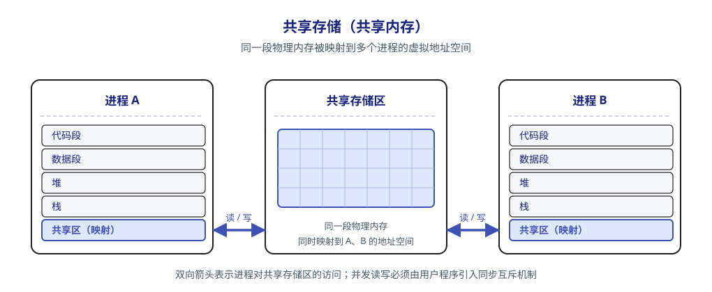
</figure>

由于多个进程可能并发访问同一块内存，**必须由用户程序引入同步互斥机制**（例如信号量），以避免数据竞争不一致。

### 消息传递

如果进程之间没有共享内存，或者出于安全的考虑我们不想用共享内存，还有别的方法吗？

有的。我们还可以利用操作系统提供的消息传递（message passing）机制：进程间的数据交换以格式化的消息（message）作为单位，通过操作系统提供的发送原语和接收原语进行。这种方式将通信的底层细节封装在内核中，**对用户透明**（再次提醒注意，这里的“透明”意思是“不可见”），从而简化了应用程序的设计。这种机制也是目前应用最广泛的进程间通信机制，例如微内核和服务器之间的交互就是基于消息传递机制。它也能够很好地支持分布式系统、多处理器系统等。

消息传递可以分为两种基本模式。

1.  直接通信方式。发送方将消息发送给指定的接收方：内核负责将消息从发送方复制到接收方的内核缓冲队列；接收方接收消息。

    <figure markdown>
    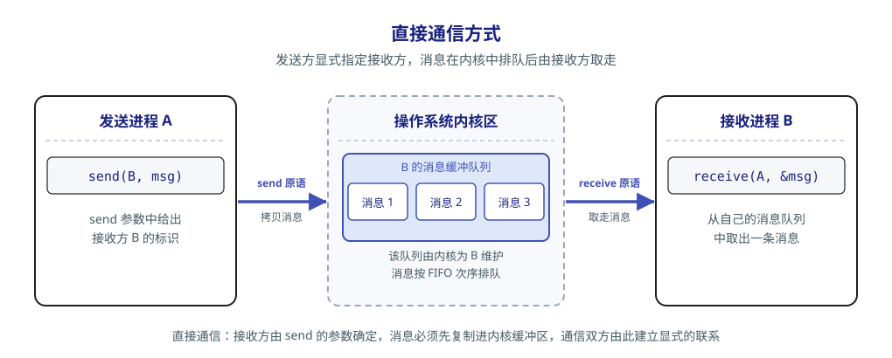{:width="80%"}
    </figure>

2.  间接通信方式。通信双方经过中间实体（信箱）进行消息交换。发送方将消息投递到信箱，接收方从信箱中取出消息。

    <figure markdown>
    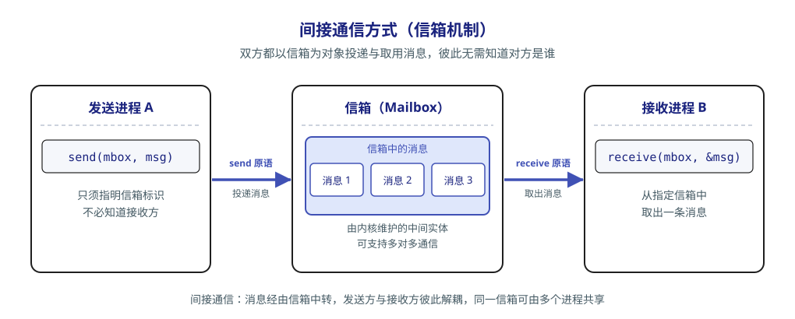{:width="80%"}
    </figure>

### 管道通信

管道（pipe）通信是一种基于 FIFO 原则的进程间通信机制，常用于具有亲属关系的进程之间，以 **生产者-消费者模式** 进行数据交换。

> 有关生产者-消费者模式，请看[同步与互斥]()这一节的有关内容。

<figure markdown>
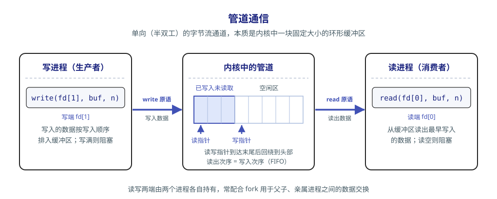
</figure>

从编程接口上看，管道表现为一种特殊的共享文件，它支持标准的 `read()` 和 `write()` 操作；但从实现上看，它是由操作系统内核维护的一块 **固定大小的内存缓冲区**，而并非一个磁盘上的文件。

管道机制必须提供三方面的协调能力以确保通信的正确性：1) **互斥**——任一时刻只允许一个进程对管道进行读或写，防止并发访问导致的混乱；2) **同步**——管道满时，写进程自动阻塞直到管道不满；管道空时，读进程自动阻塞直到管道不空；3) **写端关闭检测**——写端关闭后，读端 `read()` 应返回 0 以表示无数据可读。

!!! info "Linux 系统中，管道是一种广泛使用的 IPC 机制。"

!!! warning "① 从管道中读数据是一次性操作。数据一旦被读出，其占用的缓冲区空间即被释放，供后续写入使用。<br>② 普通管道仅支持单向通信，若需双向通信，则必须创建两个管道，分别用于两个方向的数据传输。"

### 信号

信号（Signal）是一种用于通知进程某个事件已发生的机制。不同的系统事件对应不同的信号类型，每类信号对应一个序号。

这种机制的实现基础是：

-   在进程的 PCB 中，用一个 n 位向量（例如 Linux 内核实现了约 30 种信号，于是用一个 32 位整型变量记录）记录该进程当前待处理的信号，当向某进程发送一个信号时，内核将该信号对应位记为 1，一旦该信号被处理即被清零。
-   PCB 中还维护另一个 n 位向量，用于记录被阻塞的信号。这时若某位为 1 则代表对应的信号不会被立即处理，而是暂存起来直到解除阻塞。

信号的发送主要有以下两种方式：

1.  内核发送信号。内核检测到特定系统事件时向对应进程发送相应信号。例如，若进程执行了非法的指令，内核向其发送 SIGILL 信号（序号 04）。
2.  进程发送信号。一个进程可以通过调用诸如 `kill()` 这类函数，请求内核向指定进程（当然，进程需要提供目标进程的 PID 和信号序号）<del>（？这不还是本质内核发送信号吗）</del> 发送信号。当然进程也可以给自己发信号。

当操作系统从内核态返回用户态时，会检查当前进程是否存在未被阻塞的待处理信号。若存在，则立即处理其中一个（从表观上看，通常优先处理序号较小的）。

信号的处理也主要有两种方式：

1.  执行默认的信号处理程序。这些默认操作由操作系统设定。例如 SIGILL 信号对应进程终止。
2.  执行进程自定义的信号处理程序。进程可以为某类信号定义自己的处理函数。

处理完信号后，通常返回到原程序被中断的位置继续执行后续指令。

## 线程

线程（thread）是一种“轻量级进程”。它是程序执行流的最小单元，也是处理器调度的基本单位。它的引入是为了进一步降低程序并发执行时的时空开销（减少 fork 和切换的开销），因为进程内的线程可以共享相同的系统资源，可以并发执行相同的程序代码。

在多线程操作系统中，进程不再作为基本的执行实体。进程成为除 CPU 外的系统资源分配单位，而线程则成为 CPU 调度和执行的基本单位。

| 比较维度 | 进程 | 线程 |
| --- | --- | --- |
| 调度 | 传统 OS 中既是资源拥有者，又是独立调度的基本单位，每次调度都需完整的上下文切换，开销较大 | 独立调度的基本单位。同一进程内的线程切换不会引起进程切换；但从一个进程的线程切换到另一进程的线程时，仍会触发进程切换 |
| 并发性 | 进程之间可以并发执行 | 同一进程内的多个线程可以并发，不同进程中的线程也能并发，并发层次更丰富，资源利用率与吞吐量更高 |
| 拥有资源 | 系统资源分配的基本单位，拥有独立的地址空间与资源 | 不拥有独立的系统资源，只持有运行所必需的私有数据结构；与同进程的其他线程共享该进程的地址空间及资源 |
| 独立性 | 拥有完全独立的地址空间，默认情况下其他进程无法直接访问其内存 | 对其他进程完全不可见；同进程内的线程因共享地址空间而紧密协作 |
| 系统开销 | 创建/撤销需分配或回收 PCB、地址空间、I/O 资源等，开销显著；切换涉及整个地址空间与资源上下文 | 创建/撤销只需分配栈和少量内核对象，开销很小；切换只需保存与恢复寄存器状态；线程间同步与通信容易实现 |
| 多处理器支持 | 单线程进程虽可被调度到任意 CPU，但任一时刻只能在一个 CPU 上执行 | 多线程进程可将多个线程同时调度到多个 CPU 上并行执行，真正发挥多核性能优势 |

### 多线程模型

按线程管理的实现位置，可分为 **用户级线程（User-Level Thread，ULT）** 和 **内核级线程（Kernel-Level Thread，KLT，又称内核支持的线程）**；按用户线程与内核线程的映射关系，又可分为多对一、一对一和多对多模型。这是两种不同的划分角度，用户级与内核级机制可以组合使用。

-   **用户级线程** 由应用程序借助 **线程库（thread library）** 在用户空间管理，共享所属进程的资源。程序通常从一个初始线程开始，再调用库函数创建其他线程；创建、撤销、调度和切换均可在用户态完成，内核感知不到各个用户级线程。其优点是切换无须陷入内核，开销小；各进程可独立定制调度算法；线程管理不依赖内核的线程支持，便于移植，也不必为每个用户线程分配内核线程及其 ID、TCB，因而通常能以较小开销支持更多线程。注意，用户级线程仍需线程库维护自己的标识和运行状态，并非“没有线程 ID”。

纯用户级实现中，内核仍以进程为调度单位，进程内所有线程分享该进程获得的 CPU 时间。例如，两个进程各获 100 ms 时间片，其中一个只有 1 个线程，另一个有 100 个线程；若后者在内部均分时间，则各线程分别获得 100 ms 和 1 ms，说明 **进程间公平不等于线程间公平**。此外，一个线程执行阻塞型系统调用，会使整个进程被内核挂起；同一进程内的线程只能在一个 CPU 上交替运行，无法利用多核并行。这两点对应下述多对一模型；仅在线程库内部等待、且可切换到其他就绪线程时，不必阻塞整个进程。

-   **内核级线程** 由内核创建、撤销、调度和切换，内核为每个线程维护 TCB（线程控制块，类似于 PCB），以感知并控制其运行。内核可以将同一进程的多个线程调度到不同 CPU 上并行执行；某个线程因系统调用阻塞时，仍可调度本进程或其他进程的就绪线程；内核自身也可采用多线程，提高系统服务的并发性。代价是线程管理与调度需要内核介入，切换涉及模式转换和上下文保存、恢复，且 TCB 等内核资源与调度负担限制了可支持的线程数。这里的“内核级”指 **由内核管理**，并不表示线程的应用代码一直在内核态执行。

-   **组合方式（混合实现）** 同时使用两级机制：线程库在用户空间调度用户级线程，内核将承载它们的内核级线程调度到 CPU 上。用户线程的执行始终需要内核可调度的执行实体承载，并非仅在系统调用时才建立这种关系。三种典型映射如下（图中每组线程均属于同一进程）：

<figure markdown>
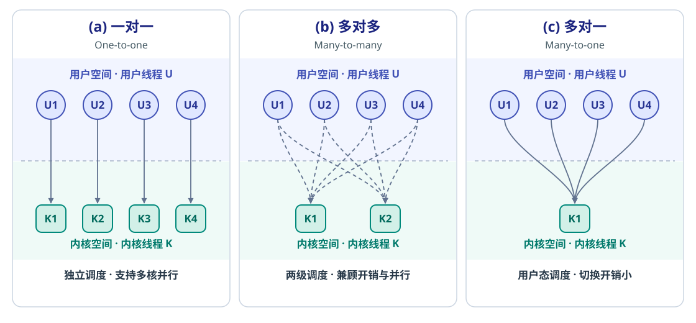
<figcaption></figcaption>
</figure>

| 模型 | 映射与调度 | 优点 | 局限 |
| --- | --- | --- | --- |
| **一对一** | 每个用户线程对应一个内核线程，由内核调度 | 一个线程阻塞不必阻塞整个进程，支持多核并行 | 每创建一个用户线程都需创建对应的内核线程，管理和切换开销较大，线程数受内核资源限制 |
| **多对多** | 将 $n$ 个用户线程映射到 $m$ 个内核线程，$n\ge m$；用户态与内核态分别负责各自层级的调度 | 用户线程可在用户空间高效切换；用较少的内核线程支持较多用户线程，并兼顾多核并行和阻塞隔离 | 并行度受可用内核线程数与 CPU 核数限制；一个内核线程阻塞后，其他用户线程需有可用的内核线程承载才能继续运行 |
| **多对一** | 多个用户线程共享一个内核线程，由线程库在用户空间管理、调度；同一时刻至多一个用户线程通过它执行或与内核交互 | 管理开销小，线程切换快 | 阻塞型系统调用会阻塞整个进程；无法在多核上并行执行该进程的线程 |

多对多是典型的混合实现：既缓解多对一的并行度限制，又避免一对一为每个用户线程配置内核线程的开销。不过，**用户级线程切换** 与 **内核级线程切换** 仍是两回事，后者依然需要内核参与。

??? info "线程库是创建和管理线程的 API，并不等同于用户级线程。"
    
    纯用户空间的线程库将代码和数据结构放在用户空间，调用库函数只是本地过程调用；内核支持的线程库则通过系统调用，由内核完成相应操作。常见接口有 POSIX Pthreads、Windows 线程 API 和 Java 线程 API：Pthreads 是接口标准，具体实现可以基于用户级或内核级线程；Windows 线程 API 由 Windows 内核支持；Java 通过 JVM 提供线程接口，书中所述的传统平台线程通常借助宿主系统的线程库实现，如 Windows API 或类 UNIX 系统的 Pthreads。
