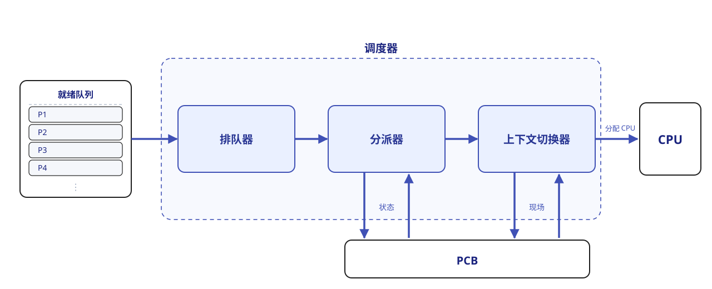
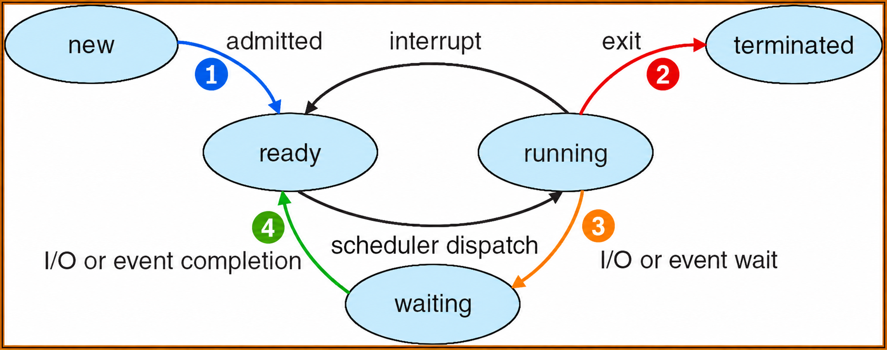

# 调度

在现代操作系统多道程序的环境中，进程的数量通常元多于 CPU 的个数。使用 Windows 操作系统的读者可以打开自己的任务管理器，在“性能 - CPU”一栏确认进程数和核数。因此，多个进程争用 CPU 的情况在所难免。同时，进程经常需要等待外部设备的输入，而外部设备的速度远低于 CPU。若让 CPU 长时间等待 I/O 完成，将造成极大的资源浪费。

我们这时就需要一个算法，兼顾公平性与效率，从就绪队列中选择一个进程并将 CPU 分配给它运行，从而实现多个进程的并发执行，而这就是 **CPU 调度算法**。

???+ info "调度的层次"

    一个作业从提交到完成，通常会经历三级调度，由高级到低级分别是：

    1.  **作业调度**。这一级调度负责从外存或后备队列中按照一定规则挑选一个或多个作业，为其分配资源、创建相应进程，或者说让其获得参与 CPU 竞争的资格。
    
        换言之，作业调度实现的是内存和外存之间的调度；每个作业在整个生命周期中仅被调入和调出一次。

    2.  **内存调度**。这一级调度负责在内存紧张时将某些暂无法运行的进程（在阻塞态、等待时间较长）换出到外存（这时进程称为 *挂起态*），而在这些进程具备运行条件且内存有空闲时再将其换进内存恢复为就绪态，将进程加入就绪队列。

        内存调度实际上是存储管理中的对换功能。

    3.  **进程调度**。这一级调度负责按照特定算法从就绪队列中选择一个进程，将 CPU 分配给它。

        这一级调度是 **最基础、最频繁** 的一级调度，不可或缺。进程调度的频率通常能达到每几十毫秒一次。

    我们接下来实际上主要关注进程调度。

??? info "调度器"

    用来实现 CPU 调度与分派的软件组件称为调度器。它通常包含三个部分：

    <figure>
    {:width="75%"}
    </figure>

    1.  **排队器**。将所有就绪进程按照特定的组织策略组织成一个或多个就绪队列。
    2.  **分派器**。根据调度算法选定的进程，执行实际的 CPU 分配操作：从就绪队列中移出目标进程、触发上下文切换、将 CPU 控制权转交目标进程。
    3.  **上下文切换器**。进程切换时会发生两对[上下文切换](#cont_switch)。一对是移出当前进程、装入分派程序，一对是移出分派程序、装入新选进程。

??? info "两种线程的调度"

    前面一章我们提到过用用户级线程和内核级线程。这两种线程实际上的调度方式是不太一样的。

    -   用户级线程调度：由于内核并不知道用户线程的存在，因此内核仍以进程为单位进行调度，将 CPU 时间 **分配给整个进程**。当内核将 CPU 分配给某进程后，由该进程内部的用户级线程库决定具体运行哪个线程。线程切换在同一进程内完成，仅需保存少量寄存器状态，开销极小。但缺点是：若一个线程执行阻塞操作（如 I/O），**整个进程都会被阻塞**。
        
    -   内核级线程调度：内核直接感知并管理每个线程，**调度时选择的是特定线程**，而非进程。每个线程拥有独立的内核上下文，可被单独赋予时间片；若时间片用完或被更高优先级线程抢占，则该线程会被强制挂起。由于涉及完整的上下文切换、地址空间更新（在跨进程线程间）以及可能的 TLB 刷新和缓存失效，**其切换开销远高于用户级线程**，通常高出数倍。

???+ tip "Lab 中的 idle process"
    
    当进程切换发生时，若系统没有就绪进程，操作系统就会调度 **闲置进程**（idle process，王道中将这个术语翻译为闲逛进程）来运行。它的主要任务是在空闲循环中不断检测中断请求。

    它的 PID = 0，**优先级最低**。一旦有新进程进入就绪队列，它就会立即让出 CPU。

    闲置进程不占用除了 CPU 以外的其他系统资源，自然也就不会因为等待事件而阻塞。

!!! warning "章节标题带有 * 表示这一节内容在课堂上未曾涉及或是涉及很少，但是王道参考书中有这部分内容。请读者朋友们根据目标自主决定。"

## 调度的目标

我们希望调度算法的性能是越高越好的，但也必须要考虑到使用的情景。为此，人们提出了多种衡量标准。

-   **CPU 利用率**（utilization）。应尽可能使得 CPU 保持“忙碌”状态。

    $$
    \text{CPU 利用率}=\frac{\text{CPU 有效工作时间}}{\text{CPU 有效工作时间} + \text{CPU 空闲等待时间}}
    $$

-   **系统吞吐量**（throughput）。表示单位时间内系统完成的作业数量。容易推导，短作业占比高，有助于提升吞吐量。
-   **周转时间**（turn-around time，TT）。指从作业提交到作业完成所经历的总时间，包括作业 **等待、在就绪队列中排队、在 CPU 上执行以及进行 I/O 操作的所有阶段的时间之和**（如果不计哪一项，考试题目会有说明）。最大周转时间时间能反映出调度算法的效率和“公平性”。

    在此基础上，我们定义平均周转时间（ATT）：

    $$
    \text{ATT} = \frac{\sum\limits_i \text{TT}_i}{n}
    $$

    还有为了衡量相对等待程度提出的带权周转时间：

    $$
    \text{带权周转时间}=\frac{\text{TT}}{\text{实际运行时间}}
    $$

-   **等待时间**（waiting time）。指进程在就绪队列中等待 CPU 的总时间（直到完全结束前）。容易发现：

    $$
    \text{等待时间} = \text{周转时间} - \text{运行时间}
    $$

-   **响应时间**（response time）。指从用户提交请求到系统 **首次产生响应** 的时间。

## 调度的时机

我们回忆一下进程的状态转换图。一个发现是，就绪、运行和阻塞三个状态同时拥有入边和出边，因此它们三个可以说是基本状态；而在整个图中，就绪和运行两个状态同时和图里所有的边都有关联，我们可以说所有的状态都围绕着这两位展开，CPU 的资源分配过程也就是通过这两个状态之间的转换而体现的。

<figure markdown>
{:width="75%"}
</figure>

1.  创建新进程后，父进程和子进程都处于就绪态，因此需要决定是运行父进程还是子进程，调度程序可以合法地选择其中一个先运行。
2.  进程正常结束或异常终止后，必须从就绪队列中选择某个进程运行；若没有就绪进程，则通常运行一个系统提供的闲置进程。
3.  当进程因 I/O 请求、信号量操作或其他原因而被阻塞时，必须调度其他进程运行。
4.  当 I/O 设备准备就绪后，发出 I/O 中断，原先等待 I/O 的进程由阻塞态转换为就绪态，此时需决定是让该新就绪进程投入运行，还是让中断发生时正在运行的进程继续执行。
5.  在支持抢占的系统中，若更高优先级的进程进入就绪队列，或当前进程的时间片用完，也会触发调度并可能剥夺当前进程的 CPU。

!!! note "抢占与非抢占"

    在很多系统中，进程有优先级之分。根据如何对待后进来但优先级更高的进程，调度方式可以分为两类：

    -   非抢占式（non-preemptive）调度。也即一个进程在 CPU 上执行时，即使有某个更为重要或紧迫的进程进入就绪队列，系统仍让当前进程继续执行，直至该进程脱离运行态。
    -   抢占式（preemptive）调度。也即一个进程在 CPU 上执行时，若出现更高优先级的就绪进程，调度程序可依据一定策略暂停当前进程，将CPU分配给更紧迫的进程。

## 进程的切换

在调度程序决定该由谁使用 CPU 之后，就要进行进程的切换了。将 CPU 切换到另一个进程，需保存（save）当前进程的状态，并恢复（reload/restore）另一个进程的状态，这样才能保证一致性。这个任务就是 **上下文切换**。

!!! tip "这也就是说，调度是 **决策行为**、切换是 **执行行为**。通常都是先调度决策，紧接着触发上下文切换实现决策。"

一个进程的现场，或者说上下文，包含 CPU 寄存器的值、进程状态、内存管理信息等，这些东西都会保存在 PCB 中。上下文切换的流程如下：

1.  挂起当前进程，将其 CPU 上下文保存到其PCB中。
2.  将该进程的 PCB 移入相应的队列，例如就绪队列，或因等待某事件而进入的阻塞队列。
3.  选择另一个进程执行，并更新其 PCB 中的相关信息。
4.  恢复新进程的 CPU 上下文。
5.  跳转到新进程 PCB 中的程序计数器所指向的位置，开始执行该进程。

??? info "上下文切换的消耗"

    由于上下文切换需要执行大量寄存器的保存与恢复指令，尤其是在高负载系统中，切换的频率叠加上微秒量级的切换所需时间，其开销是比较大的。为了减少这一开销，某些处理器架构提供了多个寄存器组，通过切换寄存器组指针来完成上下文切换而减少保存恢复指令的频次；但大多数通用处理器仍然采用完整保存和恢复寄存器状态的策略。

!!! tip "上下文切换中的模式切换"

    严格意义上，上下文切换只到前面所述的第四步就结束了，第五步实际上是模式切换，也就是从内核态回到用户态，然后执行用户进程的过程（如果换上来的进程是用户进程）。

    （严格意义上的）上下文切换只能由内核完成，整个切换过程都在内核态下进行。

## 调度算法

操作系统中存在多种调度算法，有的适用于作业调度，有的适用于进程调度，也有的两者均可适用。接下来我的文字中，适用于进程调度的算法主要以进程调度为情景。

### FCFS 调度

这是一种最简单的调度算法，先来先服务（First Come First Serve）只需要把进入队列最早的那一个拿出来就可以。FCFS 是最基本的 **非抢占式** 调度方法。

FCFS 算法的特点是 **实现简单**，但效率较低。它对长作业较为有利，而对短作业相对不利（与 SJF 或高响应比优先调度算法相比）。此外，它相比于 I/O 繁忙型作业更有利于 CPU 繁忙型作业。

### SJF 调度

意思是最短作业优先（Shortest Job First）。若有多个进程处于就绪态时，选择需要运行时间最短的进程先运行。

SJF 算法在所有作业同时到达且运行时间都已知的情况下，其平均等待时间和平均周转时间是最优的（证明如下）。但它的缺点也很明显：如果有一个进程需要的运行时间很长，那么它可能会一直被推迟，从而导致“饥饿”现象（即无限期等待）；此外，计算机并不知道进入队列的作业的时间长短，只能进行估计。

??? success "证明：SJF 的最优结论"

    这里的“最优”指 **平均等待时间和平均周转时间最小**。假设只有一个 CPU，所有作业在时刻 $0$ 同时到达，运行时间已知，作业之间相互独立，执行过程中没有 I/O 阻塞，且忽略调度和切换开销。

    设作业 $i$ 的运行时间、等待时间和完成时刻分别为 $p_i$、$W_i$ 和 $C_i$。由于到达时刻都是 $0$，其周转时间就是 $C_i$，且

    $$
    C_i = W_i + p_i,\qquad
    \frac{1}{n}\sum_{i=1}^{n} C_i
    = \frac{1}{n}\sum_{i=1}^{n} W_i + \frac{1}{n}\sum_{i=1}^{n} p_i.
    $$

    其中 $\sum p_i$ 是固定的，所以 **最小化平均等待时间与最小化平均周转时间等价**。下面用相邻交换法证明。

    所有作业均已到达，主动让 CPU 空闲只会推迟完成时间，因此只需考虑无空闲的调度。先考虑非抢占式调度：若某个执行顺序不是按运行时间非递减排列的，其中必然存在相邻的两个作业 $A$、$B$，满足 $p_A > p_B$，却先执行 $A$ 再执行 $B$。设这两个作业开始前已经过去了 $t$ 时间，则：

    -   交换前，二者的等待时间分别为 $t$ 和 $t+p_A$，合计 $2t+p_A$。
    -   交换后，二者的等待时间分别为 $t+p_B$ 和 $t$，合计 $2t+p_B$。

    因此，交换后总等待时间减少了 $p_A-p_B > 0$。排在它们之前的作业不受影响；排在它们之后的作业也不受影响，因为这两个作业占用的总时间仍为 $p_A+p_B$。

    不断交换这样的相邻逆序作业，最终一定得到按运行时间非递减排列的顺序，即 **SJF**。每次交换都使总等待时间减小，因此 SJF 的平均等待时间最小，平均周转时间也最小。运行时间相等的作业可以任意交换，所以最优顺序不一定唯一。

    即使允许抢占，也无法得到更小的平均周转时间：对任意抢占式调度，按其作业完成的先后顺序，构造一个从时刻 $0$ 开始连续执行的非抢占式调度。对其中第 $k$ 个完成的作业，原调度在它完成前至少已经执行完前 $k$ 个作业的全部工作量，因此其原完成时刻不小于这 $k$ 个作业运行时间之和；而这个和恰好是新调度中它的完成时刻。所以新调度中每个作业都不会更晚完成，再应用上述交换证明即可。

    但这不意味着 SJF 能缩短 **全部作业执行完所需的总时间**：在这些假设下，任何无空闲的调度都需要 $\sum p_i$ 时间。

在普通情况下，SJF 是非抢占式的。但设想这样的情况：有一个执行时间较短的进程进入就绪队列，其时间比当前进程的剩余时间还少。如果不优化，这个短进程就要等当前进程执行完再执行。这种情况显然是可以优化的，于是我们提出 SRTF（最短剩余时间优先）算法，总是执行剩余运行时间最短的进程。SRTF 显然是抢占式的，但其优缺点和 SJF 一样。

!!! info "预测时间"

    计算机并不知道进入队列的作业的时间长短，需要用户告诉它进程需要多长时间，或者它自己来预测。用户可能有意或无意地低估其作业的实际运行时间，以获取调度优势。那如果采取预测的方法，表现又怎么样呢？

    课堂上（参考教材中）提供了一种叫 exponential average 的预测方法。

### RR 调度

即时间片轮转（Round-Robin）调度算法。它要适用于分时系统，其最大特点是公平性。

系统将所有就绪进程按 FIFO 的原则组织成一个就绪队列。每隔固定的时间间隔（称为 **时间片**），系统会产生一次时钟中断，激活调度程序，将CPU分配给就绪队列的队首进程，并允许其执行一个时间片。当该进程执行完一个时间片后，即使尚未运行完毕，也必须被剥夺 CPU，并重新放入就绪队列的末尾，等待下一次调度；而下一个队首进程则获得 CPU 的使用权。由于时间片到期后，操作系统会强制停止进程，因此它是 **抢占式** 的。

在RR算法中，时间片的大小对系统性能有显著影响。时间片太大，RR 会接近 FCFS；时间片太小，CPU 在调度和切换上的开销（dispatch latency）占比就会变大。

### 优先级调度

优先级调度算法通过为每个作业或进程分配一个优先级，以反映其紧迫程度。当有多个进程处于就绪态时，选择优先级最高的进程先运行。这样做的缺点也是明显的，如果有一个进程的优先级很低，那么它可能会一直被推迟，从而导致“饥饿”现象。这一点和 SJF 很像；而事实上，SJF/SRTF 可以说是优先级调度的一个特例（优先级是运行时间/剩余时间）。优先级调度当然也可以实现抢占式和非抢占式两种。

此外，优先级的分配可以根据使用需求进行设计，衡量标准可以是某个值、某个意义、某种组合的结果等等。优先级也并不一定是静态的，先前我们提到过的饥饿问题，就可以通过 **动态的优先级** 来解决：优先级随着等待时间增加不断增长，等待过久的任务就会被赋予较高的优先级，以此避免饥饿的发生，这种策略叫 priority aging（老化）。

一般而言，进程优先级的设置可以有以下几个原则：系统进程 > 用户进程；交互型（前台）进程 > 非交互型（后台）进程；I/O 型进程 > 计算型进程；等等。

### 多级队列调度

我们会发现，前面的调度算法都是着眼于一个队列的。但是系统中的进程类型有很多，一个队列的调度算法难以兼顾很多需求。于是，人们提出了多级队列（Multilevel Queue）调度算法。

该算法将系统中的就绪进程划分为多个独立的就绪队列。每个队列对应一类具有相似特性的进程（如系统进程、交互型进程、批处理进程等）。每个队列可独立采用适合其特性的调度算法，例如，交互性队列可以使用 RR 算法，批处理队列可以使用 FCFS 算法等。各队列也 **具有不同的优先级**。调度时，系统总是优先调度高优先级队列中的进程；只有当所有高优先级队列均为空时，才会调度低优先级队列中的进程。进一步地，高优先级队列如果后到达，也会抢占当前正在运行的低优先级任务。

### 多级反馈队列调度

!!! warning "有关这里的调度算法，课堂上和王道上给出的实现不太相同。这里我两个都列出来。"

在多级队列调度的基础上，多级反馈队列（Multilevel Feedback Queue）调度动态调整进程所处的队列（优先级）和对应的时间片大小，以此兼顾系统的多种目标。

-   课堂讲解

    一个进程如果使用了过长的 CPU 时间，它可能被移动到优先级更低的队列；相反，如果一个进程等待了太久，它可能被移动到优先级更高的队列。

-   《王道》

    和多级队列调度不同的地方在于，每个队列内部都采用 RR 调度。新进程创建后总是会首先进入第 1 级队列，如果该进程执行时没有在当前时间片执行完毕，则被移至低一级的队列末尾，重复过程直至进程完成。而通常，队列优先级越低，其时间片会相应越长。

### 高响应比优先（*）

高响应比优先调度算法主要用于作业调度。它在调度决策时考虑每个作业的等待时间和估计运行时间，计算其响应比：

$$
\text{响应比} = \frac{\text{等待时间 + 估计运行时间}}{\text{估计运行时间}}
$$

所以该算法既和 SJF 的特性有相似之处，又和 FCFS 的特性有相似之处。而对于长作业，响应比会随着等待时间的增加而提高，最终总能被调度执行，有效缓解饥饿现象。

### 基于公平原则的调度算法（*）

还有一些以公平性作为主要设计目标的调度算法。

-   保证调度。为每个进程提供可量化的 CPU 时间分配保证。例如在 $n$ 个并发进程的系统中，每个进程应获得约 $\displaystyle\frac 1n$ 的 CPU 时间。调度器会动态跟踪各进程的 CPU 使用情况并据此调整调度顺序。具体来说：
    -   跟踪每个进程自创建以来已获得的 CPU 时间；
    -   计算每个进程应获得的 CPU 时间（进程创建以来的时间除以 n）；
    -   计算公平比率，定义为实际获得的 CPU 时间与应获得的 CPU 时间之比。比率小于 1 表示没有达到应得的份额，大于 1 表示超额占用；
    -   调度程序将 CPU 分配给当前比率最小的进程，让它一直运行至比率超过最接近它的进程的比率。
-   公平分享调度。保证每个用户都获得相同的 CPU 时间（或要求的比例），公平性是在用户层面而言的。

## 多 CPU 调度（*）

多处理器系统通常分为两类，即非对称多处理器（AMP-Asymmetric）和对称多处理器（SMP-Symmetric）。前者通常是主从式架构，后者的所有 CPU 地位对等。我们这里主要讨论 SMP 的调度。

SMP 调度中存在两个方面的考量。

-   处理器亲和性。当一个进程从一个 CPU 移动到另一个 CPU 上时，需要将第一个 CPU 的缓存设为无效，并重新填充第二个 CPU 的缓存。这样的操作代价是很高的，所以应该尽量让一个进程运行在同一个 CPU 上。
-   负载均衡。一个或几个 CPU 空闲，会让其他的 CPU 处于高负载状态，同时进程可能更容易陷入等待的状态。应该尽量保证所有的 CPU 负载均衡以发挥出多处理器的优势。

可以发现，负载均衡通常会抵消处理器亲和性带来的好处。所以某些系统会采取当负载的不平衡达到一定程度后才会触发进程迁移。

我们介绍两种多处理器调度方案：

-   公共就绪队列。系统中仅设置一个公共就绪队列，所有 CPU 共享该队列。这主要考虑的是负载均衡性，因为 CPU 一旦空闲，就会立刻从公共就绪队列中选择一个进程运行。

    提升该方案的处理器亲和性可以有两种方法：① 软亲和。调度程序应该尽量让一个进程保持在同一 CPU 运行，但特殊情况也可以迁移到其他 CPU 上。② 硬亲和。用户通过系统调用，主动请求系统将其和固定的 CPU 绑定。Linux 系统同时实现了上述两种方案。

-   私有就绪队列。每个 CPU 都有一个私有的就绪队列，CPU 空闲时会从各自的就绪队列选择一个进程运行。这主要考虑的是处理器亲和性。

    提升该方案的负载均衡能力通常有两种方法：① 推迁移。由一个特定的系统程序周期性地检查各 CPU 的负载，如果发现不平衡，就从超载的 CPU 的就绪队列中推出部分进程到空闲 CPU 的就绪队列上。② 拉迁移。当某个 CPU 负载很低时，主动从高负载或超载的 CPU 的就绪队列中拉取部分进程到自己的就绪队列。实际系统中，推迁移和拉迁移常常被结合使用。