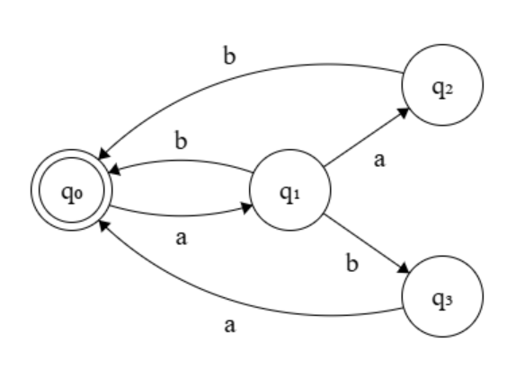
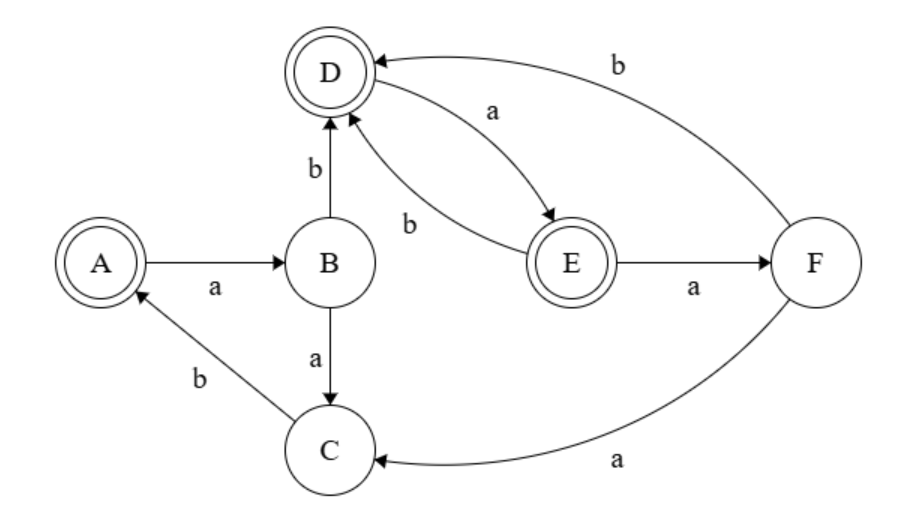

# 计算理论

!!! Abstract "授课信息"

    **授课教师**：顾实 / 金小刚（顾老师实际授课）
    
!!! Success "参考资料"

    请支持 [TonyCrane 的计算理论笔记](https://note.tonycrane.cc/cs/tcs/toc/)

!!! Tip "写在前面..."

    所谓计算理论，大致上说，就是计算机科学的理论基础。它以抽象的方式研究计算机“算什么”、“怎么算”、“算的代价”。

    在计算机科学中，对于同一个话题，我们主要研究**四类问题**：

    - **优化问题**。例如，找一个图的<u>最小</u>生成树。

    - **搜索问题**。例如，找一个权重和 $\le k$ 的生成树。

    - **决策问题**。例如，判断<u>是否存在</u>一个权重和 $\le k$ 的生成树。

    - **计数问题**。例如，一个图总共有多少权重和 $\le k$ 的生成树。

    在这其中，我们主要研究**决策问题**。

    - 输出简单，要么是 Yes，要么是 No。

    - 这也把所有的输入实例分成了两类：让答案为“是”的 Yes-instance 和让答案为“否”的 No-instance。

    - 由于**难度等价性**，研究了决策问题的难度，就基本掌握了其他问题的难度。

## 01 集合、关系（数学基础）

### 三种基础的证明方法

- **归纳法 (Induction)**

- **鸽笼原理**

- **对角线论法（反证法）** 

#### 康托尔定理 (Cantor's Theorem)

集合 $A$ 的幂集（所有子集的集合）$P(A)$ 的势严格大于 $A$ 的势，即 $\text{card}(A) < \text{card}(P(A))$ 对所有集合 $A$ 都成立。

??? Success "证明"

    令 $f$ 是一个从 $A$ 到其幂集 $P(A)$ ($2^A$) 的映射。显然地，$\text{card}(A) \le \text{card}(P(A))$。

    我们需要证明 $A \neq P(A)$，即我们要证明这个单射(injection) $f$ 不能是满射的(surjective)。

    采取反证法。构造一个集合 $B = \{x \in A \mid x \notin f(x)\}$。由于假设 $f$ 是满射，那么在 $A$ 中必然存在一个元素 $t$，使得 $f(t) = B$。接下来考虑 $t$ 与 $B$ 的关系：
        
    - **如果 $t \in B$**：那么根据集合 $B$ 的定义，可知 $t \notin f(t)$。但由于我们假设了 $f(t) = B$，这推导出了 $t \notin B$，产生**矛盾**。
        
    -  **如果 $t \notin B$**：那么根据集合 $B$ 的定义，可知 $t \in f(t)$。同样由于 $f(t) = B$，这推导出了 $t \in B$，再次产生**矛盾**。

证明的核心就是“对角线论法”。

!!! Example "Considering the set $T$ of all infinite sequences of binary digits (i.e. each digit is zero or one). Is $T$ countable?"

    $T$ is **uncountable**（$T$ 不可数）。

    我们注意到，我们可以将 $T$ 中的某个序列 $s$ 中 1 的位置表示为自然数集的子集，例如对于 $\{ 1, 4 \}$，我们可以解释为 $s$ 只有第 1 和第 4 位是 1（从 0 开始计，当然不从 0 也无所谓），其余位置为 0 。这样，$T$ 和自然数集 $\mathbb N$ 的幂集 $P(\mathbb N)$ 存在一一对应关系（存在一个双射）。那么，$| T | = | P(\mathbb N) |$。

    由康托尔定理，我们有：

    $$|\mathbb N| < |P(\mathbb N)|$$

    因此，$| T | > | \mathbb N |$；我们无法做到为每一个可能的无限序列编号，因此 $T$ 不可数。事实上，可数的数学定义就是存在一个从 $S$ 到自然数集 $\mathbb N$ 的单射 (Injection) 函数（直观地说，能以自然数编号）。

### 闭包及其性质

如果一个集合中的元素在进行某种运算后，结果仍然在该集合中，称该集合对该运算**封闭 (closed)**。

例如，自然数集对加法封闭，但对减法不封闭。整数 $\mathbb Z$ 是包含 $\mathbb N$ 且对减法封闭的最小集合，那么 $\mathbb Z$ 就是 $\mathbb N$ 在减法下的**闭包 (closure)**（The set $\mathbb Z$ is called a **closure** of $\mathbb N$ **under** subtraction.）。

#### 关系的闭包

简单来说，关系 $R$ 的闭包就是通过给关系添加**最少数量**的新元素，来使得添加之后的关系 $R'$ 满足一定的性质 $P$，这个新的关系 $R'$ 就被称为关系 $R$ 关于性质 $P$ 的闭包。

??? "正式定义"

    假设 $R$ 是集合 $A$ 上的一个二元关系，$P$ 是某种性质（如自反性、对称性或传递性）。如果存在另一个关系 $R'$，满足以下三个条件，则称 $R'$ 是 $R$ 关于性质 $P$ 的闭包：
    1. **包含性**：$R \subseteq R'$ （原有的关系都在里面）。
    2. **性质性**：$R'$ 具有性质 $P$。
    3. **最小性**：对于任何包含 $R$ 且具有性质 $P$ 的关系 $S$，都有 $R' \subseteq S$（它是满足条件的所有关系中“最小”的那一个，不多加任何没用的元素）。

最常用的闭包有三种，**自反 (Reflexive)、对称 (Symmetric)、传递 (Transitive)**。读者可以回顾离散数学课程的相关内容。

- 我们一般将关系 $R$ 的**自反传递**闭包记为 $R^\ast$ 。其定义是

$$
R^\ast = \{(a,b) | a,b \in A~\text{and there is path from}~a~\text{to}~b ~\text{in}~R\}
$$

- 我们一般将关系 $R$ 的**传递**闭包记为 $R^+$ 。

---

## 02 形式语言的理论基础

!!! Question "我们为什么要这样抽象地研究它？"

    总感觉这里解释的不太好。回来再想想怎么解释，先复习吧。
    
    考虑一个决策问题。它完全可以抽象为：**给定一个串 $w$，判断 $w$ 是否属于所有 yes-instance 编码的集合 $L$**。这里的 $L$ 也就是语言。

首先我们想一门人类的语言。无论它有没有文字，一门语言总是包含一些音素。它们的组合可以表达一个词语、短语或者句子，组成各种表达。研究表明，人类可以发出的音素数量是有限的。

### 2.1 符号化表示

我们定义：

- **字母表 (Alphabet，记为 $\Sigma$)**：一个**有限**集合。集合内的元素被称作符号 (Symbols)。

- **字符串 (String)**：由 $\Sigma$ 中的符号组成的**有限**序列，称作 String over $\Sigma$ 。

    - 空串 ($\varepsilon$ 或者 $e$)：长度为 0 的字符串。

    - $\Sigma^\ast$ 表记字母表 $\Sigma$ 上所有可能字符串的集合；
    
        $\Sigma^+$ 表记字母表 $\Sigma$ 上所有非空字符串的集合（正闭包）；
      
        $\Sigma^i$ 表记字母表 $\Sigma$ 上所有长度为 $i$ 的字符串。
      
        所以 $\Sigma^\ast = \bigcup_{i \ge 0}\Sigma^i$，$\Sigma^+ = \bigcup_{i \ge 1}\Sigma^i$。

- **语言 (Language)**：是 $\Sigma^\ast$ 的任意子集（$L \subseteq \Sigma^\ast$）。对于有无限个串的语言，我们通常用下面的形式表示：

$$
L = \{w \in \Sigma^\ast: w~\text{有性质}~P\}
$$

### 2.2 字符串运算

*   **连接 (Concatenation)**：$xy$。
*   **幂运算 (Exponentiation)**：$w^k$ 表示 $w$ 重复 $k$ 次。$w^0 = \varepsilon$。
*   **反转 (Reversal)**：$w^R$。归纳定义：$\varepsilon^R = \varepsilon$, $(ua)^R = a u^R$。

### 2.3 语言

*   **基数悖论**：
    *   对于一个字母表 $\Sigma$（有限），字符串集 $\Sigma^*$ 是可数（可数无限）的。语言总是 $\Sigma^*$ 的子集，所以一个语言总是可数的。
        
        ??? Success "证明"
            证明 $\Sigma^*$ 可数，也就是需要构建一个双射 $f: \mathbb N \to \Sigma^*$。

            *   我们不妨给字母表里的符号按照某种顺序固定：$\Sigma = \{a_1, a+2, ..., a_n\}$。
            *   对于字符串集的每一个串，
                *   按长度排：长度短的字符串永远排在长度长的字符串前面。
                *   同长度按字母表中的顺序排：如果长度一样，就按照预先定好的字母表顺序来排。
            
            这样，每一个串都有一个确定的位置，每一个自然数都对应了一个唯一的字符串（长度 + 字典定位）。

    *   **语言的集合**（即 $P(\Sigma^*)$）是**不可数**的（由康托尔定理）。一个非空字母表形成的所有语言的数量是 $|\mathbb R|$。更一般的，一个可数无限集的幂集的势总是 $|\mathbb R|$。
    
    不可判定性：计算机程序/算法/正则表达式是有限长度的字符串，因此只有可数无限多个程序。这意味存在**无数个无法被计算机描述或解决的语言（问题）**。

### 2.4 语言的运算

*   **集合运算**：并 ($\cup$)、交 ($\cap$)、补 ($\bar{L} = \Sigma^* - L$)、差 ($-$)。

*   **连接 (Concatenation)**：$L_1 L_2 = \{xy \mid x \in L_1, y \in L_2\}$。

*   <u>**克林星号 (Kleene Star, $L^*$)**：</u>
    *   定义：从 $L$ 中取任意个（包括0个）字符串进行连接所组成的所有字符串的集合。
    *   $L^* = \bigcup_{i \ge 0} L^i = L^0 \cup L^1 \cup L^2 \dots$
        
        我们以 $L^k$ 表示从 $L$ 中任取 $k$ 个字符串所有可能的集合。

    *   总是包含 $\varepsilon$，因为 $L^0 = \{\varepsilon\}$。

*   **正闭包 ($L^+$)**：$L^+ = LL^* = \bigcup_{i \ge 1} L^i$。
    *   如果不包含空串的组合，则 $L^+$ 不含 $\varepsilon$。

### 2.5 语言的有限表示法：正则表达式

由于许多语言是无限集，我们想要一种有限的方式来描述它们。

#### 定义

正则表达式采用递归定义法。它是定义在字母表 $\Sigma \cup \{(,),\cup,\ast\}$ 上的字符串。

1.  **基础 (原子性，Atomic)**：$\emptyset$ 和 $\{a\}$ (其中 $a \in \Sigma$) 是正则表达式。$\varepsilon$ (或 $\{e\}$) 也是。
2.  **归纳 (组合性，Composite)**：如果 $\alpha, \beta$ 是正则表达式，则以下也是：
    *   $\alpha \cup \beta$。
    *   $\alpha \circ \beta$（也表示成 $\alpha \beta$）。
    *   $\alpha^*$，表示克林星号（重复）。

其实就类似于各编程语言中使用的正则表达式，不过那些“正则表达式”一般都加了不属于这里规定的正则表达式的更多功能。

#### 表示

函数 $\mathcal{L}(r)$ 将正则表达式 $r$ 映射到它所代表的语言。

*   $\mathcal{L}(\emptyset) = \emptyset$

*   $\mathcal{L}(a) = \{a\}$

*   $\mathcal{L}(\alpha \cup \beta) = \mathcal{L}(\alpha) \cup \mathcal{L}(\beta)$

*   $\mathcal{L}(\alpha \beta) = \mathcal{L}(\alpha) \circ \mathcal{L}(\beta)$

*   $\mathcal{L}(\alpha^*) = (\mathcal{L}(\alpha))^*$

**克林定理 (Kleene's Theorem)** 指出，一个语言是正则的，**当且仅当**它可以被某个正则表达式描述。

!!! Note "正则语言的三个性质"
    
    1. 每个能用正则表达式表示的语言，都可以用无穷多个不同的正则表达式来表示。（正则表达式和正则语言是多对一的关系。）

    2. 正则语言类是由基本语言（单个字符和空集）在并、连接和克林星号运算下的闭包。（封闭性。请参考正则表达式的递归定义。）

    3. 正则表达式在通用性上是不充分的。例如 $\{0^n 1^n : n \ge 0\}$ 无法被正则表达式描述。（正则表达式本质上对应于有限状态自动机（DFA，后面讲到）。DFA 的状态是有限的，它无法记住“已经读入了多少个 0”，即缺乏计数能力。）

#### 重要恒等式 (Identities)

*   $SR \ne RS$ (连接不满足交换律)
*   $S \cup R = R \cup S$ (并集满足交换律)
*   $R(ST) = (RS)T$ (连接结合律)
*   $R(S \cup T) = RS \cup RT$，$(R \cup S)T = RT \cup ST$ (分配律)
*   $\emptyset^* = \{ e \}$ (空集的星号是含空串的集合) $= e^* $
*   $(R^*)^* = R^*$
*   $(R^* S^*)^* = (R \cup S)^*$

!!! Note "补充"

    **生成器 vs 识别器**

    这是计算理论中描述语言的两种视角：

    1.  **生成器 (Generator)**：
        *   **代表**：正则表达式。
        *   **机制**：给出一套蓝图或指令，展示如何**构造**出语言中的字符串（例如：“先写个a，再写任意个b...”）。
    2.  **识别器 (Recognition Device)**：
        *   **代表**：有限自动机 (DFA/NFA)。
        *   **机制**：输入一个字符串，机器内部状态流转，最后输出 **Yes/No** 来判定该字符串是否属于该语言。

    **$\emptyset$ vs $\{ e \}$**
        *   $\emptyset$ 是空语言，没有元素。
        *   $\{ e \}$ 是只包含空串的语言，有一个元素（长度为0的串）。
        *   在连接运算中：$L \circ \emptyset = \emptyset$，但 $L \circ \{ e \} = L$。

---

## 03 正则语言与有限自动机

### 3.1 确定性有限自动机 (DFA)

#### 定义

从直观上理解，DFA 是一种计算模型，拥有有限个内部状态。它从左到右读取输入符号，根据当前状态和输入符号转移到下一个状态。更进一步地，一个有限自动机 $M$ 就是一种“设备”，拥有有限个内部状态，根据收到的字符串是否在对应语言给出“是”或“否”的回答。

*   **形式化定义 (5元组)**：一个 DFA $M$ 表示为 $(K, \Sigma, \delta, s, F)$。
    *   $K$：有限的状态集合 (States)。
    *   $\Sigma$：输入字母表 (Alphabet)。
    *   $s \in K$：初始状态 (Initial state)。
    *   $F \subseteq K$：接受状态集合 (Final/Accepting states)。
    *   $\delta$：转移函数 (Transition Function)，$K \times \Sigma \to K$。
        *   对于每一个状态和每一个输入符号，DFA **必须**恰好有一个 (unique) 确定的下一状态。

#### 运行机制

*   **格局 (Configuration)**：$(q, w)$ 表示当前在状态 $q$，剩余输入串为 $w$。
*   **转移 (Yield)**：
    *   **一步转移 ($\vdash_M$)**：$(q, aw') \vdash_M (q', w')$ 当且仅当 $\delta(q, a) = q'$。
    *   **多步转移 ($\vdash_M^*$)**：一步转移关系的自反传递闭包。即经过任意步（包括0步）后到达的状态。

#### 接受语言 (Language Recognition)
*   字符串 $w$ 被接受的含义是，如果从初始状态出发，自动机读完整个 $w$ 后停在接受状态 $F$ 中，我们认为这个串被该自动机接受。即 $(s, w) \vdash_M^* (q, e)$ 且 $q \in F$。
*   **$L(M)$**：机器 $M$ 接受的所有字符串构成的集合，也就是说 $M$ 对应的语言是 $L(M)$。
*   如果自动机 $M$ 接受语言 $L$ 中的每一个串，但拒绝任意一个不属于该语言的串，我们称**该自动机接受 (accept) 语言 $L$**。

### 3.2 非确定性有限自动机 (NFA)

我们发现，对于有些问题，如果使用自动机，我们需要费很大劲来确认这个自动机长什么样，例如，接受语言 $L=(ab \cup aba)^*$ 的自动机至少要五个状态：

{ width="400" style="display: block; margin: 0 auto;"}

因此，我们考虑设计简化自动机，于是我们有了 NFA。NFA 允许“猜测”路径，只要存在一条成功的路径即视为接受。

#### 定义

*   **与 DFA 的区别**：
    1.  **多重路径**：对于一个输入符号，可以转移到多个状态，也可以没有转移。
    2.  **$\varepsilon$-转移 (e-moves)**：允许不读取任何输入符号就改变状态。
*   **形式化定义 (5 元组)**：$(K, \Sigma, \Delta, s, F)$，标识符含义与 DFA 基本一致。
    
    !!! Warning "$\Delta$ 是一个**关系 (Relation)** 而不一定是函数"
        $\Delta \subseteq K \times (\Sigma \cup \{e\}) \times K$。因为对于同一个当前状态和同一个输入，NFA 可以跳转到不同的状态（分支）。三元组 $(p, u, q)$ 就表示状态 $p$ 读到 $u$ 时跳转到状态 $q$。

### 3.3 NFA 与 DFA 的等价性
*   **定理**：任何 NFA 都有一个等价的 DFA（即接受相同的语言），反之结论显然。
    
    这意味着 NFA **没有**比 DFA 更强的表达能力，只有表达上的简洁性。

!!! Success "NFA 转 DFA"
    **构造算法 (子集构造法 / Subset Construction)**：

    *   **核心思想**：DFA 的每一个状态代表 NFA 当前可能处于的所有状态的集合。
    *   我们定义概念 **$E(q)$ ($\varepsilon$-闭包)**：从状态 $q$ 出发，仅通过 $\varepsilon$-转移所能到达的所有状态的集合。
    *   **构造步骤**：

        1.  新 DFA 的起始状态 $s' = E(s)$。

        2.  对于新状态（集合）$Q \subseteq K$ 和输入 $a \in  \Sigma$，新转移 $\delta(Q,a) = \mathop{\bigcup}\limits_{p \in Q} E(\text{states reachable from } p \text{ by } a)$。
        
            这里书上用的形式化表达是 $\delta(Q,a) = \bigcup\{E(p) | q \in Q \wedge p \in K \wedge (q,a,p) \in \Delta\}$。

        3.  只要集合中包含原 NFA 的任意一个接受状态，该集合即为 DFA 的接受状态。$F' = \{Q | Q \subseteq K, Q \cap F = \emptyset\}$
    *   由于状态集 $K'$ 理论上是 $K$ 的幂集，最坏情况下，DFA 的状态数是 $2^{|K|}$（指数级爆炸）。但通常，大部分的状态与自动机要完成的运算无关。

??? Example "小练习"
    **作业题：**考虑语言 $(ab \cup aab \cup aba)^*$。

    1.   找到一个接受该语言的简单的 NFA；
    2.   将这个 NFA 转化为 DFA。

    **解答：**

    -   可以画出如下所示的图。   

        { width="300" style="display: block; margin: 0 auto;"}

    -   考虑子集构造法：
        -   起始状态：$\{q_0\} (A)$
        -   $\delta(\{q_0\}, a) = \{q_1\} (B)$
        -   $\delta(\{q_0\}, b) = \emptyset$ (Trap)
        -   $\delta(\{q_1\}, a) = \{q_2\} (C)$
        -   $\delta(\{q_1\}, b) = \{q_0, q_3\} (D)$
        -   $\delta(\{q_2\}, a) = \emptyset$
        -   $\delta(\{q_2\}, b) = \{q_0\} (A)$
        -   $\delta(\{q_0, q_3\}, a) = \{q_1, q_0\} (E)$
        -   $\delta(\{q_0, q_3\}, b) = \emptyset$
        -   $\delta(\{q_0, q_1\}, a) = \{q_1, q_2\} (F)$
        -   $\delta(\{q_0, q_1\}, b) = \{q_3, q_0\} (D)$
        -   $\delta(\{q_1, q_2\}, a) = \{q_2\} (C)$
        -   $\delta(\{q_1, q_2\}, b) = \{q_3, q_0\} (D)$

        最终的 DFA：

        { width="300" style="display: block; margin: 0 auto;"}

### 3.4 正则表达式

请读者再一次回顾 [2.5节](#2.5) 中的内容。

#### 克林定理 (Kleene's Theorem)

一个语言是正则的，**当且仅当**它被有限自动机 (DFA/NFA) 接受，当且仅当它能用正则表达式描述。

!!! Success "证明"

    **证明方向 A：正则表达式 $\to$ FA (递归构造)**
    *   利用 NFA 的封闭性（实际上就是正则语言的封闭性）进行构造：
        *   **并集**：引入新起点，$\varepsilon$-转移到两个分支。
        *   **连接**：前一个的终点 $\varepsilon$-转移到后一个的起点。
        *   **星号**：终点回环到起点，起点直通终点（通过 $\varepsilon$）。

    **证明方向 B：FA $\to$ 正则表达式 (状态消除法 / GNFA)**

    对应“自动机对应什么正则表达式”的问题。

    **课件中的方法 ($R(i, j, k)$)**：

    *   定义 $R(i, j, k)$ 为从状态 $q_i$ 到 $q_j$，且中间经过的状态编号不超过 $k$ （即步数不超过 $k$）的所有字符串集合。$R(i, j, k) = \{w \in \Sigma^*; (q_i,w) \vdash_{M,k}^* (q_j,e)\}, i,j = 1,2,3,...,n; k = 0,1,2,...,n$

    *   **递归公式**：$R(i, j, k) = R(i, j, k-1) \cup R(i, k, k-1) R(k, k, k-1)^* R(k, j, k-1)$。

    *   这本质上是动态规划（Floyd-Warshall 算法的变体）。

#### 状态消除求正则表达式

从直观上讲，我们可以通过**广义自动机 (Generalized FA)**的方法求对应的正则表达式。

标准的 DFA 或 NFA 可能有多个接受状态，且起始状态可能有进入的箭头。为了能用“状态消除法”提取正则表达式，我们需要把自动机“规范化”：
*   **只有一个起始状态**，且没有任何箭头指向它。
*   **只有一个接受状态**，且它没有任何箭头指出去。

*   将自动机转换为 GNFA：

    1.  **重命名原始状态**：
        假设原始自动机 $M$ 有 $n-2$ 个状态，我们将它们标记为 $q_1, q_2, \dots, q_{n-2}$。其中 $s$ 是原来的起始状态。

    2.  **添加两个新状态**：
        *   **$q_{n-1}$**：作为**新的起始状态 ($s_G$)**。
        *   **$q_n$**：作为**新的接受状态 ($f_G$)**。

    3.  **建立连接**：
        *   从新的起始状态 $s_G$ 画一条 $\varepsilon$ 边指向旧的起始状态 $s$。
        *   从**所有**旧的接受状态（集合 $F$ 中的状态）画 $\varepsilon$ 边指向新的唯一接受状态 $f_G$。

    4.  **数学定义 ($\Delta_G$)**：
        新的转移关系 $\Delta_G$ 等于：
        $\Delta \cup \{(q_{n-1}, e, s)\} \cup \{(q_n, e, q_n),q \in F\}$。

*   符号说明
    *   **$e$**：表示空串转移。即不需要读入任何字符，机器就可以直接跳过去。
    *   **$M$**：代表原来的整个自动机。
    *   **$M_G$**：代表扩展后的“广义”自动机。
    *   **$L(M) = L(M_G)$**：这说明这种构造没有改变自动机识别的语言。原来的字符串能被 $M$ 接受，现在也能通过这条“高速公路”到达新的终点 $f$。

构造好这个 GNFA 之后，你下一步要做的就是**状态消除**：

1.  每次删掉中间的一个状态（比如 $q_1$）。
2.  为了补偿删掉的状态，把原来的字符路径改成正则表达式（比如从 $a \to b$ 变成 $ab$）。
3.  重复这个过程，直到只剩下 $s_G$ 和 $f_G$。
4.  最后这两点之间连线上的那个巨大表达式，就是该自动机对应的**正则表达式**。

!!! info "判定性质"
    对于正则语言，以下问题是可判定的（即存在算法解决）：

    *   **成员性 (Membership)**：$w \in L(M)$？（模拟运行 DFA 即可）。

    *   **空性 (Emptiness)**：$L(M) = \emptyset$？（检查从起点到终点是否有路径，BFS/DFS）。

    *   **有限性 (Finiteness)**：$L(M)$ 是有限集吗？（检查是否存在从起点可达且能到达终点的环）。

    *   **等价性 (Equivalence)**：$L(M_1) = L(M_2)$？（检查 $(L(M_1) \cap \overline{L(M_2)}) \cup (\overline{L(M_1)} \cap L(M_2))$ 是否为空）。

!!! Warning "正则语言的局限性"
    虽然正则语言能处理模式匹配（如 grep），但无法处理嵌套结构（如编程语言中的括号匹配、HTML 标签配对）。这引出了下一章的内容：**上下文无关文法 (Context-Free Grammars)** 和 **下推自动机 (Pushdown Automata)**。

### 3.5 泵引理 (Pumping Lemma) —— 用于证明“非正则”
*   **定理内容**：若 $L$ 是正则的，则存在长度 $n$（泵长度），使得任意长度 $\ge n$ 的字符串 $w \in L$ 都可以被分割为 $w = xyz$，满足：
    1.  $|xy| \le n$
    2.  $y \ne e$ ($|y| > 0$)
    3.  $\forall i \ge 0, xy^iz \in L$
*   **证明非正则的思路**：鸽笼原理。自动机状态有限，长字符串必然导致状态重复（环）。这个环对应的就是 $y$。
    *   你（证明者）想证明 $L$ **不是**正则的。
    *   对手声称 $L$ 是正则的。
    *   **步骤**：
        1.  对手选定一个 $n$。
        2.  你找出一个特例字符串 $w \in L$（长度 $\ge n$）。
        3.  对手把 $w$ 分解为 $xyz$。
        4.  你选择一个 $i$（通常是 0 或 2），证明 $xy^iz \notin L$，从而导出矛盾。

!!! Tip "典型非正则语言例子"
    *   $L = \{a^n b^n \mid n \ge 0\}$：需要“计数”或“记忆”数量，有限状态机做不到。

    *   $L = \{ww^R \mid w \in \Sigma^*\}$：回文串。

    *   $L = \{a^p \mid p \text{ is prime}\}$：素数长度。

        ??? Success "证明"

            假设 $L$ 正则。那么必然存在 $w = xyz \in L$；不妨令 $x = a^p, y = a^q, z = a^r$，其中 $p,r \ge 0, q > 0$。

            由泵引理，我们有：对于每个非负的 $n$，$xy^nz \in L$，也即 $p + nq + r$ 总是素数。

            但这不可能。令 $n = p + 2q + r + 2$，那么此时 $p + nq + r = (q + 1) \cdot (p + 2q + r)$。

            导出矛盾，所以原语言不是正则的。

!!! Question "极小化 DFA"
    *   **问题**：给定一个 DFA，是否存在状态更少的等价 DFA？
    *   **Myhill-Nerode 定理**：
        *   **可区分性 (Distinguishability)**：如果存在字符串 $w$ 使得 $\delta(p, w) \in F$ 而 $\delta(q, w) \notin F$（反之亦然），则状态 $p$ 和 $q$ 是可区分的。
        *   **算法 (填表法)**：
            1.  标记所有接受状态和非接受状态对。
            2.  迭代标记：如果 $(p, q)$ 的某个输入 $a$ 转移到了已被标记的对 $(\delta(p, a), \delta(q, a))$，则标记 $(p, q)$。
            3.  未被标记的对合并。
    *   **结论**：每个正则语言都有（同构意义下）唯一的最小 DFA。

---

## 04 上下文无关语言与下推自动机

我们已经看到了确定性有限自动机（正则语言）的有限之处。但正如我们在 [2.5节](#2.5) 中提到的，我们仍然想要用有限的表示描述无限的语言。我们需要一个更强的生成装置。

!!! Abstract "一般来讲这里的内容足够分成两章。但是我想借用这样的标题引发读者比较本章内容和前一章内容。"

### 上下文无关文法 (CFG)

