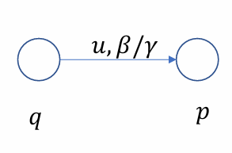
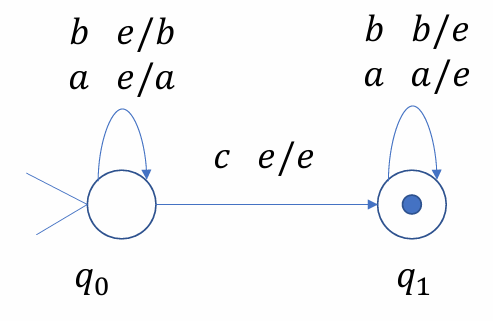
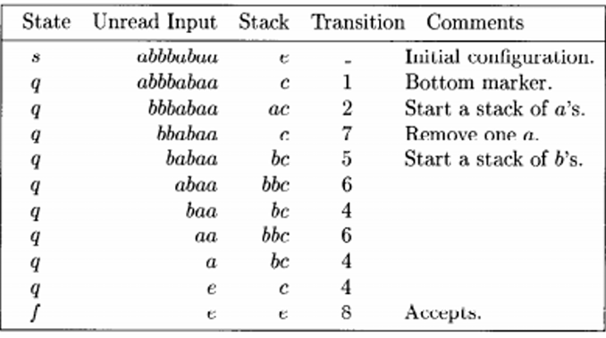
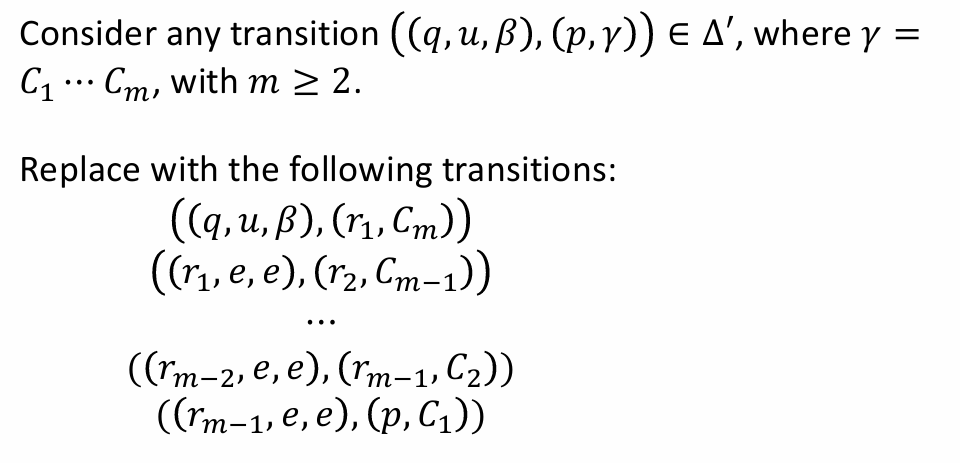
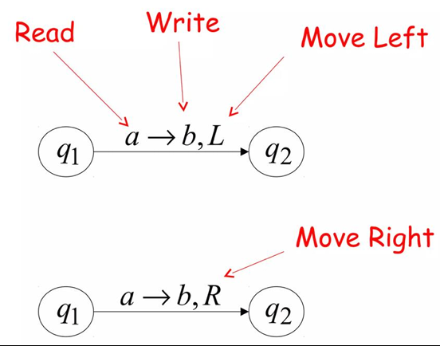
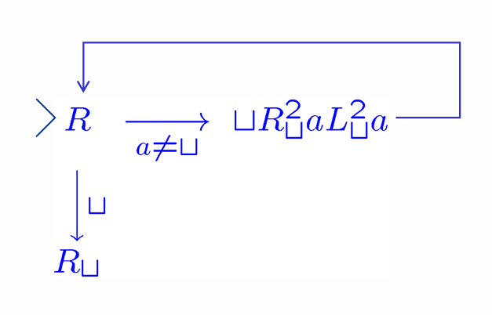

# 计算理论

!!! Abstract "授课信息"

    **授课教师**：顾实 / 金小刚（顾老师实际授课）
    
!!! Success "参考资料"

    请支持 [TonyCrane 的计算理论笔记](https://note.tonycrane.cc/cs/tcs/toc/)

!!! Tip "写在前面..."

    所谓计算理论，大致上说，就是计算机科学的理论基础。它以抽象的方式研究计算机“算什么/什么能被计算”（可计算性）、“怎么算”（自动机模型）、“算的代价”（复杂性）。

    在计算机科学中，对于同一个话题，我们主要研究**四类问题**：

    - **优化问题**。例如，找一个图的<u>最小</u>生成树。

    - **搜索问题**。例如，找一个权重和 $\le k$ 的生成树。

    - **决策问题**。例如，判断<u>是否存在</u>一个权重和 $\le k$ 的生成树。

    - **计数问题**。例如，一个图总共有多少权重和 $\le k$ 的生成树。

    在这其中，我们主要研究**决策问题**。

    - 输出简单，要么是 Yes，要么是 No。

    - 这也把所有的输入实例分成了两类：让答案为“是”的 Yes-instance 和让答案为“否”的 No-instance。

    - 由于**难度等价性**，研究了决策问题的难度，就基本掌握了其他问题的难度。

    本课程的逻辑（应该）是，从小范围（特解）逐渐向大范围（通解）介绍对计算的抽象。

## 01 集合、关系（数学基础）

### 三种基础的证明方法

- **归纳法 (Induction)**

- **鸽笼原理**

- **对角线论法（反证法）** 

#### 康托尔定理 (Cantor's Theorem)

集合 $A$ 的幂集（所有子集的集合）$P(A)$ 的势严格大于 $A$ 的势，即 $\text{card}(A) < \text{card}(P(A))$ 对所有集合 $A$ 都成立。

??? Success "证明"

    令 $f$ 是一个从 $A$ 到其幂集 $P(A)$ ($2^A$) 的单射。显然地，$\text{card}(A) \le \text{card}(P(A))$。

    我们需要证明 $A \neq P(A)$，即我们要证明这个单射(injection) $f$ 不能是满射的(surjective)。

    采取反证法。构造一个集合 $B = \{x \in A \mid x \notin f(x)\}$。由于假设 $f$ 是满射，那么在 $A$ 中必然存在一个元素 $t$，使得 $f(t) = B$。接下来考虑 $t$ 与 $B$ 的关系：
        
    - **如果 $t \in B$**：那么根据集合 $B$ 的定义，可知 $t \notin f(t)$。但由于我们假设了 $f(t) = B$，这推导出了 $t \notin B$，产生**矛盾**。
        
    -  **如果 $t \notin B$**：那么根据集合 $B$ 的定义，可知 $t \in f(t)$。同样由于 $f(t) = B$，这推导出了 $t \in B$，再次产生**矛盾**。

证明的核心就是“对角线论法”。

!!! Example "Considering the set $T$ of all infinite sequences of binary digits (i.e. each digit is zero or one). Is $T$ countable?"

    $T$ is **uncountable**（$T$ 不可数）。

    我们注意到，我们可以将 $T$ 中的某个序列 $s$ 中 1 的位置表示为自然数集的子集，例如对于 $\{ 1, 4 \}$，我们可以解释为 $s$ 只有第 1 和第 4 位是 1（从 0 开始计，当然不从 0 也无所谓），其余位置为 0 。这样，$T$ 和自然数集 $\mathbb N$ 的幂集 $P(\mathbb N)$ 存在一一对应关系（存在一个双射）。那么，$| T | = | P(\mathbb N) |$。

    由康托尔定理，我们有：

    $$|\mathbb N| < |P(\mathbb N)|$$

    因此，$| T | > | \mathbb N |$；我们无法做到为每一个可能的无限序列编号，因此 $T$ 不可数。事实上，可数的数学定义就是存在一个从 $S$ 到自然数集 $\mathbb N$ 的单射 (Injection) 函数（直观地说，能以自然数编号）。

### 闭包及其性质

如果一个集合中的元素在进行某种运算后，结果仍然在该集合中，称该集合对该运算**封闭 (closed)**。

例如，自然数集对加法封闭，但对减法不封闭。整数 $\mathbb Z$ 是包含 $\mathbb N$ 且对减法封闭的最小集合，那么 $\mathbb Z$ 就是 $\mathbb N$ 在减法下的**闭包 (closure)**（The set $\mathbb Z$ is called a **closure** of $\mathbb N$ **under** subtraction.）。

#### 关系的闭包

简单来说，关系 $R$ 的闭包就是通过给关系添加**最少数量**的新元素，来使得添加之后的关系 $R'$ 满足一定的性质 $P$，这个新的关系 $R'$ 就被称为关系 $R$ 关于性质 $P$ 的闭包。

??? "正式定义"

    假设 $R$ 是集合 $A$ 上的一个二元关系，$P$ 是某种性质（如自反性、对称性或传递性）。如果存在另一个关系 $R'$，满足以下三个条件，则称 $R'$ 是 $R$ 关于性质 $P$ 的闭包：
    1. **包含性**：$R \subseteq R'$ （原有的关系都在里面）。
    2. **性质性**：$R'$ 具有性质 $P$。
    3. **最小性**：对于任何包含 $R$ 且具有性质 $P$ 的关系 $S$，都有 $R' \subseteq S$（它是满足条件的所有关系中“最小”的那一个，不多加任何没用的元素）。

最常用的闭包有三种，**自反 (Reflexive)、对称 (Symmetric)、传递 (Transitive)**。读者可以回顾离散数学课程的相关内容。

- 我们一般将关系 $R$ 的**自反传递**闭包记为 $R^\ast$ 。其定义是

$$
R^\ast = \{(a,b) | a,b \in A~\text{and there is path from}~a~\text{to}~b ~\text{in}~R\}
$$

- 我们一般将关系 $R$ 的**传递**闭包记为 $R^+$ 。

---

## 02 形式语言的理论基础

!!! Question "我们为什么要这样抽象地研究它？"

    总感觉这里解释的不太好。回来再想想怎么解释，先复习吧。
    
    考虑一个决策问题。它完全可以抽象为：**给定一个串 $w$，判断 $w$ 是否属于所有 yes-instance 编码的集合 $L$**。这里的 $L$ 也就是语言。

首先我们想一门人类的语言。无论它有没有文字，一门语言总是包含一些音素。它们的组合可以表达一个词语、短语或者句子，组成各种表达。研究表明，人类可以发出的音素数量是有限的。

### 2.1 符号化表示

我们定义：

- **字母表 (Alphabet，记为 $\Sigma$)**：一个**有限**集合。集合内的元素被称作符号 (Symbols)。

- **字符串 (String)**：由 $\Sigma$ 中的符号组成的**有限**序列，称作 String over $\Sigma$ 。

    - 空串 ($\varepsilon$ 或者 $e$)：长度为 0 的字符串。

    - $\Sigma^\ast$ 表记字母表 $\Sigma$ 上所有可能字符串的集合；
    
        $\Sigma^+$ 表记字母表 $\Sigma$ 上所有非空字符串的集合（正闭包）；
      
        $\Sigma^i$ 表记字母表 $\Sigma$ 上所有长度为 $i$ 的字符串。
      
        所以 $\Sigma^\ast = \bigcup_{i \ge 0}\Sigma^i$，$\Sigma^+ = \bigcup_{i \ge 1}\Sigma^i$。

- **语言 (Language)**：是 $\Sigma^\ast$ 的任意子集（$L \subseteq \Sigma^\ast$）。对于有无限个串的语言，我们通常用下面的形式表示：

$$
L = \{w \in \Sigma^\ast: w~\text{有性质}~P\}
$$

### 2.2 字符串运算

*   **连接 (Concatenation)**：$xy$。
*   **幂运算 (Exponentiation)**：$w^k$ 表示 $w$ 重复 $k$ 次。$w^0 = \varepsilon$。
*   **反转 (Reversal)**：$w^R$。归纳定义：$\varepsilon^R = \varepsilon$, $(ua)^R = a u^R$。

### 2.3 语言

*   **基数悖论**：
    *   对于一个字母表 $\Sigma$（有限），字符串集 $\Sigma^*$ 是可数（可数无限）的。语言总是 $\Sigma^*$ 的子集，所以一个语言总是可数的。
        
        ??? Success "证明"
            证明 $\Sigma^*$ 可数，也就是需要构建一个双射 $f: \mathbb N \to \Sigma^*$。

            *   我们不妨给字母表里的符号按照某种顺序固定：$\Sigma = \{a_1, a+2, ..., a_n\}$。
            *   对于字符串集的每一个串，
                *   按长度排：长度短的字符串永远排在长度长的字符串前面。
                *   同长度按字母表中的顺序排：如果长度一样，就按照预先定好的字母表顺序来排。
            
            这样，每一个串都有一个确定的位置，每一个自然数都对应了一个唯一的字符串（长度 + 字典定位）。

    *   **语言的集合**（即 $P(\Sigma^*)$）是**不可数**的（由康托尔定理）。一个非空字母表形成的所有语言的数量是 $|\mathbb R|$。更一般的，一个可数无限集的幂集的势总是 $|\mathbb R|$。
    
    不可判定性：计算机程序/算法/正则表达式是有限长度的字符串，因此只有可数无限多个程序。这意味存在**无数个无法被计算机描述或解决的语言（问题）**。

### 2.4 语言的运算

*   **集合运算**：并 ($\cup$)、交 ($\cap$)、补 ($\bar{L} = \Sigma^* - L$)、差 ($-$)。

*   **连接 (Concatenation)**：$L_1 L_2 = \{xy \mid x \in L_1, y \in L_2\}$。

*   <u>**克林星号 (Kleene Star, $L^*$)**：</u>
    *   定义：从 $L$ 中取任意个（包括0个）字符串进行连接所组成的所有字符串的集合。
    *   $L^* = \bigcup_{i \ge 0} L^i = L^0 \cup L^1 \cup L^2 \dots$
        
        我们以 $L^k$ 表示从 $L$ 中任取 $k$ 个字符串所有可能的集合。

    *   总是包含 $\varepsilon$，因为 $L^0 = \{\varepsilon\}$。

*   **正闭包 ($L^+$)**：$L^+ = LL^* = \bigcup_{i \ge 1} L^i$。
    *   如果不包含空串的组合，则 $L^+$ 不含 $\varepsilon$。

### 2.5 语言的有限表示法：正则表达式

由于许多语言是无限集，我们想要一种有限的方式来描述它们。

#### 定义

正则表达式采用递归定义法。它是定义在字母表 $\Sigma \cup \{(,),\cup,\ast\}$ 上的字符串。

1.  **基础 (原子性，Atomic)**：$\emptyset$ 和 $\{a\}$ (其中 $a \in \Sigma$) 是正则表达式。$\varepsilon$ (或 $\{e\}$) 也是。
2.  **归纳 (组合性，Composite)**：如果 $\alpha, \beta$ 是正则表达式，则以下也是：
    *   $\alpha \cup \beta$。
    *   $\alpha \circ \beta$（也表示成 $\alpha \beta$）。
    *   $\alpha^*$，表示克林星号（重复）。

其实就类似于各编程语言中使用的正则表达式，不过那些“正则表达式”一般都加了不属于这里规定的正则表达式的更多功能。

#### 表示

函数 $\mathcal{L}(r)$ 将正则表达式 $r$ 映射到它所代表的语言。

*   $\mathcal{L}(\emptyset) = \emptyset$

*   $\mathcal{L}(a) = \{a\}$

*   $\mathcal{L}(\alpha \cup \beta) = \mathcal{L}(\alpha) \cup \mathcal{L}(\beta)$

*   $\mathcal{L}(\alpha \beta) = \mathcal{L}(\alpha) \circ \mathcal{L}(\beta)$

*   $\mathcal{L}(\alpha^*) = (\mathcal{L}(\alpha))^*$

**克林定理 (Kleene's Theorem)** 指出，一个语言是正则的，**当且仅当**它可以被某个正则表达式描述。

!!! Note "正则语言的三个性质"
    
    1. 每个能用正则表达式表示的语言，都可以用无穷多个不同的正则表达式来表示。（正则表达式和正则语言是多对一的关系。）

    2. 正则语言类是由基本语言（单个字符和空集）在并、连接和克林星号运算下的闭包。（封闭性。请参考正则表达式的递归定义。）

    3. 正则表达式在通用性上是不充分的。例如 $\{0^n 1^n : n \ge 0\}$ 无法被正则表达式描述。（正则表达式本质上对应于有限状态自动机（DFA，后面讲到）。DFA 的状态是有限的，它无法记住“已经读入了多少个 0”，即缺乏计数能力。）

#### 重要恒等式 (Identities)

*   $SR \ne RS$ (连接不满足交换律)
*   $S \cup R = R \cup S$ (并集满足交换律)
*   $R(ST) = (RS)T$ (连接结合律)
*   $R(S \cup T) = RS \cup RT$，$(R \cup S)T = RT \cup ST$ (分配律)
*   $\emptyset^* = \{ e \}$ (空集的星号是含空串的集合) $= e^*$
*   $(R^*)^* = R^*$
*   $(R^* S^*)^* = (R \cup S)^*$

!!! Note "补充"

    **生成器 vs 识别器**

    这是计算理论中描述语言的两种视角：

    1.  **生成器 (Generator)**：
        *   **代表**：正则表达式。
        *   **机制**：给出一套蓝图或指令，展示如何**构造**出语言中的字符串（例如：“先写个a，再写任意个b...”）。
    2.  **识别器 (Recognition Device)**：
        *   **代表**：有限自动机 (DFA/NFA)。
        *   **机制**：输入一个字符串，机器内部状态流转，最后输出 **Yes/No** 来判定该字符串是否属于该语言。

    **$\emptyset$ vs $\{ e \}$**
        *   $\emptyset$ 是空语言，没有元素。
        *   $\{ e \}$ 是只包含空串的语言，有一个元素（长度为0的串）。
        *   在连接运算中：$L \circ \emptyset = \emptyset$，但 $L \circ \{ e \} = L$。

---

## 03 正则语言与有限自动机

### 3.1 确定性有限自动机 (DFA)

#### 定义

从直观上理解，DFA 是一种计算模型，拥有有限个内部状态。它从左到右读取输入符号，根据当前状态和输入符号转移到下一个状态。更进一步地，一个有限自动机 $M$ 就是一种“设备”，拥有有限个内部状态，根据收到的字符串是否在对应语言给出“是”或“否”的回答。

*   **形式化定义 (5元组)**：一个 DFA $M$ 表示为 $(K, \Sigma, \delta, s, F)$。
    *   $K$：有限的状态集合 (States)。
    *   $\Sigma$：输入字母表 (Alphabet)。
    *   $s \in K$：初始状态 (Initial state)。
    *   $F \subseteq K$：接受状态集合 (Final/Accepting states)。
    *   $\delta$：转移函数 (Transition Function)，$K \times \Sigma \to K$。
        *   对于每一个状态和每一个输入符号，DFA **必须**恰好有一个 (unique) 确定的下一状态。

#### 运行机制

*   **格局 (Configuration)**：$(q, w)$ 表示当前在状态 $q$，剩余输入串为 $w$。
*   **转移 (Yield)**：
    *   **一步转移 ($\vdash_M$)**：$(q, aw') \vdash_M (q', w')$ 当且仅当 $\delta(q, a) = q'$。
    *   **多步转移 ($\vdash_M^*$)**：一步转移关系的自反传递闭包。即经过任意步（包括0步）后到达的状态。

#### 接受语言 (Language Recognition)
*   字符串 $w$ 被接受的含义是，如果从初始状态出发，自动机读完整个 $w$ 后停在接受状态 $F$ 中，我们认为这个串被该自动机接受。即 $(s, w) \vdash_M^* (q, e)$ 且 $q \in F$。
*   **$L(M)$**：机器 $M$ 接受的所有字符串构成的集合，也就是说 $M$ 对应的语言是 $L(M)$。
*   如果自动机 $M$ 接受语言 $L$ 中的每一个串，但拒绝任意一个不属于该语言的串，我们称**该自动机接受 (accept) 语言 $L$**。

### 3.2 非确定性有限自动机 (NFA)

我们发现，对于有些问题，如果使用自动机，我们需要费很大劲来确认这个自动机长什么样，例如，接受语言 $L=(ab \cup aba)^*$ 的自动机至少要五个状态：

{ width="400" style="display: block; margin: 0 auto;"}

因此，我们考虑设计简化自动机，于是我们有了 NFA。NFA 允许“猜测”路径，只要存在一条成功的路径即视为接受。

#### 定义

*   **与 DFA 的区别**：
    1.  **多重路径**：对于一个输入符号，可以转移到多个状态，也可以没有转移。
    2.  **$\varepsilon$-转移 (e-moves)**：允许不读取任何输入符号就改变状态。
*   **形式化定义 (5 元组)**：$(K, \Sigma, \Delta, s, F)$，标识符含义与 DFA 基本一致。
    
    !!! Warning "$\Delta$ 是一个**关系 (Relation)** 而不一定是函数"
        $\Delta \subseteq K \times (\Sigma \cup \{e\}) \times K$。因为对于同一个当前状态和同一个输入，NFA 可以跳转到不同的状态（分支）。三元组 $(p, u, q)$ 就表示状态 $p$ 读到 $u$ 时跳转到状态 $q$。

### 3.3 NFA 与 DFA 的等价性
*   **定理**：任何 NFA 都有一个等价的 DFA（即接受相同的语言），反之结论显然。
    
    这意味着 NFA **没有**比 DFA 更强的表达能力，只有表达上的简洁性。

!!! Success "NFA 转 DFA"
    **构造算法 (子集构造法 / Subset Construction)**：

    *   **核心思想**：DFA 的每一个状态代表 NFA 当前可能处于的所有状态的集合。
    *   我们定义概念 **$E(q)$ ($\varepsilon$-闭包)**：从状态 $q$ 出发，仅通过 $\varepsilon$-转移所能到达的所有状态的集合。
    *   **构造步骤**：

        1.  新 DFA 的起始状态 $s' = E(s)$。

        2.  对于新状态（集合）$Q \subseteq K$ 和输入 $a \in  \Sigma$，新转移 $\delta(Q,a) = \mathop{\bigcup}\limits_{p \in Q} E(\text{states reachable from } p \text{ by } a)$。
        
            这里书上用的形式化表达是 $\delta(Q,a) = \bigcup\{E(p) | q \in Q \wedge p \in K \wedge (q,a,p) \in \Delta\}$。

        3.  只要集合中包含原 NFA 的任意一个接受状态，该集合即为 DFA 的接受状态。$F' = \{Q | Q \subseteq K, Q \cap F = \emptyset\}$
    *   由于状态集 $K'$ 理论上是 $K$ 的幂集，最坏情况下，DFA 的状态数是 $2^{|K|}$（指数级爆炸）。但通常，大部分的状态与自动机要完成的运算无关。

??? Example "小练习"
    **作业题：**考虑语言 $(ab \cup aab \cup aba)^*$。

    1.   找到一个接受该语言的简单的 NFA；
    2.   将这个 NFA 转化为 DFA。

    **解答：**

    -   可以画出如下所示的图。   

        { width="300" style="display: block; margin: 0 auto;"}

    -   考虑子集构造法：
        -   起始状态：$\{q_0\} (A)$
        -   $\delta(\{q_0\}, a) = \{q_1\} (B)$
        -   $\delta(\{q_0\}, b) = \emptyset$ (Trap)
        -   $\delta(\{q_1\}, a) = \{q_2\} (C)$
        -   $\delta(\{q_1\}, b) = \{q_0, q_3\} (D)$
        -   $\delta(\{q_2\}, a) = \emptyset$
        -   $\delta(\{q_2\}, b) = \{q_0\} (A)$
        -   $\delta(\{q_0, q_3\}, a) = \{q_1, q_0\} (E)$
        -   $\delta(\{q_0, q_3\}, b) = \emptyset$
        -   $\delta(\{q_0, q_1\}, a) = \{q_1, q_2\} (F)$
        -   $\delta(\{q_0, q_1\}, b) = \{q_3, q_0\} (D)$
        -   $\delta(\{q_1, q_2\}, a) = \{q_2\} (C)$
        -   $\delta(\{q_1, q_2\}, b) = \{q_3, q_0\} (D)$

        最终的 DFA**（省略了死状态！建议考试有时间还是画出来）**：

        { width="300" style="display: block; margin: 0 auto;"}

!!! Danger "关于死状态 (Trap State)..."

    -   对于 NFA 来讲，转移是一个“关系”。如果某个状态面对某个字符没有对应的转移三元组，机器就直接在该路径上“死亡”（拒绝）。这种“死路一条”是 NFA 天生的特性，不需要专门画一个状态来承载。

    -   对于 DFA 来讲，转移是一个“函数”。如果不画死状态，从数学定义上讲，这个自动机是不完备的（被称为 Partial DFA）。所以虽然为了简洁起见经常省略，但如果要求画一个 complete 的 DFA，我们仍然需要画出死状态。

### 3.4 等价性定理

请读者再一次回顾 [2.5节](#2.5)中的内容。

#### 克林定理 (Kleene's Theorem)

一个语言是正则的，**当且仅当**它被有限自动机 (DFA/NFA) 接受，**当且仅当**它能用正则表达式描述。

!!! Success "证明"

    **证明方向 A：正则表达式 $\to$ FA (递归构造)**
    *   利用 NFA 的封闭性（实际上就是正则语言的封闭性）进行构造：
        *   **并集**：引入新起点，$\varepsilon$-转移到两个分支。
        *   **连接**：前一个的终点 $\varepsilon$-转移到后一个的起点。
        *   **星号**：终点回环到起点，起点直通终点（通过 $\varepsilon$）。

    **证明方向 B：FA $\to$ 正则表达式 (状态消除法 / GNFA)**

    对应“自动机对应什么正则表达式”的问题。

    **课件中的方法 ($R(i, j, k)$)**：

    *   定义 $R(i, j, k)$ 为从状态 $q_i$ 到 $q_j$，且中间经过的状态编号不超过 $k$ 的所有字符串集合。
    
        $R(i, j, k) = \{w \in \Sigma^*; (q_i,w) \vdash_{M,k}^* (q_j,e)\}, i,j = 1,2,3,...,n; k = 0,1,2,...,n$

    *   **递归公式**：$R(i, j, k) = R(i, j, k-1) \cup R(i, k, k-1) R(k, k, k-1)^* R(k, j, k-1)$。

    *   这本质上是动态规划（Floyd-Warshall 算法的变体）。

#### 状态消除求正则表达式

从直观上讲，我们可以通过**广义自动机 (Generalized FA)**的方法求对应的正则表达式。

标准的 DFA 或 NFA 可能有多个接受状态，且起始状态可能有进入的箭头。为了能用“状态消除法”提取正则表达式，我们需要把自动机“规范化”：
*   **只有一个起始状态**，且没有任何箭头指向它。
*   **只有一个接受状态**，且它没有任何箭头指出去。

*   将自动机转换为 GNFA：

    1.  **重命名原始状态**：
        假设原始自动机 $M$ 有 $n-2$ 个状态，我们将它们标记为 $q_1, q_2, \dots, q_{n-2}$。其中 $s$ 是原来的起始状态。

    2.  **添加两个新状态**：
        *   **$q_{n-1}$**：作为**新的起始状态 ($s_G$)**。
        *   **$q_n$**：作为**新的接受状态 ($f_G$)**。

    3.  **建立连接**：
        *   从新的起始状态 $s_G$ 画一条 $\varepsilon$ 边指向旧的起始状态 $s$。
        *   从**所有**旧的接受状态（集合 $F$ 中的状态）画 $\varepsilon$ 边指向新的唯一接受状态 $f_G$。

    4.  **数学定义 ($\Delta_G$)**：
        新的转移关系 $\Delta_G$ 等于：
        $\Delta \cup \{(q_{n-1}, e, s)\} \cup \{(q, e, q_n),q \in F\}$。

*   符号说明
    *   **$e$**：表示空串转移。即不需要读入任何字符，机器就可以直接跳过去。
    *   **$M$**：代表原来的整个自动机。
    *   **$M_G$**：代表扩展后的“广义”自动机。
    *   **$L(M) = L(M_G)$**：这说明这种构造没有改变自动机识别的语言。原来的字符串能被 $M$ 接受，现在也能通过这条“高速公路”到达新的终点 $f$。

构造好这个 GNFA 之后，你下一步要做的就是**状态消除**：

1.  每次删掉中间的一个状态（比如 $q_1$）。
2.  为了补偿删掉的状态，把原来的字符路径改成正则表达式（比如从 $a \to b$ 变成 $ab$）。
3.  重复这个过程，直到只剩下 $s_G$ 和 $f_G$。
4.  最后这两点之间连线上的那个巨大表达式，就是该自动机对应的**正则表达式**。

### 3.5 泵引理 (Pumping Lemma) —— 用于证明“非正则”
*   **定理内容**：若 $L$ 是正则的，则存在长度 $n$（泵长度），使得任意长度 $\ge n$ 的字符串 $w \in L$ 都可以被分割为 $w = xyz$，满足：
    1.  $|xy| \le n$
    2.  $y \ne e$ ($|y| > 0$)
    3.  $\forall i \ge 0, xy^iz \in L$
*   **证明非正则的思路**：鸽笼原理。自动机状态有限，长字符串必然导致状态重复（环）。这个环对应的就是 $y$。
    *   你（证明者）想证明 $L$ **不是**正则的。
    *   对手声称 $L$ 是正则的。
    *   **步骤**：
        1.  对手选定一个 $n$。
        2.  你找出一个特例字符串 $w \in L$（长度 $\ge n$）。
        3.  对手把 $w$ 分解为 $xyz$。
        4.  你选择一个 $i$（通常是 0 或 2），证明 $xy^iz \notin L$，从而导出矛盾。

!!! Tip "典型非正则语言例子"
    *   $L = \{a^n b^n \mid n \ge 0\}$：需要“计数”或“记忆”数量，有限状态机做不到。

    *   $L = \{ww^R \mid w \in \Sigma^*\}$：回文串。

    *   $L = \{a^p \mid p \text{ is prime}\}$：素数长度。

        ??? Success "证明"

            假设 $L$ 正则。那么必然存在 $w = xyz \in L$；不妨令 $x = a^p, y = a^q, z = a^r$，其中 $p,r \ge 0, q > 0$。

            由泵引理，我们有：对于每个非负的 $n$，$xy^nz \in L$，也即 $p + nq + r$ 总是素数。

            但这不可能。令 $n = p + 2q + r + 2$，那么此时 $p + nq + r = (q + 1) \cdot (p + 2q + r)$。

            导出矛盾，所以原语言不是正则的。

!!! Question "极小化 DFA"
    *   **问题**：给定一个 DFA，是否存在状态更少的等价 DFA？
    *   **Myhill-Nerode 定理**：
        *   **可区分性 (Distinguishability)**：如果存在字符串 $w$ 使得 $\delta(p, w) \in F$ 而 $\delta(q, w) \notin F$（反之亦然），则状态 $p$ 和 $q$ 是可区分的。
        *   **算法 (填表法)**：
            1.  标记所有接受状态和非接受状态对。
            2.  迭代标记：如果 $(p, q)$ 的某个输入 $a$ 转移到了已被标记的对 $(\delta(p, a), \delta(q, a))$，则标记 $(p, q)$。
            3.  未被标记的对合并。
    *   **结论**：每个正则语言都有（同构意义下）唯一的最小 DFA。

### 3.6 判定性问题

对于正则语言，以下问题是可判定的（即存在算法解决）：

*   **成员性 (Membership)**：$w \in L(M)$？（模拟运行 DFA 即可）。

*   **空性 (Emptiness)**：$L(M) = \emptyset$？（检查从起点到终点是否有路径，BFS/DFS）。

*   **有限性 (Finiteness)**：$L(M)$ 是有限集吗？（检查是否存在从起点可达且能到达终点的环）。

*   **等价性 (Equivalence)**：$L(M_1) = L(M_2)$？（检查 $(L(M_1) \cap \overline{L(M_2)}) \cup (\overline{L(M_1)} \cap L(M_2))$ 是否为空）。

!!! Warning "正则语言的局限性"
    虽然正则语言能处理模式匹配（如 `grep`），但无法处理嵌套结构（如编程语言中的括号匹配、HTML 标签配对）。这引出了下一章的内容：**上下文无关文法 (Context-Free Grammars)** 和 **下推自动机 (Pushdown Automata)**。

---

## 04 上下文无关语言与下推自动机

我们已经看到了确定性有限自动机（正则语言）的有限之处。但正如我们在 [2.5节](#2.5)中提到的，我们仍然想要用有限的表示描述无限的语言。我们需要一个更强的生成装置。

!!! Abstract "一般来讲这里的内容足够分成两章。但是我想借用这样的标题引发读者比较本章内容和前一章内容。"

### 4.1 上下文无关文法 (CFG)

*   **形式化定义 (4元组)**：一个 CFG $G$ 表示为 $(V, \Sigma, R, S)$。
    *   $V$：字母表 (Variables/Alphabets)。
    *   $\Sigma \subseteq V$：终结符集合 (Terminals)。
    *   $R$：产生式规则集合 (Rules)。形式为 $A \to w$，其中 $A \in V - \Sigma, w \in V^*$。不难看出 $R \subseteq (V-\Sigma) \times V^*$。
    *   $S$：起始变元 (Start variable, $S \in V - \Sigma$)。

*   **推导 ($\Rightarrow$)**：对于一个 CFG $G$，任意的 $x,y,z,w,u \in V^*$ 和任意的 $A \in V-\Sigma$：
    *   一步推导；$uAv \Rightarrow_G u\beta v$ if $(A, \beta) \in R$
    *   一般的推导：$w \Rightarrow_G^* u$ if $w = u \vee w \Rightarrow_G ... \Rightarrow_G u$

*   **语言 $L(G)$**：$\{w \in \Sigma^* | S \Rightarrow^* w\}$。即从 $S$ 出发能推导出的所有终结符串。如同正则语言的判定，我们说如果一个语言能由一个 CFG 生成（$L = L(G)，G~\text{is CFG}$），那么该语言就是上下文无关语言 (CFL)。

!!! Tip "所有正则语言都是 CFL，但反之不然（$\text{Regular Languages} \subseteq \text{CFL}$）。（如 $\{a^n b^n \mid n \ge 0\}$ 是 CFL 但不是正则语言）。"

!!! Warning "提示"
    
    -   ~~Language $L$ is CFL iff it is accepted by a CFG.~~

        **accept 是不对的**。因为 CFG 是一个生成串的 relation，我们只能说由 CFG 生成 (generated)。

    -   ~~The set of terminals is always nonempty.~~

        在定义下，**终结符集合可以是空集**。定义只要求终结符集合有限。在终结符是空集的情况下，CFG 要么生成空语言，要么只包含空串。

    -   The set of non-terminals is always nonempty.

        这句话是**正确**的。无论怎么说，起始变元都是非终结符。

### 4.2 文法的范式 (Normal Forms)

*   **乔姆斯基范式 (Chomsky Normal Form, CNF)**：
    *   所有规则形式均为 $A \to BC$ 或 $A \to a$。
    *   性质：任何长度为 $n$ 的字符串在 CNF 中文法的推导步数正好是 $2n-1$。
*   **格雷巴赫范式 (Greibach Normal Form, GNF)**：
    *   规则形式为 $A \to a\alpha$（$a$ 是终结符，$\alpha$ 是变元串）。
    *   性质：非常适合用于构造对应的下推自动机。

### 4.3 推导、解析树与二义性

*   **解析树 (Parse Tree)**：可以表示一个 CFG 的推导。

    *   根节点是 $S$，叶节点是终结符或 $\varepsilon$，内部节点是变元；反过来说，终结符或 $\varepsilon$ 只能出现在叶节点，变元只能出现在内部节点。

    *   直观展示了字符串的语法结构。

对于同一个 CFG 和同一个串，我们或许有许许多多推导的过程。考虑两个推导

$$
D = x_1 \Rightarrow x_2 \Rightarrow x_3 \Rightarrow ... \Rightarrow x_n, x_i \in V^*, x_1 \in V - \Sigma, x_n \in \Sigma^*
$$

$$
D' = x'_1 \Rightarrow x'_2 \Rightarrow x'_3 \Rightarrow ... \Rightarrow x'_n, x'_i \in V^*, x'_1 \in V - \Sigma, x'_n \in \Sigma^*
$$

$D$ **先于 (preceds/precede)** $D'$ ($D \prec D'$) $\Leftrightarrow \exists~1 \le k \le n$，使得：

-   对于所有的 $i \ne k$，$x_i = x'_i$
-   $x_{k-1} = x'_{k-1} = uAvBw$，其中 $u,v,w \in V^*$，$A,B \in V-\Sigma$
-   $x_k = uyvBw，x'_k = uAvzw$，其中 $A \to y \in R, B \to z \in R$
-   $x_{k+1} = x'_{k+1} = uyvzw$

$D$ 和 $D'$ 相似 (similar) $\Leftrightarrow (D, D')$ 在 $\prec$ 的自反、对称、传递闭包上。

!!! Warning "辨析"

    但我们不能武断地说，只要 $x_1 = x'_1, x_n = x'_n$，两个推导就一定是相似的。有可能它们存在两处或以上的不同（不妨加一个中间者来验证这一点）。

我们规定两种**推导类型**：

*   **最左推导 (Leftmost Derivation)**：每一步都替换最左边的非终结符。

*   **最右推导 (Rightmost Derivation)**：每一步都替换最右边的非终结符。

不难发现，

-   对于给定的一棵解析树，
    
    采用（左子树优先的）前序遍历展开非终结符，可以得到最左推导；
    
    采用右子树优先的前序遍展开非终结符，可以得到最右推导。

-   对于给定的最左或最右推导，

    我们也可以唯一确定一棵解析树（上面的方式反过来）。

可以看出，解析树和最左/最右推导之间是一对一映射。（一棵解析树对应唯一的最左推导和唯一的最右推导。）

*   **二义性 (Ambiguity)**：

    *   **定义**：如果一个字符串 $w$ 在给定文法下存在**两棵不同的解析树**（或两个不同的最左推导），则称该**文法**是二义的。

    *   **例子**：算术表达式 $E \to E + E \mid E * E \mid id$ 对字符串 `id + id * id` 有两种解析树（先加还是先乘）。

    *   **固有二义性 (Inherent Ambiguity)**：有些语言本身就是二义的，无论怎么设计文法，都无法消除二义性（例如 $\{a^n b^n c^m d^m\} \cup \{a^n b^m c^m d^n\}$）。

### 4.4.1 下推自动机 (Pushdown Automata, PDA)

#### 基本定义
*   **核心思想**：PDA = 有限自动机 (FA) + **栈 (Stack)**。栈提供了无限的“后进先出”存储（写）能力，使其能处理嵌套结构。
*   **形式化定义 (6元组)**：$M = (K, \Sigma, \Gamma, \Delta, s, F)$。
    *   $K$：状态集。
    *   $\Sigma$：输入字母表。
    *   $\Gamma$：**栈字母表** (Stack Alphabet)。（比自动机多的东西！）
    *   $s$：初始状态。
    *   $F$：接受状态集。
    *   $\Delta$：转移关系 (非确定性)。每个 Component 形式为 $((p, u, \beta), (q, \gamma)) \in \Delta$。这里 $\beta, \gamma \in \Gamma^*$
        *   含义：在状态 $p$，读入输入 $u$ (可以是 $\varepsilon$。课件上把这个描述成“磁带头”，读入的输入非空就往前挪，读入空串就不动)，弹出栈顶 $\beta$，转移到状态 $q$，压入 $\gamma$。
        *   在画图的时候，$((p, u, \beta), (q, \gamma))$ 常表示成：
            { width="200" style="display: block; margin: 0 auto;"}

!!! Warning "需要特别注意的是，即使符号可能相同，栈字母表和输入字母表是完全独立的两个表。PDA 不是从输入拿字符到栈上的；PDA 用栈来辅助自己判断下一步应该怎么办。"

??? Example "符号晦涩难懂？来看个例子！"

    { width="300" style="display: block; margin: 0 auto;"}

    根据图示，我们可以知道 $M$ 的转移关系有五个 Components：

    -   $((q_0, a, e), (q_0, a)) \to$ 读到了输入 $a$，将栈字母表中的符号 $a$ 压栈；
    -   $((q_0, b, e), (q_0, b)) \to$ 读到了输入 $b$，将栈字母表中的符号 $b$ 压栈；
    -   $((q_0, c, e), (q_1, e)) \to$ 读到了 $c$，进入接受态；
    -   $((q_1, a, a), (q_1, e)) \to$ 如果栈顶为 $a$，又读到输入 $a$，则将栈字母表中的符号 $a$ 弹出；
    -   $((q_1, b, b), (q_1, e)) \to$ 如果栈顶为 $b$，又读到输入 $b$，则将栈字母表中的符号 $b$ 弹出。

    这个自动机对应的语言 $L(M) = \{wcw^R : w \in \{ a,b \}^* \}$

#### 运行机制与接受条件

*   **格局 (Configuration)**：$(q, w, \alpha)$ 表示当前状态 $q$，剩余输入 $w$，栈内容 $\alpha$。

*   **PDA 接受一个字符串的方式**：

    A PDA $M$ accepts a string $w \in \Sigma^*$ **iff**

    1.  **终态接受 (Acceptance by Final State)**：输入读完且停在 $F$ 中（课件采用此定义）。

        $(s,w,e) \vdash_M^* (p,e,e)$ for some $p \in F$.

    2.  **空栈接受 (Acceptance by Empty Stack)**：输入读完且栈变空。
    
    这两种接受方式在非确定性 PDA 下是等价的，可以互相转化。我们说被 $M$ 接受的语言就是上述字符串的集合。

??? Example "设计一个接受某语言的 PDA"

    Design a PDA $M$ to accept the language $L = \{w \in \{a, b\}^*: w \text{ has the same number of } a\text{'s and } b\text{'s}\}$.

    核心思想是，遇到需要记忆的部分就进行压栈操作。一般来讲，我们可以将 PDA 拆分为三个逻辑阶段：

    -   压栈。把需要记住的信息压进去。
    -   状态转换。特别地，有时候需要 $\varepsilon$-转移来猜测。
    -   出栈。读入输入，弹出栈顶并比对，比对成功则继续。

    **Solution:**

    -   Let $M = (K, \Sigma, \Gamma, \Delta, s, F)$, where $K = \{s, q, f\},~\Sigma = \{a, b\},~\Gamma = \{a, b, c\},~F=\{f\}$

    -   $\Delta$：
        -   $((s,e,e),(q,c))$
        -   $((q,a,c),(q,ac))$
        -   $((q,a,a),(q,aa))$
        -   $((q,a,b),(q,e))$
        -   $((q,b,c),(q,bc))$
        -   $((q,b,b),(q,bb))$
        -   $((q,b,a),(q,e))$
        -   $((q,e,c),(f,e))$

        { width="350" style="display: block; margin: 0 auto;"}

### 4.4.2 确定性下推自动机 (DPDA)
*   **定义**：对于任意格局，至多只有一种可能的动作（无 $\varepsilon$-转移冲突）。
*   **局限性**：
    *   **DPDA < NPDA**：**与有限自动机不同**，确定性 PDA 的能力**弱于**非确定性 PDA。
    *   **DCFL (Deterministic CFL)**：被 DPDA 接受的语言。
    *   例如：回文 $\{ww^R\}$ 是 CFL 但不是 DCFL（因为机器不知道中间点在哪，必须猜，只能用 NPDA）。

### 4.5 等价性定理

**一个能被 PDA 接受的语言一定是一个 CFG 生成的，反之也成立。**即如果一个语言被 PDA 接受，那么它是 CFL。

#### CFG to PDA (构造法)
*   **思路**：PDA 模拟 CFG 的最左推导。
*   **构造**：
    *   栈中初始放入 $S$。
    *   若栈顶是变元 $A$，非确定性地选择规则 $A \to w$，将 $A$ 弹出并压入 $w$（展开）。
    *   若栈顶是终结符 $a$，则从栈顶弹出该终结符，匹配输入的 $a$（匹配）。

#### PDA to CFG (构造法)

*   **思路**：文法中的变元需要表示 PDA "从状态 $p$ 到状态 $q$ 且清空了期间压入的栈" 的过程。

*   **简单 PDA (Simple PDA)**：如果当前状态不是起始状态，那么限制每一步动作要么 pop 1个，要么 push 0-2 个符号。

!!! Note "PDA 转等价简单 PDA"
    类似将 FA 化为 GFA，如果 PDA $M = (K, \Sigma, \Gamma, \Delta, s, F)$，我们构造简单 PDA $M' = (K \cup \{s', f'\}, \Sigma, \Gamma \cup \{Z\}, \Delta', s', \{f'\})$。$Z$ 是栈底元素。
    $\Delta'$ 包含：
    
    -   $((s', e, e),(s, Z))$
    -   For each $f \in F$, $((f, e, Z),(f', e))$
    -   All transition of $\Delta$，但需要替换为满足条件的等价形式：
        -   替换 $|\beta| \ge 2$ 的转换；
        { width="300" style="display: block; margin: 0 auto;" }
        -   替换 $|\gamma| > 2$ 的转换（同时避免引入 $|\beta| \ge 2$）。
        { width="300" style="display: block; margin: 0 auto;" }

*   **变元构造**：非终结符形如 $\langle p, X, q \rangle$，对应从状态 $p$ 开始，栈顶是 $X$，经过一系列计算最终到达状态 $q$ 并把这个 $X$ 弹出的过程。

### 4.6 泵引理 (Pumping Lemma for CFL) —— 用于证明不是CFL
*   **定理**：若 $L$ 是 CFL，则存在长度 $p$，对任意 $s \in L$ 且 $|s| \ge p$，可分解为 $s = uvxyz$，满足：
    1.  $|vxy| \le p$ (泵出的部分长度有限)
    2.  $|vy| > 0$ (至少有一部分是非空的)
    3.  $\forall i \ge 0, uv^ixy^iz \in L$
*   **直观解释**：解析树非常高时，必然有一条长路径，路径上会出现重复的非终结符（鸽笼原理）。这个重复的非终结符 $A$ 导致了可以被重复生成的结构（$A \Rightarrow^* vAy$）。
*   **博弈论应用**：与正则语言类似，通过与“对手”博弈来寻找矛盾。
*   **典型非 CFL 例子**：
    *   $L = \{a^n b^n c^n \mid n \ge 0\}$（因为 CFL 只有两个“泵”位置 $v, y$，无法同时照顾到 $a, b, c$ 三个部分）。
    *   $L = \{ww \mid w \in \{0,1\}^*\}$（复制语言，因为栈 LIFO，开始读后半部分 $w$ 时，需要比对现在在栈底的那个第一个字符，但显然无法完成）。
    *   $L = \{a^p \mid p \text{ is prime}\}$（若单字母表语言是 CFL 则必是正则，但素数语言不是正则）。

!!! Tip "泵引理的泵到底是什么"
    就是那些可以被复制任意多次的片段，类比成水泵源源不断。

!!! Warning "CFL 的局限性"
    我们可以看到，虽然有了栈能够解决更多的语言了，但是，栈只能对栈顶进行操作。这引出了下一章内容，**图灵机**。

### 4.7 CFL 的封闭性
*   **封闭的运算**：
    *   **并 (Union)**: $S \to S_1 \mid S_2$。
    *   **连接 (Concatenation)**: $S \to S_1 S_2$。
    *   **Kleene 星号 (Star)**: $S \to S S_1 \mid \epsilon$。
    *   **逆转 (Reversal)**。
*   **不封闭的运算**：
    *   **交 (Intersection)**：$L_1 \cap L_2$ 不一定是 CFL。
        *   例：$\{a^n b^n c^*\} \cap \{a^* b^n c^n\} = \{a^n b^n c^n\}$ (非 CFL)。
    *   **补 (Complementation)**：如果 CFL 对补封闭，由德摩根律可知它对交也封闭，导出矛盾。
*   **特殊情况**：
    *   CFL $\cap$ 正则语言 = CFL (课件中证明了这一点，通过构造 PDA 与 DFA 的“积自动机”实现)。
    *   **DCFL** 在补运算下封闭，而一般 CFL 不封闭。

### 4.8 判定性问题
*   **成员性**：给定 $w$，问 $w \in L(G)$？
    *   **CYK 算法**：基于动态规划，时间复杂度 $O(n^3)$。需要先将文法转为 CNF。
*   **空性**：$L(G) = \emptyset$？
    *   可判定。检查起始符 $S$ 是否能推导出终结符串（标记法）。
*   **有限性**：$L(G)$ 是有限集吗？
    *   可判定。检查生成的依赖图中是否存在环。
*   **等价性无法判定！**：
    *   判断两个 CFG 是否等价 ($L(G_1) = L(G_2)$?) 是**不可判定**的；
    *   判断 CFG 是否有二义性是**不可判定**的。

---

??? Note "总结：正则语言 vs 上下文无关语言"

    | 特性 | 正则语言 (Regular) | 上下文无关语言 (CFL) |
    | :---: | :---: | :---: |
    | **生成器** | 正则表达式 | 上下文无关文法 (CFG) |
    | **识别器** | 有限自动机 (DFA/NFA) | 下推自动机 (PDA) |
    | **核心限制** | 有限内存 | 无限栈内存 (后进先出) |
    | **典型例子** | $\{a^n \mid n \ge 0\}$ (Parity) | $\{a^n b^n \mid n \ge 0\}$ (Matching) |
    | **泵引理** | $w = xyz$ | $w = uvxyz$ |
    | **封闭性** | 并, 交, 补, 连接, 星号 | 并, 连接, 星号 (**交, 补不封闭**) |
    | **等价性判定** | 可判定 | **不可判定** |

---

## 05 递归可枚举语言与图灵机

!!! Abstract "我们已经发现了前面内容之间的关系。读者可以继续联系本章内容和前一章内容。在这一章里，图灵机是判定器视角，无限制文法是生成器视角。"

我们已经看到了栈（PDA）的局限性。有没有更广泛的办法？如果我们把栈和输入带结合起来，让这个带子可写呢？

!!! Note "邱奇-图灵论题 (Church-Turing Thesis)"
    人类计算者 (Human Computer) 的计算过程（读写符号、状态转移、移动注意力）都可以被通用图灵机精确模拟。换句话说，任何“算法”可计算的过程，都可以由通用图灵机 (Universal Turing Machine, UTM) 计算。它是一个公理/假设，而非数学定理，但目前所有已知的计算模型（如 $\lambda$ 演算、递归函数）都被证明与图灵机等价。

### 5.1 图灵机定义
*   **形式化定义 (5 元组)**：$M = (K, \Sigma, \delta, s, H)$
    *   $K$：有限状态集。
    *   $\Sigma$：字母表（包含输入符号、空格 $\sqcup$、左端点 $\triangleright$）。请注意字母表不包含左右移（$\leftarrow, \to$）。
    *   $s$：初始状态。
    *   $H$：停机状态集 (Halting states)，通常包含 $\{y, n\}$ (Yes/No)；意味着所有的转移函数中没有以停机状态为起点的转移。如果没有以当前状态为起点的转移函数，图灵机**停机**。
    *   $\delta$：转移函数，$(K - H) \to K \times (\Sigma \cup \{\leftarrow, \to\})$。$\delta(q, a) = (p, b)$ 表示“当前状态 $q$ 读到 $a$，转为状态 $p$，写入 $b$”。$b \in \Sigma \cup \{\leftarrow, \to\}$，如果 $b$ 是 $\leftarrow, \to$ 则代表将读写头左移或右移。特别地，如果 $a = \triangleright$，$b$ 必然是 $\to$；$a \in \Sigma$，$b$ 必然不是 $\triangleright$。
        
        在图示中经常这样表示（$L$，左或 $R$，右）：
        { width="200" style="display: block; margin: 0 auto;" }

#### 基础图灵机与图灵机表示法
从上面的定义，我们可以定义两种基础的图灵机（在 $M = (\{s,h\}, \Sigma, \delta, s, \{h\})$ 定义下）：

-   写字符机器（$M_a$）：如果 $a \in \Sigma - \triangleright$（字母表），那么 $M_a$ 就是在当前格写入字符 $a$。

-   移动磁头机器（$M_{\leftarrow},~M_{\to}$）：将磁头向左或向右移动一格。

我们将 $M_a$ 简记为 $a$，$M_{\leftarrow}$ 简记为 $L$，$~M_{\to}$ 简记为 $R$。特别地，$\delta(s,\triangleright) = (s,\to)$。

基础的图灵机可以组合。当你看到从一个机器指向另一个机器的箭头，且箭头上标有字符时，它的含义是：“运行前一个机器；完成（停机）后，观察当前磁头下的字符；如果字符匹配，则运行下一个机器。”例如我们可以构建：

$$
R \xrightarrow{a, b, \triangleright, \sqcup} R
$$

这表示这个机器先向右移一格；如果那一格里是箭头上字符中的任何一个，它就再向右移一格。如果箭头上的条件是整个字母表，那么我们可以简记这个组合机器为 $R^2$。

你或许还会看到有下标的情况。比如 $R_{\sqcup}$，它的意思是一直右移，直到遇到 $\sqcup$（停在空格位置）。 

### 5.2 图灵机的运行
*   **格局 (Configuration)**：图灵机在某时刻的快照，包括当前状态、带子内容、读写头位置；可以简记为 $(q, w\underline{a}u)$。状态分量在 $H$ 中的格局被称为停机格局。
*   **计算 (Computation)**：格局的序列 $C_0 \vdash C_1 \vdash \dots \vdash C_n$。
*   **接受 (Accept)**：图灵机在输入 $w$ 上最终停在接受状态 $y$。

### 5.3.1 图灵机作为判定器

#### 判定 (Decide)：

*   图灵机 $M$ **判定** 语言 $L$，意味着对于所有输入 $w$，$M$ **总能停机**。若 $w \in L$ 则接受，若 $w \notin L$ 则拒绝。

*   此类语言称为 **递归语言 (Recursive Language)** 或 **可判定语言 (Decidable)**。

#### 半判定 (Semidecide)：

*   图灵机 $M$ **半判定** 语言 $L$，意味着若 $w \in L$，则 $M$ 停机接受；若 $w \notin L$，则 $M$ **要么拒绝，要么死循环（永不停机）**。

*   此类语言称为 **递归可枚举语言 (Recursively Enumerable, R.E.)**。不难发现，如果一个语言是递归的，它一定是 R.E. 

!!! Tip "这也就是说，相较于只有接受或拒绝两个状态的 PDA 或者 FA，图灵机即使只有 2 个停机状态（$y,n$），也可以通过永不停机来给出一个答案。"

### 5.3.2 图灵机作为函数计算机

对于一个图灵机 $M = (K, \Sigma, \delta, s, H)$，我们构建一个新字母表 $\Sigma_0 \subseteq \Sigma - \{ \triangleright, \sqcup \}$，以及令 $w \in \Sigma_0^*$。如果我们标记图灵机输入的内容是 $w$，经过运算停机时带子上的内容是 $y$，那么 $y = M(w)$ 就是图灵机 $M$ 在输入 $w$ 上的输出。

我们定义一个函数 $f: \Sigma_0^* \to \Sigma_0^*$。如果 $\forall w \in \Sigma_0^*, M(w) = f(w)$，我们称这个图灵机可以计算 (compute) 该函数。另一方面，如果对于某个函数，存在一个图灵机能够计算它，那么这个函数是 **可计算(computable) / 递归** 的。

!!! Example "拷贝机"

    能够将 $\underline{\sqcup} w \sqcup$ 变为 $\sqcup w \sqcup w \underline{\sqcup}$，$w$ 不含 $\sqcup$（不然机器不知道哪个该拷贝哪个不该拷贝）。长这样：

    { width="300" style="display: block; margin: 0 auto;" }

### 5.4 图灵机的变体与等价性

这些“增强”的图灵机并不会增加其计算能力（即**能解决的问题范围**）。也就是说，以下这些图灵机在**可计算性**上和标准图灵机是等价的。

1.  **多带图灵机 (Multitape TM)**：
    *   *模型*：有 $k$ 条带子和 $k$ 个独立读写头（$\delta : (K-H) \times \Sigma^k \to K \times (\Sigma \cup \{\leftarrow, \to\})^k$）。
    *   *约定*：输入和输出都会在 **第一条带子** 上，其他带子上的内容在计算结束会被舍弃。
    *   我们通常用构造的方法证明多带图灵机和标准图灵机的等价性，也叫用标准图灵机（$M'$）*模拟*多带图灵机（$M$）。
        单带图灵机可以通过“多道 (Tracks)”技术模拟多带，并在带子上标记每个虚拟头的位置。也正因如此，$M'$ 的字母表 $\Sigma'$ 通常比原字母表 $\Sigma$ “大”（$|\Sigma'| \ge |\Sigma|$）。具体来讲：
    !!! Success "模拟方法"
        -   **Parse 1 - 初始化**
            1.  **右移输入**：为了腾出空间并标准化起始位置，先把输入 $w$ 向右移动一格（前面插一个空格）。
            2.  **设置起始标记**：回到 $\triangleright$（左端点）右侧的第一格。在这一格写入一个特殊符号，这个符号是一个 $2k$ 元组：$(\sqcup, 1, ..., \sqcup, 1)$。
                -   这里的 $1$ 是**磁头标记**，都是 $1$ 表示 $k$ 条带子的磁头全都在当前格（第一格）。
                -   $\sqcup$ 相当于表示了当前格存什么。
            3.  **转换剩余输入**：磁头（单带图灵机的这个物理磁头）向右走。对于输入 $w$ 中的每个字符 $a$，将其对应格变成 $(a, 0, \sqcup, 0, ..., \sqcup, 0)$。
                -   $0$ 表示磁头不在这些格子上。
            这样，我们就利用单带表示出了 $k$ 个逻辑（虚拟）轨道。第一道存输入，其他道都是空白。
        -   **Parser2 - 模拟运行**
            
            一旦初始化完成，$M'$ 就开始重复以下步骤来模拟 $M$ 的每一次状态转移，直到 $M$ 停机。
            在这之前，需要注意，$M'$ 当前的物理磁头停在第一格未被分轨的格子上 (true blank)。这里是模拟区域的右侧终点。

            1.  **信息收集**：
            
                -   首先，$M'$ 扫一遍带子（向左扫描），识别出所有轨道中标记为 $1$ 的位置，通过 finite control 记住该轨道当前对应的字符是什么。
            
                -   扫描结束后，$M'$ 已经知道了 $M$ 当前的内部状态以及 $k$ 个磁头看到的 $k$ 个字符。磁头移回 true blank 待命。
            
            2.  **更新状态和带子**：
            
                -   根据 $M$ 的转移函数，$M'$ 计算出每条轨道要改写成什么新符号、每个虚拟磁头标记（$1$）要左移/右移还是不动、进入什么新状态。
                    
                    在此期间，磁头向左扫描，横跨数据区（轨道化区域），在路过每一个有磁头标记的格子时写符号、移动磁头标记。
                
                -   现在，向左的扫描结束了，也更新完了状态。磁头一路向右，一直找到 true blank，准备下一次模拟。

                    但是，如果在更新过程中，某个虚拟磁头向右移动到了原本是 true blank 的位置，那么这个“向右扫”的过程还肩负着**“领土扩张”**的任务：它需要把这个原本的 True Blank 划分成新的 $k$ 个轨道，初始化为 $(\sqcup, 1, ...)$。

    *   *代价*：对于一个输入 $x \in \Sigma^*$，如果多带图灵机从开始到停机需要 $t$ 步，那么标准图灵机解决同样的问题，其时间复杂度是 $O(t(|x| + t))$。

2.  双向无穷带 (Two-way infinite tape)：容易被一个两条带的多带图灵机模拟，把这条左右无限的带子“剪成”两段就可以（那自然能被单带图灵机模拟）。

3.  多头图灵机 (Multiple heads)：容易被一个多带图灵机模拟（用一条带子用来记录所有头的位置）。

4.  二维带 (Two dimensional tape)：其“带子”可以是一个二维的“网格”。可以被标准图灵机模拟。

5.  **非确定性图灵机 (Nondeterministic TM, NTM)**：
    *   *定义*：$M = (K, \Sigma, \Delta, s, H)$，$\Delta$ 是一个关系而非函数，一个状态可能有多个后续动作。
    
    !!! Note "NTM 判定语言、计算函数的定义"

        -   我们称 NTM $M$ 判定一个语言 $L \subseteq (\Sigma - \{\triangleright, \sqcup\})^*$，如果：
            -   所有的计算路径都必须在有限步内停机；
            -   该语言中的所有 $w$ 存在**至少一条**计算路径最终进入 $y$ 状态；不属于该语言的串所有的可能路径都最终进入 $n$ 状态。
        -   我们称 NTM $M$ 计算一个函数 $L \subseteq (\Sigma - \{\triangleright, \sqcup\})^*$，如果：
            -   所有的计算路径都必须在有限步内停机；
            -   每一条停机路径产出的结果都必须等于 $f(w)$。因为函数不是多值映射。
    
    *   *定理*：NTM 与 标准 DTM 等价。
    
    *   *DTM 模拟 NTM 的方法*：DTM 使用 3 条带子（1/输入带、2/模拟带、3/地址带）进行**广度优先搜索 (BFS)**，系统地遍历 NTM 的所有可能分支。若 NTM 接受，DTM 终会找到那条路径。

        模拟的过程可以这样表示：

        { width="400" style="display: block; margin: 0 auto;" }

        其中，

        -   $C^{1 \to 2}$：一个简单图灵机，擦去模拟带的内容，拷贝输入带的内容。
        -   $B^3$：在地址带上按照字典序 (lexicographically) 生成下一个串。
        -   $M_d^{2,3}$：$M$ 的确定性版本，依靠模拟带和地址带工作。

        ??? Success "$M_d$ 的工作方式"
            我们设对于一个状态 $(q,a)$，NTM 下一步有 $r$ 种可能组合。我们按照某种顺序编号。

            -   $M_d$ 和 $M$ 拥有相同的状态。
            -   一开始，模拟带（$M_d$ 的第一条）上面有输入 $w$；地址带上初始拥有一个由从 $1$ 到 $r$ 范围内的 $n$ 个整数（$i_1, i_2, ..., i_n$）组成的串。
            -   随后，接下来的 $n$ 步：
                -   第一步，它选择 $r$ 种组合中的第 $i_1$ 个组合，然后根据该转移转换自身状态；
                -   接下来，它选择第 $i_2$、$i_3$ 个组合，以此类推...
                -   当 $M_d$ 在地址带（它的第二条）上看见了一个空格，它就停机。

!!! Warning "复杂度分析"
    标准 DTM 对 NTM 的模拟不同于模拟其他拓展图灵机那样一步一步模拟，而是指数级多的步数。所以，DTM 模拟 NTM 时时间复杂度的提升是指数级的，而别的是多项式级别的。

### 5.5 文法（无限制文法，Unrestricted Grammar）

我们回顾正则表达式和 CFG 的定义。CFG 限制其规则左边必须是**单个非终结符**。这极大地限制了它生成语言的能力。现在，我们再将这个定义更一般化：

-   无限制文法允许规则左边是一个**字符串**，只需要包含**至少一个非终结符**就可以。
-   规则的形式化表示：$\alpha \to \beta$，其中 $\alpha \in (V \cup \Sigma)^+$ 且 $\exists a (\in V - \Sigma) \in \alpha$（包含非终结符）。
-   例如，$AXY \to AYX$，这就允许了上下文相关的操作，比如交换字符顺序。

不难发现，CFG 一定是一个 Grammar (UG)。

!!! Example "文法 $G$ 可以生成语言 $L = \{a^n b^n c^n\}$"
    -   $\Sigma = \{a, b, c\}$
    -   $V = \{a, b, c, S, A, B, C, T_a, T_b, T_c\}$ （后三个是特殊的非终结符，起到一个标记的作用，具体可以看转换规则理解）
    -   规则：
        -   $S \to ABCS$
        -   $S \to T_c$
        -   $BA \to AB$
        -   $CA \to AC$
        -   $CB \to BC$
        -   $CT_c \to T_cc$
        -   $CT_c \to T_bc$
        -   $BT_b \to T_bb$
        -   $BT_b \to T_ab$
        -   $AT_a \to T_aa$
        -   $T_a \to e$
   
### 5.6 等价性定理

开宗明义，**一个语言是 R.E. ，当且仅当它是被一个 UG(或简称 Grammar) 产生的。**

*   **方向 1 ($\Rightarrow$)：文法生成的语言是 R.E. 的。**
    *   **证明思路**：构造一个非确定性图灵机（NTM）来模拟推导过程。
    *   NTM 将规则写在带子上，非确定性地选择规则并应用到当前字符串上。如果生成的字符串与输入 $w$ 匹配，则接受。
*   **方向 2 ($\Leftarrow$)：R.E. 语言可以由文法生成。**
    *   **证明思路**：给定一个图灵机 $M$，构造一个文法 $G$ 来模拟 $M$ 的计算过程。
    *   **模拟方法**：将图灵机的格局（Configuration，即 `左边内容 状态 右边内容`）编码为字符串。文法的产生式规则直接模拟图灵机的转移函数 $\delta$（例如，图灵机读写头向右移，文法就对应变成 $q a \to b p$ 形式的重写规则）。
    *   如果图灵机最终停机接受，文法就能生成对应的原始输入字符串。

这意味着 **图灵机和无限制文法是等价的**。

### 5.7 递归函数论

这部分从纯数学函数的角度重新定义了“可计算性”。

#### 原始递归函数 (Primitive Recursive Functions)

这是一类基础的、必定停机的函数。
 
*   **基本函数**：
    
    1.  零函数 (Zero Function) $Z(x) = 0$
    
    2.  后继函数 (Successor Function) $S(x) = x + 1$
    
    3.  投影函数 (Projection Functions / Identity Functions) $P_i^n(x_1, \dots, x_n) = x_i$

    这里可能提到 $k$-ary 的事情，意思是几维（自变量有多少）。

*   **复杂的原始递归函数**：

    两种方法：

    1.  **合成 (Composition)**：函数套函数。

    2.  **原始递归 (Primitive Recursion)**：类似于编程中的 `For-loop`。定义 $f(n+1)$ 依赖于 $f(n)$。

*   **例子**：加法（递归调用后继）、乘法（递归调用加法）、减法、阶乘等都是原始递归函数。所有连续函数以及符号函数也都是原始递归函数。

*   **局限性**：虽然涵盖了几乎所有常见数学函数，但它**不能**表示所有可计算函数（例如阿克曼函数 Ackermann Function，它增长太快，虽可计算但不是原始递归）。

另外，我们定义 **原始递归谓词 (primitive recursive predicate)**：是一个只有 $\{0, 1\}$ 取值的原始递归函数。读者可以发现我们定义这个东西的意义在于，在研究计算机“能算什么”时，通过将这些逻辑判断转化为输出 0 或 1 的原始递归函数，我们就可以用数学工具来处理逻辑命题。例如，<u>相等关系、大小关系、整除性、素数判定</u>。

!!! Note "原始递归谓词关于逻辑运算符封闭。"

    -   $p(m)$ is a primitive recursive predicate, $\lnot p(m) = 1 - p(m)$ is also a p.r.p.
    -   $p(m, n), q(m, n)$ are the primitive recursive predicates, $p(m, n) \vee q(m, n)$ and $p(m, n) \wedge q(m, n)$ are also p.r.p.s.

!!! Note "原始递归谓词的有界析取/合取归约"

    如果 $p(n_1, n_2, ..., n_k, m)$ 是原始递归谓词，那么
    
    -   $\exists t \le m, p(n_1, n_2, ..., n_k, t) \Leftrightarrow \sum\limits_{t = 0}^m p(n_1, n_2, ..., t) \neq 0$
    -   $\forall t \le m, p(n_1, n_2, ..., n_k, t) \Leftrightarrow \prod\limits_{t = 0}^m p(n_1, n_2, ..., t) \neq 0$

    都是原始递归谓词。

#### $\mu$-递归函数 (General Recursive Functions)

为了涵盖所有图灵机可计算的函数（包括那些可能死循环的），或者说，为了涵盖不是原始递归但是是递归函数的函数，引入了 **极小化算子 ($\mu$-operator)**。

*   **极小化 (Minimalization)**：
    
    *   定义 $\mu y [g(x, y) = 0]$ 为：寻找最小的 $y$ 使得 $g(x, y) = 0$。
    
    *   这相当于编程中的 `while` 循环。
    
    *   *注意*：这个搜索过程可能永远不停机（即 $y$ 不存在），因此产生的函数是**部分函数 (Partial Function)**。

*   **$\mu$-递归函数定义**：由基本函数出发，通过合成、原始递归、**极小化**规则构成的函数类。

#### 等价性定理

*   **定理**：一个函数 $f: N^k \to N$ 是 $\mu$-递归的，当且仅当它是图灵机可计算的 (Turing Computable)，或者说它是递归的。
*   **证明思路**：
    *   ($\Rightarrow$)：图灵机可以模拟基本函数、合成、递归和极小化操作（通过循环搜索）。
    *   ($\Leftarrow$)：利用哥德尔配数（Gödel Numbering）将图灵机的格局和计算过程编码为整数，然后构造一个递归函数来模拟图灵机的步进。

---

## 06 不可判定性

---

## 总结

1.  **计算的边界**：
    *   **正则语言**（有限内存） $\subset$ **上下文无关语言**（栈内存） $\subset$ **递归语言**（图灵机，必停机） $\subset$ **递归可枚举语言**（图灵机，可能死循环） $\subset$ **所有语言**。
2.  **核心结论**：
    *   **Church-Turing Thesis**：凡是能被自然计算的，都能被图灵机计算。
    *   **鲁棒性**：增加多带、非确定性等特性，不会改变图灵机的计算能力（只改变效率）。
    *   **形式化等价**：$\text{Turing Machine} \iff \text{Unrestricted Grammar} \iff \mu\text{-Recursive Function}$。这就是计算的统一定义。
