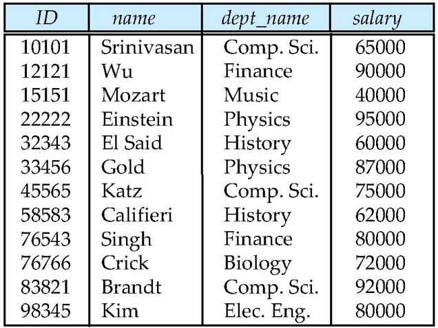
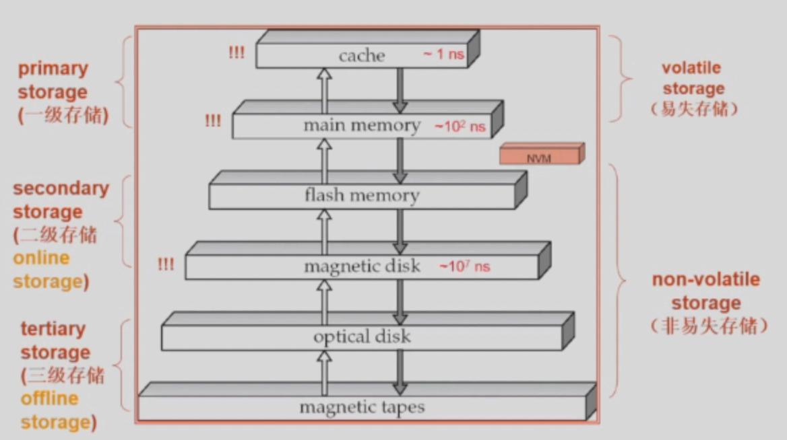

!!! Abstract
    **课程信息**
    - 黄忠东老师授课。
  
    - 参考用书：《Database System Concept》, 7th Edition

    - Grading Policy
    
!!! 这门课讲什么
    在这门课程中，我们将学习到有严格事务要求(data access requirement)的结构化数据(data type)的管理。

### 使用一般的文件处理系统可能产生的问题

- 数据冗余(redundancy)和不一致(inconsistency)

- 访问数据的困难性
  对于每个新的任务，需要写新的程序来实现

- 完整性(integrity)问题

    - 完整性约束(例如要求成绩必须>0)表示不明显

    - 修改和新增操作较为繁琐(需要修改程序代码)

- 更新异常

- 
### Data

- Different Levels

  - Physical level
  
    数据在物理层面上的存储方式。

  - Logical level \*主要关注
  
    数据在数据库中时如何组织的。

  - View level
  
    数据的可视程度。

### Data Manipulation Language

## Relational Model

**relation & relationship**

所有有相同属性的成员的集合称为一个relation。这和通常中文中认为的“关系”不同。

!!! Example
    一个球队中的所有球员、来上课的所有同学都可以称为一个relation，而你和你的宠物狗之间存在的关系在本课程中称为relationship。

**Relation Schema and Instance**

null: 不知道的值

**Domain of Attribute**

**Database**

**Keys**

**Relational Algebra**

