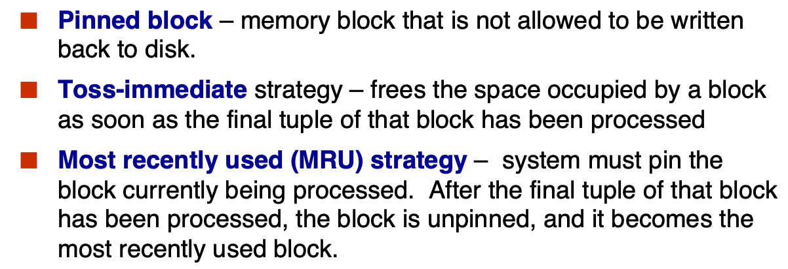

!!! Abstract
    **课程信息**
    - 黄忠东老师授课。
  
    - 参考用书：《Database System Concept》, 7th Edition

    - Grading Policy
    
!!! 这门课讲什么
    在这门课程中，我们将学习到有严格事务要求(data access requirement)的结构化数据(data type)的管理。

!!! Success "特别鸣谢🙇‍"

    - Github上[@yile-liu](https://github.com/yile-liu/ZJU_database_system)老师的数据库系统笔记。

    - Chritch老师的博客 [数据库系统篇](https://obsidian.zerokei.top/Hub/Database%20System/)

<!-- ## 数据库概念

### 使用一般的文件处理系统可能产生的问题

- 数据冗余(redundancy)和不一致(inconsistency)

- 访问数据的困难性
  对于每个新的任务，需要写新的程序来实现

- 完整性(integrity)问题

    - 完整性约束(例如要求成绩必须>0)表示不明显

    - 修改和新增操作较为繁琐(需要修改程序代码)

- 更新异常 -->

## Relational Model

我们来看一个例子：


在这个例子中，蓝底的列名被称为**attributes(属性)**，下面的每一行被称为一个**tuple(元组)**。我们给定 $A_1, A_2, …, A_n$ 是一系列attributes，那么

$$
R = (A_1, A_2, …, A_n )
$$

被称为**relation schema**。一般地，我们用 $R$ 等大写字母表记一个relation schema，用 $r$ 等小写字母表记一个 relation instance。

每一列的所有可取值(取值范围)被称为它的**domain**。我们给定列 $A_i$ 的 domain 是 $D_i$ ，那么从形式上说，一个**关系(relation)**就是 $D_1 \times D_2 \times ... \times D_n$ 的一个子集。

换句话说，一个relation instance就是一张表格，每一行代表一个事物，每一列代表一项属性。

一个**数据库(Database)**就是由多个relation组成的。这一点在后续SQL部分还会有所体现。

我们定义一个概念：**键(key)**，并规定键 $K \subseteq R~\mbox{(Relation Schema)}$，键实际上就是一个列名。

- $K$ is a **superkey** of $R$ if values for $K$ are sufficient to identify a unique tuple of each possible relation $r$.

- Superkey $K$ is a **candidate key** if the number of attributes in $K$ is minimal (If we remove one more attribute in $K$, $K$ will not be a superkey).
    
    Note that <u>Candidate key can have more than one attribute</u>.

- One of the candidate keys is selected to be the **primary key(主键)**.

- **Foreign key(外键)** constraint: Value in one relation must appear in another.

    Assume there exists relations $r$ and $s$: $r(A,B,C)$, $s(B,D)$, we can say that attribute $B$ in relation $r$ is foreign key referencing $s$, and $r$ is a referencing relation, and $s$ is a referenced relation.

    referencing relation 是“引用”，其表述的是外键所在的relation；referenced relation 是“被引用”，其表述的是被引用的键所在的relation。

## Relational Algebra

需要注意：

- 关系代数的输入和输出都是relations。

### 基础操作

| 操作 | 表达式 | 含义 |
| :--: | :--: | :--: |
| 选择 | $\sigma_{p}{(r)}$ | 单关系操作。返回关系 $r$ 中满足关系式 $p$ 的元组的关系 |
| 投影 | $\Pi_{~A_1,A_2,...,A_3~}{(r)}$ | 单关系操作。返回关系 $r$ 中属性为 $A_1, A_2, ..., A_n$ 的列并**去重** |
| 重命名 | $\rho_{x}{(E)}$ | 单关系操作。将 $E$ 重命名为 $x$ 并返回 |
| 集合并 | $r \cup s$ | 将两个属性数相等且所有属性的域相同的两个关系合并为同一个关系，并**去重** |
| 集合差 | $r - s$ | 返回<u>属于关系 $r$ </u>却不出现在关系 $s$ 中的元组的关系 |
| 笛卡尔积 | $r \times s$ | 返回任意两个关系的元组组合 (两个关系的属性应不相交，否则应重命名) |

### 进阶操作

| 操作 | 表达式 | 含义 |
| :--: | :--: | :--: |
| 集合交 | $r \cap s$ | 取同时出现在两个关系中的元组，可转化为 $r - (r - s)$ |
| 自然连接 | $r \bowtie s$ | 取两个关系公共属性中具有**相同属性值**的元组进行拼接 |
| $\theta$ 连接 | $r \bowtie_{\theta} s$ | 返回满足关系式 |
| 除 | $r \div s$ | $r \div s = \{ t \mid t \in \Pi_{R - S}{(r)} \cap \forall u \in s (t \times u \in r) \}$，找出与“除数”关系中所有元组都有联系的元组 |
| 赋值 | $r \leftarrow E$ | 将右边的计算结果赋值给左边的表 |
| <br>聚集 | <br>$_{G_1, G_2, ..., G_n}~\mathcal{G}_{F_1(A_1), F_2(A_2), ..., F_n(A_n)}{r}$ | $G_i$ 是用于分组的属性 (可为空) ，$F_i$ 是聚集函数 (反映在数据库中就是`sum`/`avg`等函数) ，$A_i$ 是属性名。聚集操作对一组值执行计算并返回单个值，它对数据集合进行"纵向"计算 (跨多行计算)。假设已经指定用于分组的属性，则按指定属性将关系划分为多个组，对每个组独立应用聚合函数，每组产生一个结果元组 |

## SQL

!!! Tip "这个章节对应教材第3-5章。"

SQL全称结构化查询语言(Structured Query Language)。SQL数据定义语言（DDL）允许定义以下关系信息：

- 每个关系的模式（schema）

- 各属性关联的值类型

- 完整性约束

- 为每个关系维护的索引集合

- 关系的安全性与授权信息

- 关系在磁盘上的物理存储结构

#### SQL的历史发展

这里应该不考，暂时鸽了（

### SQL数据类型

<div class="card" markdown="1">
<div class="card-header">char(n)</div>
<div class="card-body" markdown="1">

**含义**：定长为n的字符串

</div>
</div>

<div class="card" markdown="1">
<div class="card-header">varchar(n)</div>
<div class="card-body" markdown="1">

**含义**：长度可变的字符串，最大长度为n

</div>
</div>

<div class="card" markdown="1">
<div class="card-header">varchar(n)</div>
<div class="card-body" markdown="1">

**含义**：长度可变的字符串，最大长度为n

</div>
</div>

<div class="card" markdown="1">
<div class="card-header">int</div>
<div class="card-body" markdown="1">

**含义**：整数。其数据范围是数学上的“整数”的一个<u>由库和计算机架构决定的</u>有限子集

</div>
</div>

<div class="card" markdown="1">
<div class="card-header">smallint</div>
<div class="card-body" markdown="1">

**含义**：小整数。其数据范围是数学上的“整数”的一个<u>由库和计算机架构决定的</u>有限子集，只不过比int所包含的范围小。

</div>
</div>

<div class="card" markdown="1">
<div class="card-header">numeric(p, d)</div>
<div class="card-body" markdown="1">

**含义**：十进制表示，总共有p位，其中小数点后有d位。
> 例如对numeric(3, 1)，10.5、01.0是合法的，1.05、105、1都是不合法的。

</div>
</div>

<div class="card" markdown="1">
<div class="card-header">float(n)</div>
<div class="card-body" markdown="1">

**含义**：<u>至少</u>有n个数字的浮点数。

</div>
</div>

<div class="card" markdown="1">
<div class="card-header">real/double precision</div>
<div class="card-body" markdown="1">

**含义**：单精度浮点数和双精度浮点数。和C语言等的`float`/`double`大致对应。允许的数据范围<u>由库和计算机架构</u>决定。

</div>
</div>

SQL还有一些关于时间的预设类型：

<div class="card" markdown="1">
<div class="card-header">date</div>
<div class="card-body" markdown="1">

**含义**：日期，能且仅能包含(四位数字的)年份、月份和日期。

> 例如"2025-6-9"、"2025-06-09"

</div>
</div>

<div class="card" markdown="1">
<div class="card-header">time</div>
<div class="card-body" markdown="1">

**含义**：时间，最大单位是小时，至少包含小时、分钟、秒。

> "18:12:20" 和 "18:12:20.111" 都是可接受的输入。虽然标准格式要求小时、分钟、秒都应该是2位数字，但大多数数据库系统在输入时允许省略前导0。

</div>
</div>

<div class="card" markdown="1">
<div class="card-header">timestamp</div>
<div class="card-body" markdown="1">

**含义**：从组成上看就是date+time。

> 例如"2005-7-27 09:00:30.75"。

</div>
</div>

<div class="card" markdown="1">
<div class="card-header">interval</div>
<div class="card-body" markdown="1">

**含义**：描述一个时间段。interval值可以被加在date/time/timestamp值上。

</div>
</div>

SQL还有针对大型数据的表示方式。

<div class="card" markdown="1">
<div class="card-header">blob</div>
<div class="card-body" markdown="1">

**含义**：二进制大对象，是一个可以存储二进制文件的容器。典型的blob是一张图片或者声音文件等。对其的解析会交给外部程序去运行，数据库只负责存储这些大对象。

</div>
</div>

<div class="card" markdown="1">
<div class="card-header">clob</div>
<div class="card-body" markdown="1">

**含义**：字符大对象，是一个可以储存大段字符数据的容器。

</div>
</div>

!!! Note
    
    需要注意的是，当一个查询操作需要查询一个大对象时，会返回给它一个指向这个对象的指针而非这个大对象本身。传指针可快多了！

SQL还允许用户自定义类型(`create type`)。

### SQL语句规范

这里就不列出所有语法了，仅仅放一些个人觉得可能会错的地方。

SQL所有的关键字都是**大小写不敏感**的。

<div class="card" markdown="1">
<div class="card-header">建表</div>
<div class="card-body" markdown="1">

一个例子：

```SQL
create table student (
    ID             varchar(5),
    name           varchar(20) not null,
    dept_name      varchar(20),
    tot_cred       numeric(3,0),
    primary key (ID),          -- 声明为primary key的属性会自动确保其非空
    foreign key (dept_name) references department
                               -- references关键字后应该跟一个关系(table)名
);
```

!!! Note "完整性约束(Integrity Constraint)"
    
    完整性约束即对attribute内容的约束，不满足约束条件的tuple不能被插入。一般有5类约束方法：

    - `not NULL`：限定该属性值非NULL。

    - `primary key`：声明为primary key的属性会自动确保其非空

    - `foreign key`：某个表中被声明为外键的属性一定是另外某个表的主键。

    - `check(<predicate>)`：自定义检查的条件，例如`CHECK (semester in ("spring", "autumn"))`

    - 自定义domain：例如`create domain person_name char(20) not null`。此操作在SQL92标准被引入，允许用户自定义一个domain。其本质上是一种可重用的约束模板。其基本语法是：

        ```sql
        CREATE DOMAIN domain_name [AS] 数据类型
            [DEFAULT 默认值]
            [CHECK (约束条件)];
        
        ```
        
        然后你就可以使用这个值域了。例如：

        ```sql
        CREATE DOMAIN Email as VARCHAR(255)
        CHECK (VALUE LIKE '%@%.%');

        CREATE TABLE Users (
            user_email Email,  -- 直接复用域定义
            ...
        );
        ```
        它是基于现有类型的一种约束扩展，这一点和直接自定义类型(可以是完全独立的全新类型)有所不同。

</div>
</div>

<div class="card" markdown="1">
<div class="card-header">查询</div>
<div class="card-body" markdown="1">

一个典型的查询语句具有如下形式：

```SQL
select A1, A2, ..., An  -- A_i 代表属性名
from r1, r2, ..., rm    -- r_i 代表关系名
where P                 -- P 代表筛选条件
```

select可以细分为select all与select distinct，区别是是否为结果去重，select不使用后缀时默认为select all。select distinct与关系代数的 $\Pi$ 等价，而select all则不然。

事实上，上述语句等价于关系代数表达式：

$$
\Pi_{A1, \ldots, An} \left( \sigma_P (r1 \times r2 \times \ldots \times rm) \right)
$$

这里使用 $\Pi$ 会产生重复行的原因是，当关系中的两个元组各属性值完全相同时，$\Pi$ 才会去重，像这样先笛卡尔积后，虽然选定的属性值有重复，但是每个元组都不完全一样。 

需要注意的是，查询操作返回一个关系(table)。

!!! Tip "非典型的用法"

    select选择的内容也可以是表达式，例如`select salary/1000 from teacher;`返回的是salary/1000的结果。

    也因此select可以没有from子句，一般用于展示数据或者赋值并展示结果，例如`select 12345/5;`单纯打印这个表达式的结果数字。

    select结果可以使用`order by ATTRIBUTE_NAME (desc/asc)`子句排序，desc/asc表示按照降/升序，不显式指定默认为asc。order by后面可以跟多个attribute，以逗号分隔，靠前的优先。

</div>
</div>

<div class="card" markdown="1">
<div class="card-header">别名</div>
<div class="card-body" markdown="1">

as可以为一个对象赋别名。当然，as还可以为同一个对象赋两个别名以实现自我对比。但是，as别名的作用域仅限于这条语句，实际名称并不会被更改，下图中的select语句完成后表名仍然叫instructor。as有时可以省略不写。

```SQL
select distinct T.name
from instructoras T,instructor as S
where T.salary > S.salary and S.dept_name ='Comp.Sci.'
```

`instructor as T` = `instructor T`。但是，在Oracle中，as必须被省略。

</div>
</div>

<div class="card" markdown="1">
<div class="card-header">(字符串)模糊搜索</div>
<div class="card-body" markdown="1">

like是模糊搜索的关键字。SQL字符串查找最常用的两个记号为`%`和`_`。`%`匹配任意字符串，`_`匹配任意单字符。

需要字符串查找内容本身包含`%`或`_`时使用逃逸字符`\%`、`\_`。字符串内容匹配默认区分大小写。


</div>
</div>

<div class="card" markdown="1">
<div class="card-header">union/intersect/except</div>
<div class="card-body" markdown="1">

它们三者各自都又有all和distinct两个版本，区别是结果是否去重，但是它们**默认去重**，这与select不同。

`union`/`intersect`/`except`分别等价于交集、并集、集合的减法。

</div>
</div>

<div class="card" markdown="1">
<div class="card-header">group by</div>
<div class="card-body" markdown="1">

配合各类代数操作，功能等价于关系代数中 $\mathcal{G}$ 前部的下标。

group by**先于select进行**，创建一个仅包含代数操作列与group by列的临时表，select操作在这个临时表中进行。

??? Danger "由此带来的特性"
    
    - select...group by...可以在多个列名和列数不完全相同的表中进行，只要共有用于代数操作和group by的列就可以了。例如下面的表r1、r2等只要共有A1、A2(用于group by)和A3(用于sum)即可，其余列无所谓。
    
    ```SQL
    select A1, sum(A3)
    from r1, r2, r3 .
    where P group by A1, A2
    ```

    - 同时select代数操作和其他的列时，其他列必须同时放在group by里面，因为不能选择临时表中没有的列。

</div>
</div>

<div class="card" markdown="1">
<div class="card-header">where/having</div>
<div class="card-body" markdown="1">

- where在group by之前进行，不满足条件的tuble不会参与group by进入临时表。

- having在group by之后进行，在产生的临时表中筛选，只返回满足的tuble。

因此引申出exists只能跟where；代数操作做条件只能跟having；同样的语句在where和having之后效果不一定相同。下面是一个正确用法示例：


</div>
</div>

<div class="card" markdown="1">
<div class="card-header">关于NULL</div>
<div class="card-body" markdown="1">

NULL值不参与对列的代数函数运算，全NULL的tuple不会被count()计数。没有非NULL元素时，代数操作返回NULL，count()返回0。

</div>
</div>

<div class="card" markdown="1">
<div class="card-header">some/all</div>
<div class="card-body" markdown="1">

some/all跟在关系符号( $<$/$>$/$\leq$/$\geq$/$=$/$\neq$ )后，some相当于于存在，all相当于任意。当其后的表中元素满足前面的关系则返回true。

```sql
5 < some{[0], [5], [6]} = true
5 < some{[0], [5]} = false
5 = some{[0], [5]} = true
5 != some{[0], [5], [6]} = true
-- (=some) = in 但是 ( != some) != not in

5 < all{[0], [5], [6]} = false
5 = all{[0], [5], [6]} = false
5 > all{[0], [4]} = true
5 != all{[0], [4]} = true
-- ( != all) = not in 但是 (=all) != in
```

</div>
</div>

<div class="card" markdown="1">
<div class="card-header">join(连接)</div>
<div class="card-body" markdown="1">

Join语句的基本功能是将两张表中的tuple按一定规则进行匹配，将他们相同的列保留其一，不同的列全部保留，合成一个大tuple。

- **Join Conditions：控制哪一些列或条件用于匹配两张表中的tuple**

    - natural：tuple所有同名列的值相等（默认）

    - using (A1, A2...)：tuple同名列中指定的部分列的值相等

    - on <predicate>：按照特定的规则匹配，不限于同名列

- **Join Types：控制如何处理没有匹配对象的tuple**

    - Inner Join：没有匹配对象则不返回（默认）

    - Left Outer Join：左侧表的tuple没有匹配对象，则为扩展的列填入NULL，一起返回

    - Right Outer Join：右侧表的tuple没有匹配对象，则为扩展的列填入NULL，一起返回

    - Full Outer Join：上面二者的并集

</div>
</div>

<div class="card" markdown="1">
<div class="card-header">with/view</div>
<div class="card-body" markdown="1">

建立一个作用域为一条语句的临时的表用于简化逻辑表达式增加可读性。相当于关系代数中的赋值操作。

```SQL
with temp_table_name(attribute_name1, attibute_name2 ... ) as alias
```

view一般用于查找以及接口，语法和with相同，作用也基本相同。唯一的区别是view一经定义则一直可用，而with的作用域仅有单条语句。

??? Note "view的特性"

    - view并不是实际存在的表，每次调用view时只是重复调用了筛选的条件。因此update table后，与之关联的view也会改变。

    - 我们一般不对view进行update。大部分SQL系统对update view有严格的限制。

        

    - 部分SQL也支持materialize view，view此时是一张真实存在的表，这一般是为了用空间换时间。物化视图相关的表发生变化时，它自己也必须同时更新，以维持一般view的特性。

</div>
</div>

<div class="card" markdown="1">
<div class="card-header">index</div>
<div class="card-body" markdown="1">

```sql
CREATE INDEX index_name ON table_name ( column1, column2.....); -- 创建
ALTER TABLE table_name DROP INDEX index_name; -- 删除
```
索引的原理类似于书的目录，要查找某个词不需要从头开始阅读书籍，可以从目录查到页码直接跳转，于是加快了查找的速度。具体实现请见[#索引(indexing)](#indexing)一节。一个表可以创建多个索引，一
个索引可以包含多个列。

但索引并不是尽善尽美，例如update之后，索引需要同步维护；同时索引是一种物理结构，有额外的空间与IO开销。不适当的索引设置反而会降低效率。

</div>
</div>

<div class="card" markdown="1">
<div class="card-header">权限授予与收回</div>
<div class="card-body" markdown="1">

授予/收回权限的基本语法是：

```sql
grant <priviledge list or role name>
on <relation_name or view_name> to <user list>; -- 授予
revoke <priviledge list or role name>
on <relation_name or view_name> to <user list>; -- 收回
```

需要注意：

- 权限可以来自多个上级用户，相互可以重叠，例如有两者都为第三方授予了读取权限，此时即使有一方撤回了权限，第三方仍然可以正常读取。

- 权限可以级联下放，例如A为B授予了某些权限，B可以继续向其他人授予不高于他自己的权限。当A撤回对B的权限时，B下放给他人的权限也会同时被收回。

- 权限的基本单位是relation，需要授予某个数据库内所有relation的权限时可以使用`DB_name.*`。

有多个同类用户需要做统一的权限调整时，列出<user list>的使用方式显然不便，此时就需要role。role是权限组成的集合，你可以像赋予单个权限一样将role赋予用户。修改某个role对应的权限集合时，所有被赋予这个role身份的用户权限都会同时被修改。

</div>
</div>

### 高级SQL

#### 

## 数据库设计范式

## 存储

### 存储层级


上图中的是否易失是根据掉电后数据会不会丢失区分的。

### 磁盘存储接口

存储设备通常直接连接到计算机系统上，因此往往需要一个接口。目前一些主流的存储设备协议家族有：

- SATA

    最近的SATA 3理论带宽可以达到 6Gbps。

- SAS

    第三代SAS理论带宽可达 12Gbps，第四代的理论带宽可达 22.5Gbps。

- NVMe

    是一种直接运行在PCIe总线上的高效协议。它通过PCIe接口访问非易失性数据，延迟更小，传输速度更快。
    NVMe 2.0采用PCIe 5.0 x4接口，理论带宽可达约 16GB/s。

我们也时不时需要在网络上存储数据。**SAN** 和 **NAS** 就是两种主流的网络存储架构。

- **SAN(Storage Area Networks，存储区域网络)**

    A large number of disks are connected by a high-speed network to a number of servers.

- **NAS(Network Attached Storage，网络附加存储)**

    Networked storage provides a file system interface using networked file system protocol, instead of providing a disk system interface.

### 磁盘工作机制

下图展示一个机械硬盘的结构：


1. **读写磁头 (Read-write head)**

    - 定位在盘片表面极近处（几乎接触）

    - 通过磁编码方式读取/写入信息  
   
    *技术说明：现代硬盘采用气浮技术保持3-10纳米间距，称为"飞行高度"(Flying Height)*

2. 盘片表面划分 
   
    - 由同心圆状的**磁道(Track)**组成  
   
    - 典型硬盘每盘片含50,000-100,000条磁道  
   
    *注：磁道密度随技术发展提升，HAMR(热辅助磁记录)技术可达200k+TPI(每英寸磁道数)*

3. 磁道结构 
   
    - 每条磁道划分为**扇区(Sector)**  
   
    - 扇区是物理读写的最小数据单元  
   
    - 典型扇区大小：512字节（现代高级格式盘为4K）  
   
    - 每磁道扇区数：  
        内圈磁道：500-1000个  
        外圈磁道：1000-2000个  
    
    *技术演进：ZBR(区位记录)技术使外圈磁道存储更多扇区*

4. 扇区访问机制

    - 磁臂摆动使磁头定位到目标磁道  
   
    - 盘片持续旋转，当扇区经过磁头下方时完成读写  
    
    *延迟组成：寻道时间(Seek Time) + 旋转延迟(Rotational Latency)*

5. **磁头-盘片组件(Head-Disk Assembly, HDA)**

    - 单个主轴安装多层盘片（通常1-5片）  
   
    - 每个盘面对应一个磁头，所有磁头安装在同一磁臂上  
   
    *关键参数：面密度(Areal Density) = 磁道密度 × 线性密度*

6. **柱面(Cylinder)**  
    
    - 由所有盘片的第 $i$ 号磁道组成柱面 $i$  
    
    *优化原理：同一柱面数据无需移动磁臂即可连续访问*

有了主机系统和存储设备，我们还需要一个主机系统与物理存储设备之间的桥梁来实现管理和优化数据存取。**磁盘管理器(Disk Controller)**就担当了这一角色。

磁盘管理器：

- 接收高层读写扇区指令 (解析来自操作系统的读/写扇区命令)

- 启动磁盘操作：例如驱动磁头移动到指定磁道、执行物理层面的数据读写操作等

- 数据校验管理：为每个扇区计算并附加**校验和(checksums)** (如CRC32/ECC)，读取时通过校验和验证数据完整性

    * 错误检测机制：当数据损坏时，存储的校验和与重新计算值不匹配的概率极高

- 写入验证：采用“写后读”(Read-After-Write)技术确保写入成功

- 坏扇区处理：执行坏扇区重映射 (remapping of bad sectors，通过备用扇区替换损坏区域)

### 磁盘性能评估

磁盘性能一般从以下维度评价：

- Access time 访问时间

    对HDD又可以细分为 Seek time 寻道时间 和 Rotation latency 旋转延迟。

- Data-transfer rate 数据传输速率

- IOPS 每秒I/O操作数

- Mean time of failure(MTTF) 平均故障时间

根据所访问数据的储存位置，可以将访问分为随机访问 (Random access)和顺序访问 (Sequential access)。顺序访问的上限主要由传输速率决定；随机访问的上限主要由IOPS决定，IOPS又主要由访问时间决定。

优化磁盘性能的常见方式主要有：

- Buffering 缓冲区，避免重复读写相同数据

- Read-ahead 预读取

- Disk-arm-scheduling：针对HDD，相比让磁头来回摇摆，适当重排IO请求使磁头有序移动能减少平均寻道时间

    !!! 电梯算法

- File Organization：针对HDD，文件整理，使数据分布尽可能有序

- Wear Leveling：针对NVM和SSD，因为擦写寿命相对有限，需要实现负载均衡

### 闪存 Flash Storage

## 数据存储结构

从物理存储的层面上看，一个数据库由多个文件(files)组成，每个文件是记录(records)的有序序列，每条记录是字段(fields)的有序序列。

由于扇区的空间比较小且数目众多，在寻址时比较困难，所以操作系统就将多个扇区组合在一起，形成一个更大的单位，再对这个单位进行整体的操作。一般将这个单位称作**块(blocks)**。也就是说，操作系统是通过块来做为单位读取等操作数据的。而文件系统就是操作系统的一部分，<u>所以文件系统操作文件的最小单位是块</u>。

我们下面的讨论假设每条记录的大小都不超过一个块。

### 单条记录

#### 定长记录存储

按行存放 (Row-Oriented Storage) 的定长数据的增查改都容易实现：

- Store record i starting from byte $n * (i – 1)$, where $n$ is the size of each record.

- 访问数据是简单的，但是一条记录可能跨块存储。于是我们做出限定：记录不允许跨越块的边界。

删除一般有两种方式：

- 删除后的空位用链表串联供下次插入用 (如图所示：link all free records on a free list)

    

- 删除后将最下面的一个数据移到删除后的空位

但是数据还可以按列存放，称为 Columnar Representation 或 Column-Oriented Storage 。增删查改的实现与上面类似；按列存放更有利于向量运算。如果按属性访问多于按tuple访问，这种储存方式会更快。

#### 不定长记录存储

??? Tip "为什么会有变长记录"
    - 多记录类型共存：单文件存储不同结构记录（如PostgreSQL的TOAST机制）

    - 变长字段：VARCHAR、TEXT、BLOB等类型

    - 重复字段：历史数据模型（如网状/层次模型）允许的多值属性

    例如，存储JSON数组时可能产生变长记录

用null-bit map解决允许为NULL的数据储存。n个允许为空的属性需要n个bit的空位图，空位图中某一bit为0/1意味着对应的属性不是/是空的。

> 需要注意的是memory不允许以bit为单位的读写，n不能被8整除时需要补齐到8的整倍数 (至少1Byte) 以实现Byte为单位的读写。

属性按照顺序存储。对于不定长的属性值，用定长的数据 $\mbox{(offset, length)}$ 间接表达，例如图中(21, 5)表示该属性从21号Byte开始且长度为5。
在定长的属性值存储完后再存储不定长属性值的本体。


### 槽式页(Slotted Page)

**Slotted Page(槽式页)** 是数据库系统中用于组织磁盘数据页的一种高效结构，特别适用于管理变长记录。

不定长数据的数据页一般采用两头夹击的结构便于对齐。

- 页头(Header)设计

    - 记录条目数：维护当前页内有效记录数(如PostgreSQL的`pd_lowe`)

    - 空闲空间尾指针：指向可用空间起始位置(如MySQL的`PAGE_FREE`)

    - 记录位置/大小数组：每个槽位存储(offset, length)二元组

- 记录移动策略

    数据页可以通过移动记录消除碎片，保持数据的连续性。

    但是需要注意，所有的相关指针必须同步原子性更新，否则会破坏数据的一致性。

- 指针间接访问。外部指针指向页头中指向实际数据的指针(二级指针)。


### 文件记录组织

我们总需要一种方式组织单条数据和数据页，即它们如何分布在文件内部。下图是几种常见的结构：


#### 堆(Heap)文件管理

堆文件的**特性**有：

- 记录自由放置：记录可以插入到文件中任何有空闲空间的位置

- 记录固定性：记录一旦写入通常不移动（除非主动重组）

- 关键需求：需要高效定位空闲空间

我们可以采用**空闲空间映射表(Free-Space Map, FSM)**来快速定位有足够空闲空间的块。

- 对于一级FSM，每个块对应一个条目(1 entry per block)。每一个条目都用数位(一般最多到一个字节)来记录对应块中空余空间的比例。

- 我们来看一个例子：

    ??? Example

        在这个例子中，每个条目我们用3位，条目值除以8 ($2^3$) 的值就是块中剩余空间的比例。

        我们还可以采取二级FSM的方式加速大范围空闲块搜索。比如，对于这个示例，我们让每个二级条目对应4个一级条目，存储这4个块中的最大空闲比例。

- FSM会定期写入(非实时更新)磁盘，容忍暂时性不一致，这种暂时性的不一致会被检测并修复。通常采取的检测方式是，在实际分配时再次验证可用空间。

#### 顺序(Sequential)文件管理

这里的Sequential不是指储存空间上有序，而是指每一条数据逻辑关系上有序。在数据经常按某种排序先后取用时，可以考虑顺序文件系统。先后逻辑一般用类似指针的结构实现。

- 删除：使用指针链。改变指针指向以改变逻辑先后关系。空余位置的处理视单条数据的结构而定。

- 插入：需要先定位记录在何处插入。有剩余空间可以直接插入。但是如果当前block满了，只能插入到新block中(**overflow block**)。但我们又需要维持逻辑先后关系，这时就会形成下图所示的结构（为便于理解这里以定长数据为例）。
    
    

因为存在上图所示问题，在多次插入和删除之后指针系统会变得很低效，因此顺序文件系统需要适时Reorganize。

#### 多表聚簇(Multitable Clustering)文件管理

这种技术将多个逻辑上关联的表的记录混合存储在同一个物理文件块中，以优化关联查询性能。从实现上看，它是将频繁参与连接操作(如`JOIN`)的表记录存储在同一物理页或相邻页中。下面就是一个例子：


这可以提高查找的速度，但也意味着成倍的空间和增删改成本。

优势：

✅ 关联查询性能提升

✅ 减少连接操作的CPU开销

✅ 提高缓存局部性(相关数据同处CPU缓存行)

局限：

❌ 非关联查询可能变慢(如全表扫描单表)

❌ 插入/更新开销增加(需维护共置关系)

❌ 设计复杂度高(需预知查询模式)

我们也可以利用指针连接起一些关系的记录：


#### Table Partitioning

一个关系里的有些记录可以被分成一些更小的记录分别储存。

例如选课信息表，虽然从逻辑上所有学年的选课信息都在同一张表上，但是因为往年的数据几乎不需要增删查改，数据操作集中于当前学年，所以按照学年物理划分为多个储存文件将有助于提高性能。

#### B+ Tree File Index

B+树不仅可以作为索引的结构，还可以直接作为文件组织的结构。在下一章“索引”中会进行介绍。

### 数据字典存储(Data Dictionary Storage)

上面的三类文件组织都是对库中的实例而言的，但是数据库还有一些框架性的全局的信息需要储存，我们称为**Metadata**。**Data Dictionary**(亦称**system catalog**)就用来存储这些信息。


其中一种实现方式是用事先约定的固定的几个表，储存用户定义的信息。在磁盘中，这些metadata可以用下面的关系图表示：


### 缓冲区/缓存

我们希望更快速地获取一些短时间内频繁使用的数据。**缓冲区(Buffer)**就是这样的角色。Buffer是主内存中用于存储磁盘块副本的专用区域。而**缓冲区管理器(Buffer Manager)**就是负责动态分配和管理内存缓冲区的核心子系统。

程序进程需要缓冲区中的数据时，它们就会唤起缓冲区管理器。

若该块已在缓冲区中，缓冲区管理器返回其在主内存中的地址。  

若该块不在缓冲区中，缓冲区管理器则：  

1. 在缓冲区内为该块分配空间  

2. 如有必要，置换(移出)其他块以腾出空间  
    
    - 仅当被置换块自上次磁盘读写后被修改过，才将其写回磁盘  

3. 将目标块从磁盘读入缓冲区，并向请求者返回其主内存地址

最常用的是LRU策略(Least Recently Used Stratergy)，即根据“最近访问过的内容更有可能再次被访问”的原则管理缓存内容。需要理解下图所示buffer的变化(实际上这部分内容计组也涉及过)：


其余缓存策略：



## 索引(Indexing)<a id="indexing"></a>

索引机制旨在加速对目标数据的访问。我们生活中也会遇到索引，比如图书馆书目的索引。

一个**索引文件(index file)**由如下形式的记录(称为**索引条目(index entries)**)


其中，**search key(搜索键)**是所有列中被选中用来查找记录的属性(列名)。这里的指针都指向各条记录。

### 有序索引和无序索引

有两种基本的索引方式：**有序索引**和**无序索引**。这里的“序”指的是search key的值有无顺序。

无序索引比较常见的是**哈希索引(Hash indecies)**，其原理就是通过哈希操作分布，而哈希操作想必大家在FDS课程中都已经有所了解。

顺序索引可以根据不同的排序规则分类成：

- **Primary Index (clustering index)**

    索引(搜索键)的顺序与物理储存的顺序对应。

    

    **Index-sequential file**: ordered sequential file with a primary index.


- **Secondary Index (non-clustering index)**

    物理存储不按照搜索键存储。每个索引条目指向一个指针桶，这个指针桶指向相同搜索键值的所有数据。

    

<u>二级索引必须是**稠密(Dense)**的</u>。一个稠密索引中，一条索引必须对应一个搜索键值，每个搜索键值都要有相应的索引对应。稠密索引对文件是否是顺序的没有要求。


在上图中，文件并没有按照索引的搜索键`dept_name`存储，所以这是一个二级索引，同时是一个稠密索引。

与之对应的，**稀疏索引(Sparse Index)**指的是只有部分搜索键值有对应索引。


比如我们如果想找到搜索键值为K的记录：

- 找到比K小的搜索键值中最大的那个的索引

- 从索引指向的记录开始顺序查找

稀疏索引相较于稠密索引，其可以

- 显著减少索引体积；

- 维护成本低，增删操作时一般情况下只需要更新少量索引条目。例如：块内数据变动不触发索引更新，除非涉及块的边界键值。

但是，稀疏索引由于需要两步定位记录，所以整体上查询记录的效率不如稠密索引。

我们有一个较好的折中方案，**按数据块建立稀疏索引**：每个文件块（Block）在索引中对应一个条目，存储该块的最小搜索键值。

按照这个方案，我们可以继续嵌套下去，形成**多级索引(Multilevel Index)**。

### B+树索引

有了前面的多级索引结构，我们或许能够联想到树的结构。于是，**B+树索引**作为一种顺序索引的替代出现了，并且广泛为大家所用！

**索引顺序文件的缺点**：  

- 因溢出块(overflow block)增多，其性能会随着文件增大而下降 

- 需定期重组整个文件  

**B+树索引文件的优点**：  

- 插入/删除时可自动小幅重组  

- 多数情况下无需全文件重组即可维持性能  

**(次要)B+树的劣势**：  

- 额外的插入/删除开销  

- 空间占用略高  

但是，B+树优点远胜缺点，因而被广泛应用。下面是一个B+树的例子：


#### B+树的结构

- 所有叶子节点深度相同。我们已经学过，n阶高度为h的B+ 树的叶子层最少有 $2*(( \lceil n/2 \rceil )^{h-2}) * \lceil (n-1)/2 \rceil$ 个节点，最多 $(n^{h-1}) * (n-1)$ 个节点；

- 节点填充率：非根节点需满足至少有 $\lceil n/2 \rceil$ 到 $n$ 个子节点；

- 叶子节点通过指针链支持范围查询。

#### B+树索引的操作

- **查询**：从根到叶的路径搜索(复杂度 $O(\log_{\lceil n/2 \rceil}K)$ )

- **插入/删除**：可能触发节点分裂/合并，向上传播

    插入之前先进行排序，比乱序插入更新索引的代价小，尤其对于B+树索引而言。对B+树，批量插入还可以直接建叶节点，然后自叶向根更新而不是从顶而下插入。

!!! Note "B+树不仅可以作为记录的索引，还可以作为文件的结构，叶节点不是指针而是记录本身即可。"

一个页中可以存放的索引大小应该是：

$$
单页索引个数 = \frac{页大小 - 指针大小}{索引数据大小 + 指针大小} + 1
$$

### 内存索引优化

对**磁盘**而言，与磁盘页大小相匹配的索引用起来更快；因为磁盘IO的最小单位是扇区。

而对**memory和cache**而言，节点大小小的用起来更快；因为随机访问性能高得多，也没有扇区大小限制。

### 高级索引

**多键索引**

复合搜索键都是**按照字典序(Lexicographic order)来排列**的。多键复合索引可以高效地支持多条件查询。

??? Danger "字典序"
    字典序是指: $(a_1, a_2) < (b_1, b_2)$ if either
    
    - $a_1 < b_1$, or
    
    - $a_1 = b_1$ and $a_2 < b_2$

    假设我们有`(dept_name, salary)`作为复合搜索键。那么，我们可以有效处理：

    - `where dept_name = "Finance" and salary = 80000`

    - `where dept_name = "Finance" and salary < 80000`

    而不能有效处理

    - `where dept_name < "Finance" and balance = 80000`
        
        这会导致许多在逻辑上满足第一个条件但是不满足第二个条件的行也被选中。

### 写入优化索引

- **LSM(Log Structured Merge)树**

    内存缓冲(L0) + 多层磁盘合并(L1, L2...)，多级树型索引分别放在不同层次的储存上

    - 优点：写放大低(顺序I/O)

        保证了写入的速度(先往更快的mem写，攒够一定量后再一次性写入disk)；减少了磁盘的写入量(因为磁盘IO的最小单位是扇区，单次大量写入对磁盘的消耗远小于多次少量写入)
    
    - 缺点：读需查多级(要在多棵树里找)

        如果每一层级允许同时存在多棵树，称为**Setpped-merge index**，这种做法进一步用编程难度、空间复杂度和查询速度换写速度。

- **缓存树(Buffer Tree)**

    可以替代LSM树。其核心点在于，每个内部节点都有缓冲去缓冲写入操作，之后批量下推。

    - 每条记录的I/O操作相应减少；查询的开支也减少了。Buffer Tree可以用于<u>任何树结构的索引</u>。
    
    - 但是相对于LSM树增加了随机I/O

!!! Warning
    课程PPT将B树索引、哈希索引等一概隐藏了，这里就不放了，感兴趣的朋友可以去看教材。

## 查询处理

## 事务(Transaction)

**事务(Transaction)**是一次数据库操作若干执行操作组成的抽象概念。Transaction的提出是为了维护数据的完整性。

### ACID

事务的实现要求四个特性ACID：

## 并发控制实现

## 错误恢复