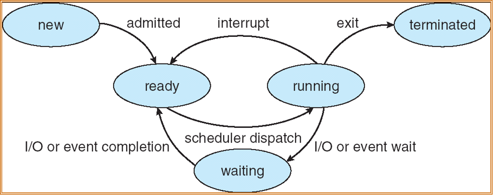
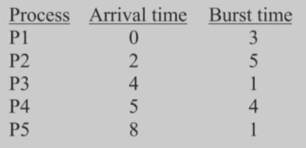

# 操作系统

!!! Abstract
    
    **授课教师**：寿黎但


用户程序对内存的视图和内核程序对内存的视图**不一样**。那我们在系统调用时，我们如何规划一块内存存放参数，内核又如何知道到哪里去访问参数呢？

??? Success

    我们一般有三种方法

## Intro

!!! Question "什么是一个操作系统?"


!!! Question "操作系统能干什么?"

    1. **进程管理**
    2. **内存管理**
    3. **存储管理**

    或者说，一个好的操作系统提供了计算机系统这些能力：
    - **Multiplexing(复用)**
    - **Isolation(隔离)**
    - **Abstraction(抽象)**


### 系统调用(System Call)的类型

- Process Control

- File Management

- Device Management

- Information Maintenance

- Communications

- Protections

### 系统程序(System Programs)

??? Note "系统调用和系统程序的区别"
    
    系统调用是一种软件中断。

Interrupt 可以分为两种：硬件中断/软件中断(Trap)。软件中断可以由于错误导致，也可以由于系统调用。在 RISC-V 术语中：

中断的处理


## OS Structures

回顾计算机系统的组成

### 虚拟机 (Virtual Machine)

虚拟机是“分层”概念的具体实现的代表之一。具体来说，一个典型的虚拟机的架构大致如下：

- 最上层/ 客户操作系统，即被安装的系统；

- 第二层/ Hypervisor (虚拟机监控器) 为各 VM 创建的虚拟硬件层；

- 第三层/ Hypervisor
  
- 最底层/ 物理硬件*

!!! Tips "最底层的“物理硬件”指的是什么？"

    这是针对 Hypervisor 的视角来说的。目前有两种流行的 Hypervisor：

    - Type 1 Hypervisor：裸金属的，直接视机器上的物理硬件为自己的硬件。它本身相当于是一个精简的专用 OS 来驱动和管理硬件。
    
    - Type 2 Hypervisor：宿主型的，视宿主操作系统 (Host OS) 的内核及其提供的 API 接口为自己的硬件。


## 进程 Process

### 1. 进程概念 (Process Concept)

* **定义**：进程是<u>“一个正在执行中的程序”</u>。操作系统执行各种程序，例如批处理系统中的“作业”（jobs）或时间共享系统中的“用户程序”或“任务”（tasks）。

<div class="grid cards" markdown>

-   **进程的内存结构**

    一个进程在内存中包含：

    * **文本区域 (text section)**：即代码 (code)；
  
    * **程序计数器 (program counter)**；
  
    * **栈 (stack)**：用于存放函数参数、局部变量和返回地址；
  
    * **数据区域 (data section)**：存放全局变量；
  
    * **堆 (heap)**：用于动态分配内存。

-   { width="350" style="display: block; margin: 0 auto;"}

</div>

### 2. 进程状态 (Process State)

进程在其执行过程中会改变状态。

* **new (新建)**：进程正在被创建；
* **running (运行)**：指令正在被执行；
* **waiting (等待)**：进程正在等待某个事件发生（例如I/O完成）；
* **ready (就绪)**：进程等待被分配到处理器；
* **terminated (终止)**：进程已完成执行.

{ width="400" style="display: block; margin: 0 auto;"}

### 3. 进程控制块 (PCB)

* **定义**：PCB是与每个进程相关联的信息集合。
* **包含信息**：
    * 进程状态
    * 程序计数器
    * CPU寄存器内容
    * CPU调度信息
    * 内存管理信息
    * 记账信息
    * I/O状态信息
* **上下文切换 (Context Switch)**：当CPU切换到另一个进程时，系统必须保存旧进程的状态（到PCB）并加载新进程的保存状态。这个过程是开销，因为系统在切换时不做有用功。

### 4. 进程调度 (Process Scheduling)

这部分介绍了操作系统如何管理和调度进程。

* **调度队列 (Queues)**：
    * **作业队列 (Job queue)**：系统中所有的进程集合。
    * **就绪队列 (Ready queue)**：所有在主存中、准备好并等待执行的进程集合。
    * **设备队列 (Device queues)**：等待I/O设备的进程集合。
    * 进程会在这些队列之间迁移。
* **调度程序 (Schedulers)**：
    * **长期调度程序 (Long-term scheduler)**：也称“作业调度程序”，它选择哪些进程应被带入内存（就绪队列）。它控制着多道程序的程度，并且调用频率很低（秒或分钟）。
    * **短期调度程序 (Short-term scheduler)**：也称“CPU调度程序”，它选择下一个应该执行的进程并分配CPU。它的调用频率非常高（毫秒级），必须很快。
    * PPT提到，UNIX和Windows不使用长期调度程序。
    * 还提到了**中期调度 (Medium Term Scheduling)**，涉及将进程换出内存。
* **进程类型**：
    * **I/O密集型 (I/O-bound)**：花费更多时间进行I/O，有许多短暂的CPU爆发。
    * **CPU密集型 (CPU-bound)**：花费更多时间进行计算，有少数很长的CPU爆发。

### 5. 进程操作 (Operations on Processes)

这部分讨论了进程的创建和终止。

* **进程创建 (Process Creation)**：
    * 父进程创建子进程，形成一个进程树。
    * **资源共享**：父子进程可以共享所有资源、部分资源 或不共享资源。
    * **执行**：父子进程可以并发执行，或者父进程等待子进程终止。
    * **UNIX 示例**：`fork()` 系统调用用于创建新进程。`exec()` 系统调用通常在 `fork()` 之后使用，用一个新程序替换进程的内存空间。PPT中提供了一个C语言示例代码。
* **进程终止 (Process Termination)**：
    * 进程执行最后一条语句并请求操作系统删除它（例如调用 `exit`）。
    * 父进程可以终止子进程的执行（例如调用 `abort`），原因可能包括子进程超出了分配的资源 或分配给子进程的任务不再需要。
    * **级联终止 (Cascading termination)**：如果父进程退出，其所有子进程也可能被终止。
    * 在某些系统中，子进程可能成为“孤儿”进程，并被“init”进程（PID=1）收养。PPT指出在MacOS上，这个进程被称为 `launchd`。

### 6. 协作进程 (Cooperating Processes)

* **独立进程**不受其他进程影响，而**协作进程**可以影响或被其他进程影响。
* **协作的优势**：信息共享、计算加速（多CPU）、模块化 和方便性。
* **生产者-消费者问题 (Producer-Consumer Problem)**：
    * 这是一个协作进程的范例。生产者进程生产信息，消费者进程消费信息。
    * **有界缓冲区 (bounded-buffer)** 假定缓冲区大小固定。PPT提供了使用共享内存解决有界缓冲区问题的伪代码 。

!!! Example "例子"

    **问题** 三个进程 P1、P2、P3 互斥使用一个包含 N (N>0) 个单元的缓冲区。
        
    - P1 每次用 `produce()` 生成一个正整数并用 `put()` 送入缓冲区某一空单元中
        
    - P2 每次用 `getodd()` 从该缓冲区取出一个奇数并用 `countadd()` 统计奇数的个数
        
    - P3 每次用 `geteven()` 从该缓冲区中取出一个偶数并用 `counteven()` 统计偶数个数
        
    请用信号量机制实现这三个进程的同步与互斥活动，并说明所定义的信号量的含义。要求使用伪代码。

    ??? Success "解答"

        这是一个典型的**生产者-消费者问题**的变种。与标准问题不同的是，消费者被分为两类（奇数消费者和偶数消费者），因此生产者在放入数据后，需要根据数据的奇偶性来唤醒不同的消费者。

        我们需要定义以下四个信号量：

        1.  **`mutex`**
            *   **初值：** 1
            *   **含义：** 互斥信号量，用于保证三个进程对缓冲区的互斥访问（即同一时刻只能有一个进程在操作缓冲区）。
        2.  **`empty`**
            *   **初值：** N
            *   **含义：** 资源信号量，表示缓冲区中当前**空闲单元**的个数。
        3.  **`odd`**
            *   **初值：** 0
            *   **含义：** 资源信号量，表示缓冲区中当前**奇数**的个数。P2 需要等待此信号量。
        4.  **`even`**
            *   **初值：** 0
            *   **含义：** 资源信号量，表示缓冲区中当前**偶数**的个数。P3 需要等待此信号量。

        伪代码如下：

        ```c
        // 全局变量与信号量定义
        semaphore mutex = 1;  // 互斥锁
        semaphore empty = N;  // 空闲缓冲区数量
        semaphore odd = 0;    // 缓冲区内奇数数量
        semaphore even = 0;   // 缓冲区内偶数数量

        // ----------------------
        // 进程 P1 (生产者)
        // ----------------------
        process P1() {
            int x;
            while (true) {
                x = produce();      // 生成一个正整数

                P(empty);           // 1. 申请一个空缓冲区单元（如果没有空位则等待）
                P(mutex);           // 2. 申请进入临界区（互斥访问缓冲区）
                
                put(x);             // 将 x 放入缓冲区某一空单元
                
                V(mutex);           // 3. 退出临界区，释放互斥锁

                // 4. 根据 x 的奇偶性，唤醒对应的消费者
                if (x % 2 != 0) {
                    V(odd);         // 如果是奇数，增加奇数信号量，可能唤醒 P2
                } else {
                    V(even);        // 如果是偶数，增加偶数信号量，可能唤醒 P3
                }
            }
        }

        // ----------------------
        // 进程 P2 (奇数消费者)
        // ----------------------
        process P2() {
            int y;
            while (true) {
                P(odd);             // 1. 申请取走一个奇数（如果缓冲区无奇数则等待）
                P(mutex);           // 2. 申请进入临界区
                
                y = getodd();       // 从缓冲区取出一个奇数
                
                V(mutex);           // 3. 退出临界区
                V(empty);           // 4. 释放一个空缓冲区单元（增加空位数，可能唤醒 P1）
                
                countodd(y);        // 统计奇数个数
            }
        }

        // ----------------------
        // 进程 P3 (偶数消费者)
        // ----------------------
        process P3() {
            int z;
            while (true) {
                P(even);            // 1. 申请取走一个偶数（如果缓冲区无偶数则等待）
                P(mutex);           // 2. 申请进入临界区
                
                z = geteven();      // 从缓冲区取出一个偶数
                
                V(mutex);           // 3. 退出临界区
                V(empty);           // 4. 释放一个空缓冲区单元（增加空位数，可能唤醒 P1）
                
                counteven(z);       // 统计偶数个数
            }
        }
        ```

        5.  **互斥控制 (`mutex`)**：
            *   无论是 `put`、`getodd` 还是 `geteven`，都涉及对共享缓冲区数据结构的操作（如修改指针、读取数据），因此必须用 `P(mutex)` 和 `V(mutex)` 包裹起来。

        6.  **同步控制 (`empty`, `odd`, `even`)**：
            *   **P1 与 P2/P3 的同步**：P1 在放入数据前必须检查是否有空间 (`P(empty)`)。P2 或 P3 取出数据后，会释放空间 (`V(empty)`)，从而允许 P1 继续生产。
            *   **P1 通知 P2/P3**：这是本题的关键点。P1 生产的数据不是通用的，必须区分类型。
                *   当 P1 放入奇数时，执行 `V(odd)`，这会使得阻塞在 `P(odd)` 上的 P2 进程得以继续执行。
                *   当 P1 放入偶数时，执行 `V(even)`，这会使得阻塞在 `P(even)` 上的 P3 进程得以继续执行。

        7.  **死锁预防**：
            *   在所有进程中，必须**先申请资源信号量**（`empty` / `odd` / `even`），**再申请互斥信号量**（`mutex`）。
            *   如果顺序反过来（例如 P2 先 `P(mutex)` 再 `P(odd)`），假设缓冲区全空，P2 获得锁后发现没奇数于是等待 `odd`，但因为 P2 拿着锁，P1 无法进入临界区去放入奇数，导致死锁。目前的顺序是正确的。

### 7. 进程间通信 (Interprocess Communication, IPC)

这部分介绍了进程间通信和同步的机制。

* **两种模型**：
    * **共享内存 (Shared memory)**
    * **消息传递 (Message passing)**
* **消息传递**：
    * 提供 `send(message)` 和 `receive(message)` 操作。
    * **直接通信**：进程必须显式地命名对方（例如 `send(P, ...)`）。
    * **间接通信**：消息被发送到“邮箱”（mailboxes）或“端口”（ports）。进程通过共享邮箱进行通信。
* **同步 (Synchronization)**：
    * 消息传递可以是**阻塞的（同步）** 或**非阻塞的（异步）**。
    * 阻塞发送：发送方被阻塞，直到消息被接收。
    * 阻塞接收：接收方被阻塞，直到有消息可用。
* **缓冲 (Buffering)**：
    * 通信链接上的消息队列可以有**零容量**、**有界容量** 或**无限容量**。

### 8. 客户端-服务器系统中的通信

这部分介绍了几种用于客户-服务器模型的IPC机制。

* **套接字 (Sockets)**：
    * 定义为通信的“端点”（endpoint）。
    * 是IP地址和端口号的组合（例如 `161.25.19.8:1625`）。
    * 通信在**一对套接字**之间进行。
* **远程过程调用 (Remote Procedure Calls, RPC)**：
    * 它抽象了网络系统中进程之间的过程调用。
    * 使用**存根 (Stubs)** 作为服务器上实际过程的客户端代理。
    * 客户端存根定位服务器并**编组 (marshals)** 参数。服务器端存根接收消息，**解组 (unpacks)** 参数，并执行过程。
* **远程方法调用 (Remote Method Invocation, RMI)**：
    * 这是Java中类似RPC的机制。
    * 它允许一台机器上的Java程序调用一个**远程对象**上的方法。

## 进程同步 Synchronization

## 线程 Thread

文档以一个Web浏览器的开发为例，说明了为什么需要线程 。

* **单线程的问题：** 如果程序采用简单的循环（检索数据、显示数据、获取输入），每个步骤都会阻塞，导致程序响应缓慢 。
* **初步尝试的缺陷：** 尝试将任务分解成非常小的片段  或在循环中不断检查是否有任务要做 ，这样做虽然能略微提高响应速度，但效率极低 。
* **核心冲突：** 程序既需要高**响应速度**（要求任务分解得极细），又需要高**效率**（要求执行大块代码），这两者是相互冲突的 。
* **线程解决方案：** 多线程允许程序创建多个并行的执行流（例如，一个线程负责检索数据，一个负责显示，一个负责获取输入）。操作系统（OS）会负责这些线程的调度 ，从而同时解决了响应速度和效率的问题。

### 线程的优势与概念

- 优势 
    * **响应速度 (Responsiveness):** 允许交互式应用程序即便在执行阻塞任务时也能继续响应用户 。
    * **资源共享 (Resource Sharing):** 线程默认共享进程的代码、数据和文件 。
    * **经济性 (Economy):** 创建和切换线程的开销远低于进程 。
    * **利用多处理器架构 (Utilization of MP Architectures):** 在多核系统上，多线程可以实现真正的并行执行，提高并发性 。

- 关键概念
    * **单线程 vs. 多线程进程：** 单线程进程只有一个执行流（一套寄存器和堆栈）；多线程进程共享代码、数据和文件，但每个线程拥有自己独立的寄存器和堆栈 。
    * **并发 vs. 并行：** **并发 (Concurrency)** 是指多个任务在单核上交错执行（看起来像同时运行）。**并行 (Parallelism)** 是指多个任务在多核上真正同时执行 。
    * **用户线程 vs. 内核线程：** **用户线程**由用户空间的线程库管理 （例如 Pthreads, Win32, Java 线程 ）。**内核线程**由操作系统内核直接支持和管理 （例如 Windows, Linux, Solaris ）。

### 多线程模型 

多线程模型定义了用户线程和内核线程之间的关系。

* **多对一模型 (Many-to-One):** 
    * **描述:** 多个用户线程映射到一个内核线程 。线程管理在用户空间完成，效率高 。
    * **缺点:** 如果一个用户线程执行了阻塞的系统调用，整个进程都会被阻塞 。内核一次只能调度一个线程 。
    * **示例:** Solaris Green Threads , GNU Portable Threads 。

* **一对一模型 (One-to-One):** 
    * **描述:** 每个用户线程映射到一个内核线程 。
    * **优点:** 提供了更好的并发性，一个线程阻塞不会影响其他线程 。
    * **缺点:** 创建每个用户线程都需要创建一个内核线程，开销较大 。
    * **示例:** Windows , Linux , Solaris 9 及更高版本 。

* **多对多模型 (Many-to-Many):** 
    * **描述:** 多个用户线程映射到多个（或更少的）内核线程 。
    * **优点:** 非常灵活 。允许程序创建任意多的用户线程，而内核线程的数量可以由操作系统动态调整 。
    * **示例:** Solaris 9 以前的版本 , Go 语言的 Goroutines 。

* **二级模型 (Two-level Model):** 
    * **描述:** 类似于多对多模型，但增加了允许将某个用户线程“绑定”到特定内核线程的功能 。
    * **示例:** Solaris 8 及更早版本 。

### 线程问题 

在使用线程时需要解决几个关键问题：

* **`fork()` 和 `exec()` 的语义:** 当多线程进程中的某个线程调用 `fork()` 时，是复制所有线程，还是只复制调用 `fork()` 的那个线程？ （`exec()` 会替换整个进程）。
* **信号处理 (Signal Handling):** 在 UNIX 系统中，当一个事件（信号）发生时 ，应该将其传递给哪个线程？（例如，传递给应用信号的线程、进程中的所有线程、某些特定线程，或指定一个线程接收所有信号）。
* **线程取消 (Thread Cancellation):** 如何提前终止一个线程 。
    * **异步取消 (Asynchronous):** 立即终止目标线程 。
    * **延迟取消 (Deferred):** 目标线程周期性地检查一个标志位，以决定是否应该自行终止 。
* **线程池 (Thread Pools):** 预先创建一定数量的线程 。当需要执行任务时，从池中获取一个可用线程，而不是创建新线程 。这可以限制线程总数 ，且服务请求更快 。
* **线程特定数据 (Thread-Specific Data):** 允许每个线程拥有自己私有的数据副本（也称线程本地存储, TLS）。这在无法控制线程创建过程（如使用线程池）时很有用 。
* **调度程序激活 (Scheduler Activations):** 在多对多或二级模型中，内核需要一种机制（称为“上调” (upcalls)）来通知用户级线程库内核线程的分配情况 ，例如当一个线程即将阻塞时通知库 。


### 具体实现

* **Pthreads:**  一个 POSIX 标准 (IEEE 1003.1c) API，用于线程创建和同步 。它只定义了行为规范，具体实现可以是用户级的，也可以是内核级的 。
* **Windows XP 线程:**  采用一对一模型 。每个线程包含线程ID、寄存器集、用户和内核堆栈以及私有存储区 ，这些构成了线程的上下文 (context) 。
* **Linux 线程:**  Linux 称线程为“任务” (tasks) 。通过 `clone()` 系统调用创建 ，`clone()` 允许子任务共享父任务（进程）的地址空间 。
* **Java 线程:**  线程由 Java 虚拟机 (JVM) 管理 。可以通过继承 `Thread` 类或实现 `Runnable` 接口来创建 。Java 线程有多种状态，如新建 (new)、可运行 (runnable)、阻塞 (blocked) 和死亡 (dead) 。

## 调度 Schedule

### 1. 基本概念 (Basic Concepts)

* **CPU-I/O 爆发周期**：进程的执行被建模为 CPU 执行（CPU burst）和 I/O 等待（I/O burst）的循环周期 。进程会在这两种状态之间交替 。
* **CPU 调度程序**：当CPU空闲时，操作系统必须从就绪队列 (ready queue) 中选择一个进程来执行 。
* **调度时机**：CPU调度决策可能在以下四种情况下发生 ：
    1.  进程从运行态切换到等待态（例如，I/O请求） 。
    2.  进程从运行态切换到就绪态（例如，发生中断） 。
    3.  进程从等待态切换到就绪态（例如，I/O完成） 。
    4.  进程终止 。
* **抢占式 (Preemptive) vs. 非抢占式 (Nonpreemptive)**：
    * 当调度只发生在情况1和4时，称为**非抢占式** 。
    * 否则，调度称为**抢占式**（例如情况2和3） 。
* **分派程序 (Dispatcher)**：这是将CPU控制权交给短期调度程序所选进程的模块 。这个过程涉及：
    * 上下文切换 (switching context) 
    * 切换到用户模式 (switching to user mode) 
    * 跳转到用户程序中的适当位置以重新启动程序 
* **分派延迟 (Dispatch Latency)**：分派程序停止一个进程并启动另一个进程运行所需的时间 。

### 2. 调度准则 (Scheduling Criteria)

评估调度算法的好坏有多个标准 ：

* **CPU 利用率 (CPU utilization)**：保持CPU尽可能繁忙 。
* **吞吐率 (Throughput)**：单位时间内完成执行的进程数量 。
* **周转时间 (Turnaround time)**：执行特定进程所需的总时间（从提交到完成） 。
* **等待时间 (Waiting time)**：进程在就绪队列中等待所花费的总时间 。
* **响应时间 (Response time)**：从提交请求到产生第一个响应所需的时间（适用于分时环境） 。

**优化目标**是：最大化 CPU 利用率  和吞吐率 ，同时最小化周转时间 、等待时间  和响应时间 。

### 3. 调度算法 (Scheduling Algorithms)

PPT详细介绍了几种主要的调度算法：

* **先来先服务 (First-Come, First-Served, FCFS)**：
    * 顾名思义，最先请求CPU的进程最先获得CPU 。
    * PPT通过两个例子展示了不同进程到达顺序如何显著影响平均等待时间 。
    * 存在**护航效应 (convoy effect)**：短进程可能需要等待一个很长的进程释放CPU 。
* **最短作业优先 (Shortest-Job-First, SJF)**：
    * 调度具有最短“下一个CPU爆发”的进程 。
    * 这种算法被证明是**最优的**，因为它能为一组给定的进程提供最小的平均等待时间 。
    * **两种模式**：
        1.  **非抢占式 (nonpreemptive)**：一旦进程获得CPU，它将一直运行直到完成其CPU爆发 。
        2.  **抢占式 (preemptive)**：如果一个新进程到达，其CPU爆发时间比当前执行进程的“剩余时间”还短，则抢占当前进程 。这也称为**最短剩余时间优先 (SRTF)** 。
    * **挑战**：无法知道下一个CPU爆发的实际长度 ，因此通常使用“指数平均法” (exponential averaging) 来预测它 。
* **优先级调度 (Priority Scheduling)**：
    * 每个进程都有一个关联的优先级（通常是一个整数） 。
    * CPU被分配给具有最高优先级的进程（例如，最小的整数） 。
    * 同样可以是抢占式或非抢占式 。
    * **问题**：可能导致**饥饿 (Starvation)**，即低优先级进程可能永远无法执行 。
    * **解决方案**：**老化 (Aging)**，即随着时间的推移逐渐增加等待时间过长的进程的优先级 。
* **轮转 (Round Robin, RR)**：
    * 专门为分时系统设计。
    * 它类似于FCFS，但增加了**抢占**。
    * 定义一个小的CPU时间单位，称为**时间片 (time quantum) `q`**（通常为10-100毫秒） 。
    * 我们维护的就绪队列是 **FIFO 的**。新进程进入时会进入就绪队列的末尾。
    * 进程被允许运行最多一个时间片。
      * 如果一个进程没有用完时间片就放弃了 CPU 资源，那么该进程自动离开就绪队列，scheduler 会继续运行下一个在就绪队列的进程。
      * 如果时间片用完，进程被抢占并**放回就绪队列的末尾** 。
    * 性能在很大程度上取决于时间片的大小：
        * 如果 `q` 很大 : 表现类似 FIFO (FCFS) 。
        * 如果 `q` 很小 : 必须相对于上下文切换时间而言足够大，否则开销会过高 。

!!! Example "RR 算法平均等待时间"
    
    { width="400" style="display: block; margin: 0 auto;"}

    时间单位是 ms，读者可以先自行计算一下答案。请时刻关注**就绪队列**的状态。

    ??? Success "Solution"

        - 0-2/ P1 到达，立即开始执行。
        - 2-3/ P2 在第 2 ms 到达，**但 P1 先于 P2 回到就绪队列**，因为 P2 是新的进程；因此 P1 继续执行直至结束；P2 等待 1 ms 。
        - 3-5/ P2 执行，P3 在第 4 ms 到达，进入队列；P4 在第 5 ms 到达，进入队列。
        - 5-6/ P3 在等待了 1 ms 后执行；P2、P4 等待 1 ms 。
        - 6-8/ P2 执行；P5 在第 8 ms 到达，**但 P2 先于 P5 回到就绪队列**，因为 P5 是新的进程；P4 等待 2 ms。
        - 8-10/ P4 执行；P2、P5 等待 2 ms 。
        - 10-11/ P2 执行；P4、P5 等待 1 ms 。
        - 11-12/ P5 执行；P4 等待 1 ms 。
        - 12-14/ P4 执行。

        所以 AWT 是 13/5 ms 。甘特图如下：
        
        ```mermaid
        block
            columns 14
            a["P1"]:2 b["P1"]:1 c["P2"]:2 d["P3"]:1 e["P2"]:2 f["P4"]:2 g["P2"]:1 h["P5"]:1 i["P4"]:2 

        ```        

- **多级队列 (Multilevel Queue)**：

    * 将就绪队列划分为多个独立的队列 。例如，分为“前台”（交互式）队列和“后台”（批处理）队列 。

    * 每个队列都有自己的调度算法（例如，前台用RR，后台用FCFS） 。

    * 必须在队列之间进行调度，例如：

        * **固定优先级**：先处理完所有前台队列，再处理后台队列（可能导致饥饿） 。

        * **时间片**：为每个队列分配一定的CPU时间（例如，80%给前台RR，20%给后台FCFS） 。

- **多级反馈队列 (Multilevel Feedback Queue)**：

    * 允许进程在不同队列之间**移动** ；这可以实现老化 。

    * 由多个参数定义：队列数量、每个队列的调度算法、何时升级/降级进程的方法等 。

    * PPT给出了一个三级队列的例子（Q0使用RR TQ=8，Q1使用RR TQ=16，Q2使用FCFS） 。

### 4. 其他调度主题

* **多处理器调度 (Multiple-Processor Scheduling)**：
    * 当有多个CPU可用时，调度变得更加复杂。
    * 涉及**对称多处理 (SMP)**（每个处理器自我调度）和**非对称多处理**。
    * 需要考虑**负载均衡 (Load balancing)**。
* **实时调度 (Real-Time Scheduling)**：
    * **硬实时系统 (Hard real-time)**：必须保证关键任务在特定时间内完成。
    * **软实时系统 (Soft real-time)**：要求关键进程的优先级高于其他进程。
* **线程调度 (Thread Scheduling)**：
    * 区分**用户级线程**（由线程库调度）和**内核级线程**（由内核调度）
    * **Pthread API** 示例展示了如何设置调度范围（SYSTEM或PROCESS）和策略（FIFO, RR等）。
* **Java 线程调度**：
    * JVM 使用抢占式的、基于优先级的调度算法。
    * 如果多个线程具有相同优先级，则使用FIFO队列。
    * PPT提到了 `Thread.yield()` 方法，它允许当前线程放弃控制权，让给另一个同等优先级的线程。

### 5. 操作系统示例

PPT最后简要介绍了几种特定操作系统的调度实现：

* **Solaris 调度**：使用优先级类（如实时、系统、交互式/分时）。
* **Windows XP 调度**：使用基于优先级的抢占式调度，具有32个优先级级别。
* **Linux 调度**：区分“分时”和“实时”算法。分时算法采用基于“信用 (credit)”的优先级系统。

### 6. 算法评估 (Algorithm Evaluation)

评估不同调度算法性能的方法包括：

* **确定性建模 (Deterministic modeling)**：针对特定的预定工作负载，计算每种算法的性能。
* **排队模型 (Queueing models)**：使用数学方法分析。使用 Little's Law ($L = \lambda \times W$) 进行分析 38。
* **模拟 (Simulations)**：通过模拟程序运行来评估算法性能。
* **实现 (Implementation)**：在真实系统上实现并进行测量。


## 主存 Main Memory

### 1. 背景与基础 (Background)

- **硬件基础：** 介绍了内存层级结构，指出主存和寄存器是 CPU 能直接访问的存储。讨论了缓存 (Cache) 的作用以及内存保护 (Memory Protection) 的必要性（通过基地址寄存器 Base 和界限寄存器 Limit 实现）。
- **内存技术发展：** 展示了从早期的真空管、磁芯存储器到现代的半导体 RAM/ROM、DRAM 的演变，以及新兴的非易失性存储 (NVM) 技术（如 PCM, ReRAM, STT-MRAM）和存内计算 (Processing-in-Memory) 。
- **地址绑定 (Address Binding)：** 解释了指令和数据绑定到内存地址的三个阶段：编译时 (Compile time)、加载时 (Load time) 和执行时 (Execution time) 。
- **逻辑 vs 物理地址：** 区分了 CPU 生成的逻辑地址 (Virtual address) 和内存单元看到的物理地址。引入了 **MMU (内存管理单元)**，负责运行时将逻辑地址映射为物理地址 。

### 2. 内存分配与碎片 (Memory Allocation & Fragmentation)

- **连续内存分配 (Contiguous Allocation)：**
  - 通常将内存分为操作系统驻留区和用户进程区。
  - **动态存储分配问题：** 介绍了三种寻找空闲内存块 (Hole) 的算法：**首次适应 (First-fit)**、**最佳适应 (Best-fit)** 和 **最差适应 (Worst-fit)** 。
- **碎片 (Fragmentation)：**
  - **外部碎片 (External)：** 总空闲空间足够但无法连续分配。可通过**紧凑 (Compaction)** 技术解决 。
  - **内部碎片 (Internal)：** 分配的内存块略大于请求的大小，未被利用的部分 。

### 3. 分页 (Paging)

这是文档的重点部分：

- **基本原理：** 将物理内存分为固定大小的**帧 (Frames)**，逻辑内存分为同样大小的**页 (Pages)**。这允许逻辑地址空间不连续 。
- **地址转换：** 逻辑地址分为页号 (p) 和页内偏移 (d)。页表 (Page Table) 用于映射页号到物理帧号 。
- **硬件支持：**
  - **TLB (转换旁视缓冲/快表)：** 为了解决两次内存访问带来的速度问题，使用关联存储器 (TLB) 作为缓存来加速地址转换 。
  - **有效访问时间 (EAT)：** 介绍了基于命中率 (Hit ratio) 计算 EAT 的公式 。
- **保护与共享：** 利用有效/无效位 (Valid-invalid bit) 进行内存保护；支持多个进程共享只读代码页 。
- **页表结构：** 介绍了处理大地址空间的几种页表结构：
  - **层次化页表 (Hierarchical/Two-level)：** 将页表本身也进行分页 。
  - **哈希页表 (Hashed)：** 适用于大于 32 位的地址空间 。
  - **倒置页表 (Inverted)：** 整个系统只有一张页表，按物理帧索引，节省空间但搜索较慢 。


### 4. 分段 (Segmentation)

- **用户视角：** 分段支持以用户视角管理内存，程序被视为一组逻辑单位（如主程序、函数、堆栈、数组等）。
- **机制：** 逻辑地址由 <段号, 偏移量> 组成。使用段表 (Segment table) 存储每个段的基地址 (Base) 和界限 (Limit) 。

### 5. 交换 (Swapping)

- **概念：** 进程暂时从内存交换到后备存储 (Backing store)，稍后再换回 。
- **带分页的交换：** 现代系统通常不交换整个进程，而是交换进程的**页 (Pages)**，开销更小 。

### 6. 实例：Intel Pentium 与 Linux

- **Intel Pentium：** 支持纯分段或**分段加分页**的混合模式。
  - 逻辑地址先通过分段单元生成线性地址，再通过分页单元生成物理地址 。
- **Linux：** 在 Pentium 架构上采用了三级分页策略（全局目录、中间目录、页表）来管理线性地址 。

## 文件系统 File System

