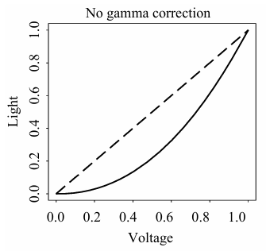

# 多媒体技术

~~半学期的课搞这么多？~~

!!! Abstract "课程信息"
    **授课教师**：肖俊

### 图像内容的表示类型

1.  1-bit Image / Binary Image (二值图像/单色图像)

    每个像素以一位存储（非黑即白：0表示黑色，1表示白色）。例如，一个 640 $\times$ 480 的此类图像理论大小为 $640 \times 480 / 8 = 38,400 \text{ Bytes} = 38.4 \text{KB}$。现在这种图像主要用于简单图形和文字图像的呈现。

2.  8-bit Grey-level Image (8位灰度图像)

    每个像素用一个字节存储，对应 0 到 255 的灰度值。灰度值为 0 时，该像素为纯黑色，为 255 时，该像素为纯白色。
    - **存储结构**：整张图像可以看作是一个二维的像素值数组（Bitmap）。也可以被视作由 8 个 1-bit 的**位平面 (bitplanes)** 叠加而成。

    ??? Question "黑白打印机为什么可以打出灰度图像？"

        黑白打印机其实还是一个 2-level (1-bit) 的设备。我们能够看到灰度变化，事实上是打印机在用空间分辨率 (spatial resolution) 代替灰度分辨率 (intensity resolution)，这个过程通常被称为**抖动 (Dithering)**。

        一个 $N \times N$ 的矩阵最多可以表示 $N^2 + 1$ 个灰度等级。对于中间等级的灰度表示，常有两种处理策略：
        1. **扩大图像法**：将每个像素替换为一个 $N \times N$ 的点阵。例如用 $4 \times 4$ 阵列，会使得输出的图像面积变为原来的 16 倍！
        2. **有序抖动 (Ordered Dither)**：为了避免图像被放大，可以使用一个“标准模式矩阵 (Standard Pattern Matrix)”。将灰度图矩阵与该标准矩阵通过取模运算进行对齐比较（如 $i = x \pmod n,\ j = y \pmod n$），若原图灰度值大于矩阵中的设定值，则在该位置打印黑点，否则不打印。

3.  24-bit Color Image (24位真彩色图像)

    每个像素用 3 个字节存储，三个字节分别表示 RGB 的灰度值（各 0-255），共支持 $256 \times 256 \times 256 \approx 1677$ 万种颜色。这种图像也叫做**真彩色图像**。
    许多 24-bit Color Image 在实际存储时会为了对齐或特效成为 32-bit Image，每个像素多一个字节来存储透明度值 ($\alpha$ value)。
    *   **半透明计算公式**：$\text{最终颜色} = \text{源图像颜色} \times (100\% - \text{透明度}) + \text{背景图像颜色} \times \text{透明度}$。

4.  8-bit Color Image (8位伪彩色图像)

    每个像素用一个字节存储，也即每个像素的颜色只能在 256 种颜色中选择一个。如果直接存颜色，图像的色彩大概率会失真。
    
    但实际上，这种图像依然可以显示丰富的色彩。在存储时，图像中提取出的最多 256 种核心颜色会进入**颜色查找表 (Color Lookup Table, LUT / Palette)**，一条索引对应一个颜色 (三字节 RGB)。图像数据区只需要存储单字节的索引值即可。
    
    **LUT 极大地减小了存储空间。在医疗图像中，通过修改 LUT 可以非常方便地将灰度图像转为伪彩色图像。**

    !!! Warning "人类视觉系统对 RGB 的敏感程度差异"
        由于人类对红色和绿色的敏感度远高于蓝色，在强行将 24 位压缩分配成 8 位色彩时，通常的简单策略是分配：R=3位，G=3位，B=2位（3:3:2）。

    !!! Question "万一原来的 RGB 图像颜色种类超过了 256 种怎么办？"

        需要从浩瀚的颜色中“聚类”或挑选出最具代表性的 256 种颜色放入查找表。由于传统聚类算法过于昂贵缓慢，通常采用
        **中值切分算法 (Median-cut Algorithm)** ——
        一种交替分割颜色空间的简单有效方案。具体思想是对某一颜色通道（如 R 通道）的字节值进行排序并找到其中位数，然后以中位数为界进行划分；在划分出的子空间内再对 G 或 B 通道继续寻找中位数切分，直到切分出 256 个区块，每个区块取其代表色存入 LUT 中。

### 图像文件的常用格式

1.  GIF (Graphics Interchange Format)

    *   1987年由 UNISYS 和 Compuserve 发明，最初用于电话线传输图像。
    *   **压缩算法**：采用 **LZW 字典压缩算法**，属于**无损压缩**，压缩率约 50%。
    *   **颜色限制**：最大只支持 **8-bit (256色)** 图像。
    *   **交错显示 (Interlacing)**：支持将图像分四次扫描加载，从而在网络较慢时能让用户快速看到图像轮廓。
    *   **动画支持**：GIF89a 标准支持在单个文件中存储多张彩色图像，从而实现动画。

2.  JPEG (Joint Photographic Experts Group)

    *   由 ISO 下属的任务组创建的标准，主要用于相片级别的图像。
    *   **压缩算法**：利用了人类视觉系统的一些局限性，实现了**有损压缩 (Lossy compression)**。
    *   **特性**：能够达到非常高的压缩率，且允许用户自主设定期望的质量水平（或压缩比例）。

3.  BMP (Bitmap)

    微软开发的图像格式，是 Windows 操作系统的主要图像格式，支持 1-bit, 4-bits, 8-bits 以及 24-bits 真彩色。
    *   **三种主要存储形式**：
        1. 原始数据不压缩（最常见）。
        2. **BI-RLE8**：用于 8-bit (256色) 图像的行程长度编码 (Run Length Encoding) 压缩。
        3. **BI_RLE4**：用于 4-bit (16色) 图像的 RLE 压缩。
    *   **文件结构组成 (4部分)**：文件头 (File Head) -> 位图信息头 (Info head) -> 调色板 (Palette, 真彩色图没有此项) -> 图像数据块 (Image Data, 带调色板的存索引，否则存RGB)。

4.  PNG / TIFF / EXIF...
    *   **PNG**: Portable Network Graphics（便携式网络图形，无损，支持透明通道）。
    *   **TIFF**: Tagged Image File Format（标签图像文件格式，多用于印刷/排版）。
    *   **EXIF**: Exchange Image File（可交换图像文件，主要用于数码相机记录拍摄参数）。

---

## 图像和视频中的色彩

### 色彩理论基础

#### Gamma 纠正

显示元件的硬件特性或限制往往使得输出的亮度和给予的电压(信号)值不成正比，但我们期望它是成正比的。

 { width="250" style="display: block; margin: 0 auto;"}

我们希望这个误差被修正。

#### 色彩匹配函数

!!! Tip "小知识"

    根据 CIE 标准，纯红色(255,0,0)光的波长为 700nm；纯绿色(0,255,0)光的波长为 546.1nm；蓝色(0,0,255)光的波长为 435.8nm。

#### 感知曲线

#### L\*a\*b\* (CIELAB) 色彩模型

人类的视觉系统主要使用 RGB 模型(眼球)和 LHS 模型(大脑处理)。

### 图像中的色彩模型

#### RGB

#### CMY / CMYK

#### YUV

## 图像和视频中的色彩

### 色彩理论基础

#### Gamma 纠正

显示元件的硬件特性或限制往往使得输出的亮度和给予的电压(信号)值不成正比，但我们期望它是成正比的。

 { width="250" style="display: block; margin: 0 auto;"}

我们希望这个误差被修正。

#### 色彩匹配函数

!!! Tip "小知识"

    根据 CIE 标准，纯红色(255,0,0)光的波长为 700nm；纯绿色(0,255,0)光的波长为 546.1nm；蓝色(0,0,255)光的波长为 435.8nm。

#### 感知曲线

#### L\*a\*b\* (CIELAB) 色彩模型

人类的视觉系统主要使用 RGB 模型(眼球)和 LHS 模型(大脑处理)。

### 图像中的色彩模型

#### RGB

#### CMY / CMYK

#### YUV