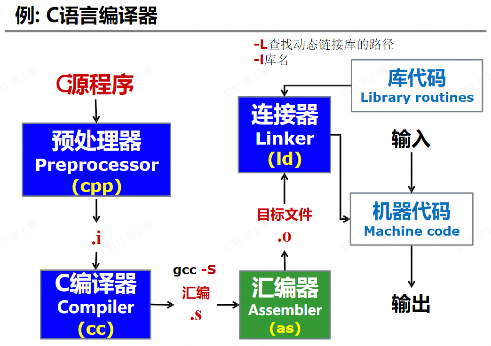

!!! Abstract
    **课程信息**
    浙江大学计算机科学与技术专业专业模块课程，培养方案推荐大三春夏修读。

    - 姚培森老师授课。

    - Grading Policy:
      75% Lecture Grade (Homework 10%+Quizzes 10%+Mid-Term 15%+Final 40%) + 25% Lab Grade; <u>Final < 40/100 then you will fail this course</u>.

## **Introduction**

### 编程语言及设计

### 编译器及其形式

!!! Success "什么是编译器?"

    编译器是一个程序，读入源程序并将其翻译成语义等价的目标程序。

    源程序用某种高级语言编写；目标程序从狭义上来看可以是用目标代码或机器语言编写，广义上来看就是某种“中间语言”。

    !!! Example

        

!!! Success "编译器的各种形式"

    - 交叉编译器

    - 增量编译器

    - 即时编译器

    - 预先编译器

### 编译器的阶段(编译过程)

1. **[前端]**词法分析→语法分析→语义分析

2. **[中端]**中间代码生成→机器无关代码优化

3. **[后端]**指令选择→寄存器分配→指令调度

## **词法分析 Lexical Analysis**

我们容易理解，程序代码是以字符串的形式传给编译器的。词法分析就是将输入的字符串识别为**有意义的子串**。这样会带来其他的辅助任务，例如过滤注释和空格等。

!!! Note "Definition: Token(词法记号，单词)"
    可以说是一类关键字的统称。以英语举例，名词(noun)就是一类token。

!!! Note "Definition: Lexeme(词素)"
    抽象地说，一个词素就是一类token的一个实例。

该部分内容和计算理论课程有很多重合: [TonyCrane/计算理论-语言、自动机与正则表达式](https://note.tonycrane.cc/cs/tcs/toc/topic1/)

### 正则表达式

- **字母表**(alphabet): 符号的有限集合；

- **串**(string, word): 字母表中符号的有穷序列。
        
    假设有一串$s$:
        
    - 其长度定义为该串中符号的个数，记作$|s|$。

    - 空串指的是长度为0的串，通常用$\varepsilon$表示。

    - 串的连接(concatenation)
        
        若另有一个串$t$，则$t$附加到$s$后面而形成的串记作$st$。例如，若$s$=`dog`，$t$=`house`，$st$=`doghouse`

        另外，空串是连接运算的单位元，即对于任何串$s$: $\varepsilon s$ = $s \varepsilon$ = $s$

    - 幂运算

        $$
        \begin{cases}
        s^0 &= \varepsilon \\
        s^n &= s^{n-1}s,n\ge 1
        \end{cases}
        $$

        即串$s$的n次幂表示将n个$s$连接起来。

    - **语言**: 字母表$\Sigma$上的一个串集。

        句子是属于语言的串。

        语言运算：

        <!--  -->

        在语言运算中，**幂**的优先级最高，其次是**连接**，最后是**并集**运算。

一个正则表达式实质上就是一个串。正则表达式(RE)$r$定义正则语言$L(r)$。

- $\varepsilon$是一个RE，$L(\varepsilon)=\{ \varepsilon \}$

- 如果$a \in \Sigma$，则$a$是一个RE，$L(a)=\{ a \}$

- 如果$r$和$s$都是RE，他们分别定义语言$L(r)$和$L(s)$:
    
    - $r | s$是一个RE，$L(r | s) = L(r) \cup L(s)$

    - $rs$是一个RE，$L(rs) = L(r) L(s)$

    - $r*$是一个RE，$L(r*) = (L(r))*$，这是Kleene闭包。

正则定义

!!! Note "正则规则的二义性"
    
    - 最长匹配原则
    
        对于输入的字符流，下一个token的匹配应该是符合某条规则的最长子串。

    - 规则优先原则

        对于一个特定的子串，其满足的第一个规则将作为其token类型。(顺序很重要！)

词法分析器自动生成：RE→最小DFA

!!! Example "Sample"

### 有穷自动机(FA)

一个有穷自动机可以用抽象表达描述为：

$$
M = ( S, \Sigma, move, s_0, F )
$$

其中，$S$代表有穷(要不然怎么是有穷自动机)状态集合；$\Sigma$代表字母表；$move(s, a)$代表转换函数，表示从状态$s$出发，读入输入$a$时转化到的状态；$s_0$表示初始状态；$F$表示终止状态。$s_0 \in S$，$F \subseteq S$。

我们可以利用**转换图**以及**转换表**来表示一个有穷自动机。

#### DFA最小化算法

- DFA状态等价条件

  - 一致性条件

    s、t同为终态或非终态

  - 蔓延性条件

    对于所有输入的符号，s、t必须转换到等价的状态集，同时具有传递性

- 简化算法(Hopcroft算法)

## 语法分析 Parse Analysis

从词法分析器获得token序列后，我们需要确认该token序列是否可以由语言的文法生成，或者说输入是否合法。这就是语法分析器的作用。一般而言，如果语法错误则报错，如果语法正确则生成语法分析树(通常生成AST，抽象语法树)。

这就需要我们

- 首先规定好合法的基本单元(token)

- 还要理解一个表达式的构成，直到看到基本单元
  
语法分析器可以自己使用<u>向下递归(recursive descent)</u>的方式手写(clang，gcc 3.4后的版本都是)，也可以使用语法生成器(Bison，Yacc等等)

我们可以利用**上下文无关文法**来描述语法。
  
### 上下文无关文法(CFG, Context-Free Grammar)

一个CFG可以表示成如下集合：

$$
G = \{T, N, P, S\}
$$

其中，$T$是终结符(Terminals)的集合，$N$是非终结符(Non-terminals)的集合，$P$是产生式(Productions)的集合，$S$是开始符号(Start symbol)。

- 终结符应该是一种语言的tokens。一旦生成了一个文法，终结符就是固定的。

- 非终结符通常表示语言中的语法变量。
    
> $: EOF(end of file) marker

#### 推导和规约

- 直接推导

    将产生式看成重写规则

#### CFG的Parse Tree

就是把之前的推导过程图形化。

!!! Warning 
    “给定CFG是否无二义性”是不可判定问题。

### 递归下降分析(自顶向下分析)

